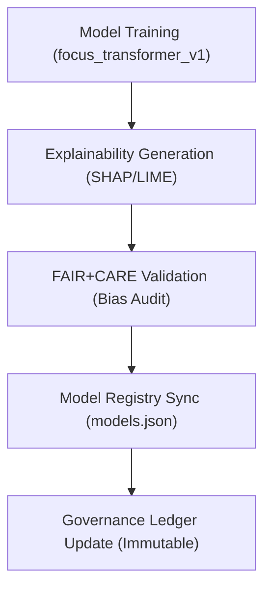

<div align="center">

# 🧩 Kansas Frontier Matrix — **Focus Transformer v1**
`src/ai/models/focus_transformer_v1/README.md`

**Purpose:** Provides architecture, metadata, and governance documentation for the Focus Transformer v1 — the primary AI model enabling Focus Mode contextual summarization and reasoning in the Kansas Frontier Matrix.  
Implements FAIR+CARE ethical transparency, explainability (SHAP/LIME), and reproducible lineage via the Immutable Governance Ledger.

[](../../../../../.github/workflows/ai-validate.yml)  
[](../../../../../docs/standards/faircare-validation.md)  
[](../../../../../docs/architecture/repo-focus.md)

</div>

---

## 📚 Overview

**Focus Transformer v1** is a transformer-based language model fine-tuned on curated Kansas historical and environmental corpora.  
It powers the **Focus Mode** AI subsystem, generating explainable contextual summaries that connect events, locations, and people through time.

**Core Objectives:**
- 🧠 Provide interpretable and fact-grounded AI summaries  
- 🧩 Integrate seamlessly with Neo4j Knowledge Graph and Focus Mode pipeline  
- ⚖️ Guarantee transparency and ethical alignment under FAIR+CARE  
- 🔍 Generate explainability outputs for model behavior (SHAP/LIME)  
- 🧾 Register model metadata, checksum, and lineage in the governance ledger  

---

## 🧱 Model Architecture

| Component | Description |
|------------|--------------|
| **Base Architecture** | Transformer encoder-decoder (6 layers, 12 attention heads) |
| **Hidden Size** | 768 |
| **Tokenizer** | Byte Pair Encoding (32k vocabulary) |
| **Training Framework** | PyTorch + HuggingFace Transformers |
| **Optimizer** | AdamW with learning rate scheduling |
| **Dataset** | `data/processed/focus_corpus.json` (Kansas historical texts, treaties, journals) |
| **Loss Function** | Cross-Entropy + Semantic Similarity Loss |
| **Explainability Tools** | SHAP (global feature attribution), LIME (local interpretability) |

Model File Summary:
```
config.json              # Model configuration and hyperparameters
weights.bin              # Serialized model weights
tokenizer.json           # Tokenizer and vocabulary file
metadata.json            # FAIR+CARE model metadata and provenance
```

---

## ⚙️ Example Usage

### 🧠 Run Model Inference
```python
from transformers import AutoModelForSeq2SeqLM, AutoTokenizer

model = AutoModelForSeq2SeqLM.from_pretrained("src/ai/models/focus_transformer_v1")
tokenizer = AutoTokenizer.from_pretrained("src/ai/models/focus_transformer_v1")

input_text = "Treaty of Fort Laramie, 1851 — describe historical significance."
inputs = tokenizer(input_text, return_tensors="pt")
outputs = model.generate(**inputs, max_length=150)
print(tokenizer.decode(outputs[0], skip_special_tokens=True))
```

### 🔍 Generate Explainability Report
```bash
python src/ai/explainability/report_generator.py --model focus_transformer_v1 --output reports/ai/explainability/focus_v1.json
```

### ⚖️ Log Model Telemetry
```bash
python src/ai/focus/telemetry_logger.py --model focus_transformer_v1 --entity treaty_1851 --confidence 0.94
```

---

## 🧩 FAIR+CARE Metadata (metadata.json)

```json
{
  "id": "focus_transformer_v1",
  "version": "1.0.3",
  "license": "MIT",
  "trained_on": "data/processed/focus_corpus.json",
  "explainability_ref": "reports/ai/explainability/focus_v1.json",
  "bias_audit_ref": "reports/fair/ai-bias-validation.json",
  "checksum_sha256": "9c2f8b1e4a31b63e0f438fb73f8c55e123c7b6d8886ea71b11f8f391be0a1ef9",
  "created_at": "2025-11-02T00:00:00Z",
  "validated_by": "faircare-validate.yml",
  "status": "active",
  "alignment": ["FAIR+CARE", "ISO 23894", "IEEE 7007"]
}
```

---

## 🧠 Governance Integration

| Workflow | Description | Output |
|-----------|--------------|---------|
| **Model Training Validation** | Confirms model registry inclusion and dataset provenance | `releases/v9.4.0/models.json` |
| **Explainability Generation** | Produces SHAP/LIME metadata for governance records | `reports/ai/explainability/focus_v1.json` |
| **Bias and Ethics Audit** | Assesses CARE Principle alignment and bias mitigation | `reports/fair/ai-bias-validation.json` |
| **Telemetry Logging** | Registers model inference activity in Immutable Ledger | `releases/v9.4.0/focus-telemetry.json` |

Governance artifacts recorded in:
```
reports/audit/governance-ledger.json
releases/v9.4.0/manifest.zip
```

---

## 🧩 Model Provenance Workflow



---

## 🔍 Explainability & Ethics

**Focus Transformer v1** provides interpretable, context-aware explanations for its predictions.  
- **SHAP:** Global feature attribution showing which input features influenced model outputs.  
- **LIME:** Local interpretability for individual predictions.  
- **Ethical Safeguards:** FAIR+CARE validation ensures balanced dataset representation and non-harmful inference outcomes.  
- **Transparency:** All summaries traceable to their historical source through CIDOC CRM event linkage.

Explainability outputs stored in:
```
reports/ai/explainability/
reports/fair/ai-bias-validation.json
```

---

## 🛡️ Security, Provenance & Reproducibility

- **Checksum Verification:** All files (`weights.bin`, `config.json`, `tokenizer.json`) registered via SHA-256.  
- **Immutable Lineage:** Provenance linked in `reports/audit/data-lineage.json`.  
- **Reproducibility:** Model version and dataset hash preserved in the registry.  
- **Governance Oversight:** Metadata cross-referenced with `ROOT-GOVERNANCE.md`.

All model files validated via:
```
tools/ai/model_sync.py
src/governance/lineage/checksum_register.py
```

---

## 🧩 Standards Alignment

| Standard | Application | Implementation |
|-----------|--------------|----------------|
| **MCP-DL v6.4.3** | Documentation-first AI lifecycle governance | This README + metadata.json |
| **FAIR+CARE** | Ethical and transparent model governance | Bias audits and telemetry reporting |
| **ISO 23894** | AI risk and lifecycle management | Drift detection and explainability checks |
| **IEEE 7007** | Ontological transparency | SHAP/LIME explainability integration |
| **SPDX 2.3** | License traceability | Model registry and license headers |

---

## 🧾 Version History

| Version | Date | Author | Summary |
|----------|------|---------|----------|
| v1.0.3 | 2025-11-02 | @kfm-ai | Enhanced explainability reports and FAIR+CARE bias audit integration. |
| v1.0.2 | 2025-10-30 | @kfm-ethics | Added SHAP and LIME interpretability layers. |
| v1.0.1 | 2025-10-28 | @bartytime4life | Integrated Neo4j entity linking and governance telemetry. |
| v1.0.0 | 2025-10-25 | @kfm-focus | Initial model release and governance registration under MCP-DL v6.4.3. |

---

<div align="center">

**Kansas Frontier Matrix — Ethical AI for Transparent Historical Reasoning**  
*“Every summary explainable. Every model governed. Every decision accountable.”* 🔗  
📍 `src/ai/models/focus_transformer_v1/README.md` — FAIR+CARE-aligned documentation for the Focus Transformer v1 model in the Kansas Frontier Matrix AI subsystem.

</div>
