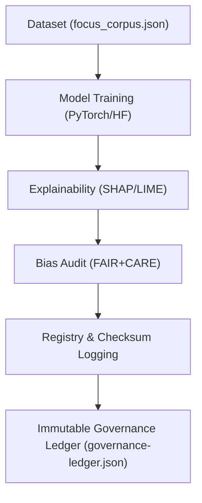

<div align="center">

# 🧩 Kansas Frontier Matrix — **Focus Transformer v1**
`src/ai/models/focus_transformer_v1/README.md`

**Purpose:** Defines the complete architecture, configuration, data lineage, and governance compliance details for the **Focus Transformer v1**, the foundational model enabling contextual reasoning and Focus Mode in the Kansas Frontier Matrix.  
Implements explainable, ethical, and reproducible AI through the **FAIR+CARE framework**, integrated with governance-led telemetry and immutable provenance logging.

[](../../../../../.github/workflows/ai-validate.yml)  
[](../../../../../docs/standards/faircare-validation.md)  
[](../../../../../docs/ai/explainability.md)  
[](../../../../../docs/architecture/repo-focus.md)

</div>

---

## 📚 Overview

**Focus Transformer v1** is a fine-tuned **encoder-decoder transformer** optimized for contextual summarization, entity linking, and reasoning over historical datasets.  
It connects structured knowledge (Neo4j entities) and unstructured text (archival sources) to generate interpretive narratives that align with FAIR+CARE governance and ethical transparency.

**Key Capabilities:**
- 🧠 Summarizes complex historical events with explainable AI reasoning.  
- 🌐 Connects map and timeline data through Focus Mode contextual AI.  
- ⚖️ Ensures ethical accountability and transparency through governance logging.  
- 🧮 Uses explainability frameworks (SHAP, LIME) for interpretability.  
- 🔍 Embeds provenance and dataset lineage metadata within outputs.

---

## 🗂️ Directory Layout

```plaintext
src/ai/models/focus_transformer_v1/
├── README.md                 # This file — full documentation and governance card
│
├── config.json               # Model configuration (architecture, hyperparameters)
├── weights.bin               # Serialized model weights (checksum-verified)
├── tokenizer.json            # Tokenizer and vocabulary
├── metadata.json             # FAIR+CARE model metadata and provenance
│
├── explainability/            # Explainability and interpretability assets
│   ├── shap_values.json      # SHAP feature importance (global interpretability)
│   ├── lime_explanations/    # LIME local explanations for single-instance predictions
│   └── report_focus_v1.json  # Consolidated explainability report (SHAP + LIME)
│
├── training/                 # Model training artifacts and metrics
│   ├── focus_corpus.json     # Fine-tuning dataset (curated Kansas corpora)
│   ├── training_log.txt      # Training log and performance summary
│   ├── metrics.json          # Evaluation metrics (loss, accuracy, bias)
│   └── dataset_manifest.json # Input dataset lineage and provenance records
│
└── governance/               # Ethics, provenance, and compliance metadata
    ├── bias_audit.json       # CARE-aligned bias and fairness audit results
    ├── checksum_record.json  # SHA-256 signatures for model artifacts
    ├── lineage_ref.json      # Provenance linkages to Immutable Governance Ledger
    └── license.txt           # SPDX-aligned license information (MIT)
```

---

## 🧱 Model Architecture & Configuration

| Parameter | Value |
|------------|--------|
| **Architecture** | Transformer (Encoder-Decoder) |
| **Layers / Heads** | 6 Layers / 12 Attention Heads |
| **Hidden Size** | 768 |
| **Tokenizer** | Byte Pair Encoding (32k vocabulary) |
| **Optimizer** | AdamW (lr = 3e-5, warmup = 0.1) |
| **Framework** | PyTorch + HuggingFace Transformers |
| **Dataset** | `data/processed/focus_corpus.json` |
| **Loss Functions** | Cross-Entropy + Semantic Similarity |
| **Explainability** | SHAP (global) + LIME (local) |
| **Governance Hooks** | FAIR+CARE telemetry, checksum registry, immutable ledger update |

---

## ⚙️ Model Usage Examples

### 🧠 Inference
```python
from transformers import AutoModelForSeq2SeqLM, AutoTokenizer

model = AutoModelForSeq2SeqLM.from_pretrained("src/ai/models/focus_transformer_v1")
tokenizer = AutoTokenizer.from_pretrained("src/ai/models/focus_transformer_v1")

query = "Describe the cultural significance of the Treaty of Fort Laramie (1851)."
inputs = tokenizer(query, return_tensors="pt")
outputs = model.generate(**inputs, max_length=150)
print(tokenizer.decode(outputs[0], skip_special_tokens=True))
```

### 🔍 Generate Explainability Report
```bash
python src/ai/explainability/report_generator.py \
  --model focus_transformer_v1 \
  --output reports/ai/explainability/focus_v1.json
```

### ⚖️ FAIR+CARE Bias Validation
```bash
python src/governance/validators/faircare_validate.py \
  --input src/ai/models/focus_transformer_v1/metadata.json \
  --output reports/fair/ai-bias-validation.json
```

---

## 🧩 FAIR+CARE Metadata Summary

```json
{
  "id": "focus_transformer_v1",
  "version": "1.0.3",
  "license": "MIT",
  "trained_on": "data/processed/focus_corpus.json",
  "description": "Transformer model fine-tuned for contextual historical summarization in Focus Mode.",
  "alignment": ["FAIR+CARE", "ISO 23894", "IEEE 7007"],
  "checksum_sha256": "9c2f8b1e4a31b63e0f438fb73f8c55e123c7b6d8886ea71b11f8f391be0a1ef9",
  "bias_audit_ref": "reports/fair/ai-bias-validation.json",
  "explainability_ref": "reports/ai/explainability/focus_v1.json",
  "telemetry_ref": "releases/v9.4.0/focus-telemetry.json",
  "governance_ref": "reports/audit/governance-ledger.json",
  "validated_by": "faircare-validate.yml",
  "created_at": "2025-11-02T00:00:00Z",
  "status": "active"
}
```

---

## 🔗 Provenance & Governance Workflow



**Workflow Summary:**
1. Model trained using FAIR-sourced, ethically screened datasets.  
2. Explainability layer produces SHAP and LIME visualizations.  
3. CARE bias audit ensures balanced data representation.  
4. Registry entry and checksum logged in `models.json`.  
5. Immutable governance ledger updated with provenance metadata.

---

## 🧠 Ethics & Transparency Controls

- **Explainability:** Every prediction includes interpretable SHAP and LIME justifications.  
- **Ethical Governance:** CARE audits confirm representational fairness and collective benefit.  
- **Provenance:** Each model artifact linked to a reproducible data lineage chain.  
- **Reproducibility:** All configurations versioned and hashed for deterministic regeneration.

All ethical reviews conducted under:
```
docs/standards/governance/FAIR-CARE.md
reports/fair/ai-bias-validation.json
```

---

## 🛡️ Security, Provenance & Reproducibility

- ✅ **Integrity:** All model artifacts (weights, config, tokenizer) checksum-verified (SHA-256).  
- 📜 **Provenance:** Recorded in `reports/audit/data-lineage.json`.  
- 🔐 **Immutable Ledger:** Governance synchronization ensures transparency.  
- 🧾 **Reproducibility:** Dataset and model metadata recorded in registry and manifests.

Validated through:
```
tools/ai/model_sync.py
src/governance/lineage/checksum_register.py
src/governance/audit/report_builder.py
```

---

## 🧩 Standards Alignment

| Standard | Function | Implementation |
|-----------|-----------|----------------|
| **MCP-DL v6.4.3** | Documentation-driven AI lifecycle governance | This README + metadata.json |
| **FAIR+CARE** | Ethical transparency and stewardship validation | Bias audit and explainability |
| **ISO 23894** | Risk management and explainability | Drift detection and governance logging |
| **IEEE 7007** | Ontological transparency | SHAP/LIME interpretability |
| **SPDX 2.3** | License provenance tracking | License in `governance/license.txt` |

---

## 🧾 Version History

| Version | Date | Author | Summary |
|----------|------|---------|----------|
| v1.0.3 | 2025-11-02 | @kfm-ai | Added directory layout, expanded ethics validation, and telemetry integration. |
| v1.0.2 | 2025-10-30 | @kfm-ethics | Implemented dual SHAP/LIME interpretability reports for transparency. |
| v1.0.1 | 2025-10-28 | @bartytime4life | Linked Neo4j entity references and governance telemetry updates. |
| v1.0.0 | 2025-10-25 | @kfm-focus | Initial release registered in AI model governance ledger. |

---

<div align="center">

**Kansas Frontier Matrix — Ethical AI for Transparent Historical Reasoning**  
*“Every model documented. Every output explainable. Every ledger immutable.”* 🔗  
📍 `src/ai/models/focus_transformer_v1/README.md` — FAIR+CARE-certified model card and documentation for Focus Transformer v1 in the Kansas Frontier Matrix.

</div>
