<div align="center">

# 🎯 **Kansas Frontier Matrix — Focus Transformer v1**  
`src/ai/models/focus_transformer_v1/README.md`

**Purpose:**  
Document the **Focus Transformer v1 model architecture**, used to generate contextual, ethical, and explainable AI summaries within the **Kansas Frontier Matrix (KFM)**.  
This transformer-based model powers **Focus Mode**, synthesizing information from the Knowledge Graph and AI pipelines under **FAIR+CARE governance** and **MCP-DL v6.3** reproducibility standards.

[](../../../../../docs/)
[](../../../../../LICENSE)
[](../../../../../docs/standards/faircare.md)
[](#)

</div>

---

## 📘 Overview

The **Focus Transformer v1** is a **multi-modal transformer** designed to unify geospatial, textual, and historical data into narrative-driven outputs.  
It underpins the **Focus Mode** AI subsystem, enabling contextual reasoning, ethical storytelling, and cultural data synthesis within KFM’s governance framework.

Core capabilities:
- 🧠 Multi-encoder attention across text, graph, and spatial embeddings.  
- 🗺️ Integration with **Neo4j Knowledge Graph** and **STAC/DCAT metadata**.  
- ⚖️ **FAIR+CARE compliance** with ethical data conditioning and bias mitigation.  
- ♻️ Telemetry for sustainability (ISO 50001) and audit traceability (ISO 19115).  

---

## 🗂️ Directory Layout

```plaintext
src/ai/models/focus_transformer_v1/
├── README.md                           # This file — Focus Transformer documentation
│
├── training/                           # Model training configuration and datasets
│   ├── focus_train.yaml
│   └── dataset_manifest.json
│
├── explainability/                     # SHAP/LIME explainability analysis
│   ├── shap_summary.json
│   └── attention_visualizer.py
│
├── governance/                         # FAIR+CARE ethics and audit validation
│   ├── model_card.md
│   ├── governance_validation.json
│   └── bias_audit.json
│
└── checkpoints/                        # Saved model checkpoints and hashes
    ├── focus_transformer_v1.ckpt
    └── checksum_registry.json
```

---

## ⚙️ Model Architecture

```mermaid
graph TD
  A["Input Data (GraphQL · GeoJSON · Text)"] --> B["Tokenization & Embedding Layers"]
  B --> C["Cross-Modal Encoder (Graph + Text Attention)"]
  C --> D["Fusion Transformer (Multi-Head Attention · Ethics Filters)"]
  D --> E["Decoder (Context-Aware Narrative Generator)"]
  E --> F["Output (Focus Mode Summary · FAIR+CARE Context)"]
```



### Design Principles
1. **Graph-Aware Embeddings:** Spatial and relational context vectors integrated into transformer tokens.  
2. **Ethical Conditioning:** CARE compliance layer masks restricted or sensitive knowledge.  
3. **Explainable Attention Maps:** Built-in attribution for transparency in Focus Mode UI.  
4. **Telemetry Hooks:** Records performance, energy, and governance metrics.

---

## 🧩 Configuration Example (`training/focus_train.yaml`)

```yaml
model:
  name: "focus_transformer_v1"
  architecture: "multi-modal-transformer"
  parameters:
    hidden_size: 1024
    num_layers: 24
    attention_heads: 16
    dropout: 0.1
  tokenizer: "kfm_bpe_32k"
  training_steps: 500000
  batch_size: 16

data:
  graph_input: "../../graph/exports/graph_embeddings.npy"
  text_input: "../../data/processed/corpus/focus_cultural_texts.json"
  metadata_input: "../../data/processed/stac_metadata.json"

telemetry:
  energy_tracking: true
  max_energy_wh: 4000
  faircare_validation: true
  telemetry_ref: "../../../../releases/v9.9.0/focus-telemetry.json"

ethics:
  reviewer: "@faircare-council"
  care_tag: "restricted"
  governance_ref: "../../../../docs/standards/governance/ROOT-GOVERNANCE.md"
```

---

## ⚖️ FAIR+CARE Integration Matrix

| Principle | Implementation | Audit Reference |
|------------|----------------|-----------------|
| **Findable** | Model registered in STAC/DCAT + SBOM manifests. | `releases/v9.9.0/manifest.zip` |
| **Accessible** | Public model card, restricted weights under CARE governance. | `governance/model_card.md` |
| **Interoperable** | CIDOC CRM + PROV-O integration for cultural entities. | `docs/architecture/data-architecture.md` |
| **Reusable** | Open configuration templates and explainability metadata. | SPDX Manifest |
| **CARE – Collective Benefit** | Narratives reinforce cultural understanding and preservation. | `governance/bias_audit.json` |
| **CARE – Authority to Control** | FAIR+CARE Council approves Focus Mode summarization outputs. | Governance Ledger |
| **CARE – Responsibility** | Ethical constraints embedded in transformer layer masks. | Model Configuration |
| **CARE – Ethics** | Excludes culturally sensitive or sacred data from narratives. | `governance_validation.json` |

---

## 🧮 Telemetry Metrics

| Metric | Description | Example |
|--------|-------------|----------|
| `training_runtime_min` | Model training time in minutes. | 720 |
| `energy_wh` | Power usage per training cycle. | 3750.4 |
| `carbon_gco2e` | CO₂ equivalent (ISO 50001). | 1550.2 |
| `bias_score` | Bias index detected during validation. | 0.03 |
| `faircare_score` | FAIR+CARE compliance score. | 99.2 |
| `explainability_stability` | Attention map variance (lower = better). | 0.07 |

Telemetry appended to:  
`releases/v9.9.0/focus-telemetry.json`  
Schema: `schemas/telemetry/src-ai-models-focus-transformer-v1.json`

---

## 🔐 Provenance & Governance

- **Governance Ledger:** `releases/v9.9.0/governance/ledger_snapshot.json`  
- **Telemetry Ledger:** `releases/v9.9.0/focus-telemetry.json`  
- **SBOM Reference:** `releases/v9.9.0/sbom.spdx.json`  
- **CARE Compliance Log:** `governance/governance_validation.json`

### Example Governance Record
```json
{
  "ledger_entry_id": "ledger_2025q4_focus_transformer_v1",
  "auditor": "@kfm-governance",
  "reviewed_by": "@faircare-council",
  "ethics_status": "certified",
  "timestamp": "2025-11-08T20:25:00Z"
}
```

---

## 🧾 Citation

```text
Kansas Frontier Matrix (2025). Focus Transformer v1 (v9.9.0).
FAIR+CARE-certified multi-modal transformer for ethical, explainable, and sustainable AI narratives in the Kansas Frontier Matrix Focus Mode subsystem.
```

---

## 🕰️ Version History

| Version | Date | Author | Summary |
|---------:|------|--------|----------|
| v9.9.0 | 2025-11-08 | `@kfm-ai` | Created documentation for Focus Transformer v1; added governance, telemetry schema, and ethical conditioning layer references. |

---

<div align="center">

**Kansas Frontier Matrix**  
*Context-Aware AI × FAIR+CARE Governance × Sustainable Intelligence*  
© 2025 Kansas Frontier Matrix · MIT · Master Coder Protocol v6.3 · FAIR+CARE Certified · Diamond⁹ Ω / Crown∞Ω Ultimate Certified  

[Back to AI Models Index](../README.md) · [Governance Charter](../../../../../docs/standards/governance/ROOT-GOVERNANCE.md)

</div>

