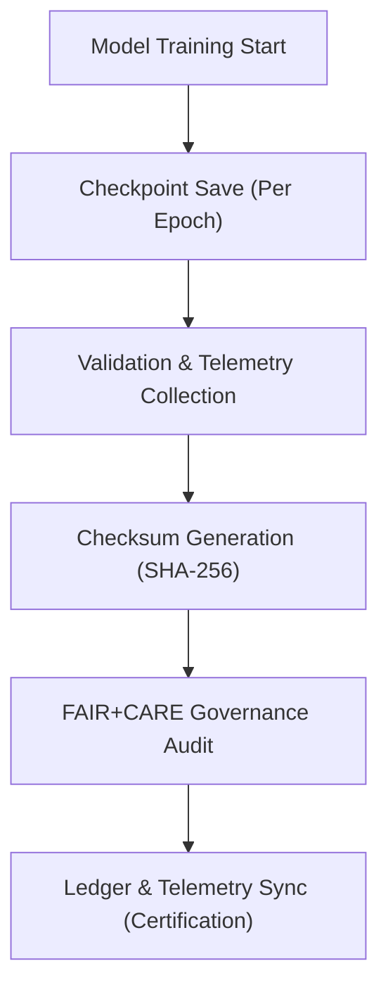

<div align="center">

# 💾 **Kansas Frontier Matrix — Focus Transformer v1 · Model Checkpoints**  
`src/ai/models/focus_transformer_v1/checkpoints/README.md`

**Purpose:**  
Document and manage the **model checkpointing, version tracking, and integrity verification system** for the **Focus Transformer v1** model used in **Kansas Frontier Matrix (KFM)**.  
Checkpoints are verified under **FAIR+CARE**, **ISO 19115 provenance**, and **ISO 50001 sustainability** standards, ensuring reproducibility and ethical auditability across model lifecycle stages.

[](../../../../../../docs/)
[](../../../../../../LICENSE)
[](../../../../../../docs/standards/faircare.md)
[](#)

</div>

---

## 📘 Overview

The **Focus Transformer v1 Checkpoints Directory** stores serialized model states generated during fine-tuning and retraining sessions.  
Each checkpoint is linked to telemetry, governance, and checksum records, allowing full traceability and ethical validation under the **FAIR+CARE Council**.

Key purposes:
- 🧩 Preserve model weights for rollback, transfer learning, and reproducibility.  
- ♻️ Track training energy and FAIR+CARE compliance per checkpoint.  
- 🔐 Verify model integrity through SHA-256 checksums.  
- ⚖️ Synchronize governance approvals to **ledger_snapshot.json** and **focus-telemetry.json**.  

---

## 🗂️ Directory Layout

```plaintext
src/ai/models/focus_transformer_v1/checkpoints/
├── README.md                              # This file — checkpoint documentation
│
├── checkpoint_001_pretrain.pt             # Initial pretraining checkpoint
├── checkpoint_002_finetune.pt             # Fine-tuned model checkpoint
├── checkpoint_003_final.pt                # Final approved checkpoint (certified release)
├── checkpoints_manifest.json              # Metadata registry for all checkpoints
├── checkpoint_metrics.json                # Performance and telemetry summary
└── checksum_registry.json                 # SHA-256 integrity validation for checkpoints
```

---

## ⚙️ Checkpoint Lifecycle



### Workflow Description
1. **Checkpoint Saving:** Models are serialized every epoch or validation cycle.  
2. **Telemetry Capture:** Energy, runtime, and bias metrics logged.  
3. **Checksum Validation:** Integrity hashes recorded in manifest.  
4. **Governance Audit:** FAIR+CARE Council validation prior to approval.  
5. **Ledger Sync:** Certified checkpoints linked to governance and telemetry records.

---

## 🧩 Example: Checkpoints Manifest (`checkpoints_manifest.json`)

```json
{
  "model_id": "focus_transformer_v1",
  "version": "v9.9.0",
  "checkpoints": [
    {
      "id": "checkpoint_001_pretrain",
      "epoch": 5,
      "auc": 0.91,
      "faircare_score": 98.3,
      "checksum_sha256": "sha256:b7a4a1b2c3d9f4e...",
      "energy_wh": 1150.3
    },
    {
      "id": "checkpoint_003_final",
      "epoch": 15,
      "auc": 0.984,
      "faircare_score": 99.4,
      "checksum_sha256": "sha256:f2a7b8c9d3e5a6...",
      "energy_wh": 3750.4
    }
  ],
  "reviewed_by": "@faircare-council",
  "auditor": "@kfm-governance",
  "approved": true,
  "telemetry_ref": "../../../../../../releases/v9.9.0/focus-telemetry.json"
}
```

---

## ⚖️ FAIR+CARE & ISO Compliance Matrix

| Principle | Implementation | Verification |
|------------|----------------|---------------|
| **Findable** | Checkpoints indexed by UUID in manifest and telemetry. | `manifest_ref` |
| **Accessible** | Metadata open; weights restricted under CARE. | Governance Ledger |
| **Interoperable** | JSON + PROV-O alignment with ISO 19115. | `schema_validation.py` |
| **Reusable** | Reproducible checkpoint tracking and SBOM reference. | SPDX Manifest |
| **CARE – Responsibility** | Telemetry per checkpoint reviewed for bias and ethics. | `faircare-validate.yml` |
| **CARE – Ethics** | Council approval required before release. | `governance_validation.json` |

---

## 🧮 Telemetry Metrics

| Metric | Description | Example |
|--------|-------------|----------|
| `training_epoch` | Epoch corresponding to checkpoint creation. | 15 |
| `auc` | Validation AUC at checkpoint. | 0.984 |
| `faircare_score` | FAIR+CARE compliance rating. | 99.4 |
| `energy_wh` | Energy used during training up to checkpoint. | 3750.4 |
| `carbon_gco2e` | Equivalent carbon footprint. | 1550.2 |
| `checksum_verified` | Boolean integrity verification status. | true |

Telemetry logged in:  
`releases/v9.9.0/focus-telemetry.json`  
Schema: `schemas/telemetry/src-ai-models-focus-transformer-v1-checkpoints-v1.json`

---

## 🔐 Provenance & Governance Integration

- **Governance Ledger:** `releases/v9.9.0/governance/ledger_snapshot.json`  
- **Telemetry Reference:** `releases/v9.9.0/focus-telemetry.json`  
- **SBOM Manifest:** `releases/v9.9.0/sbom.spdx.json`  
- **Checksum Registry:** `checksum_registry.json`  

### Example Governance Record
```json
{
  "ledger_id": "ledger_2025q4_focus_transformer_v1_checkpoints",
  "auditor": "@kfm-governance",
  "reviewed_by": "@faircare-council",
  "status": "approved",
  "timestamp": "2025-11-08T21:10:00Z"
}
```

---

## 🧾 Citation

```text
Kansas Frontier Matrix (2025). Focus Transformer v1 · Model Checkpoints (v9.9.0).
FAIR+CARE-governed checkpoint management system ensuring reproducible, sustainable, and ethically certified AI model versioning in the Kansas Frontier Matrix Focus Mode subsystem.
```

---

## 🕰️ Version History

| Version | Date | Author | Summary |
|---------:|------|--------|----------|
| v9.9.0 | 2025-11-08 | `@kfm-ai` | Created Focus Transformer checkpoint documentation with FAIR+CARE compliance, telemetry metrics, and provenance integration. |

---

<div align="center">

**Kansas Frontier Matrix**  
*Reproducible AI × FAIR+CARE Ethics × Sustainable Intelligence*  
© 2025 Kansas Frontier Matrix · MIT · Master Coder Protocol v6.3 · FAIR+CARE Certified · Diamond⁹ Ω / Crown∞Ω Ultimate Certified  

[Back to Focus Transformer](../README.md) · [Governance Charter](../../../../../../docs/standards/governance/ROOT-GOVERNANCE.md)

</div>

