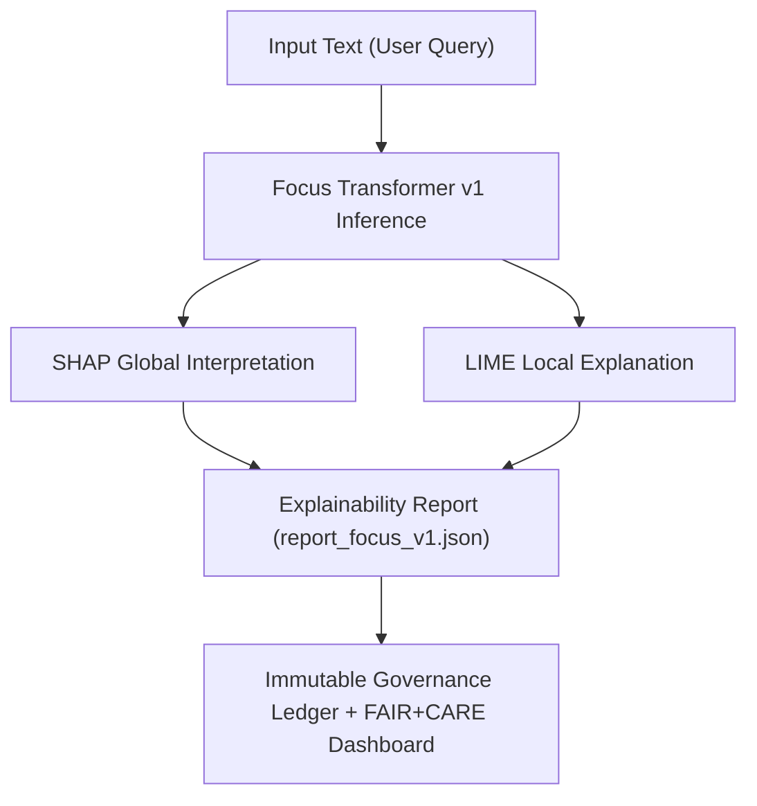

<div align="center">

# 🔍 Kansas Frontier Matrix — **Focus Transformer v1 Explainability Suite**
`src/ai/models/focus_transformer_v1/explainability/README.md`

**Purpose:** Provides full interpretability documentation, SHAP and LIME reports, and FAIR+CARE governance integration for the **Focus Transformer v1** model.  
Ensures every prediction and summary produced by the AI is ethically explainable, auditable, and traceable under the Immutable Governance Ledger.

[](../../../../../../.github/workflows/ai-validate.yml)  
[](../../../../../../docs/standards/faircare-validation.md)  
[](../../../../../../docs/architecture/repo-focus.md)

</div>

---

## 📚 Overview

The **Explainability Suite** for Focus Transformer v1 establishes AI transparency and accountability through interpretable machine learning outputs.  
By combining **SHAP (global interpretability)** and **LIME (local interpretability)**, this module provides an ethical audit trail for every model decision under FAIR+CARE principles.

**Core Objectives:**
- 🧠 Generate interpretable AI explanations for Focus Mode summaries  
- 🔍 Quantify feature influence and confidence at model and instance levels  
- ⚖️ Enforce explainability standards under ISO 23894 and IEEE 7007  
- 🧾 Synchronize explainability outputs with governance ledger and telemetry  
- 🧩 Support ethical evaluation and bias tracking through FAIR+CARE validation  

---

## 🗂️ Directory Layout

```plaintext
src/ai/models/focus_transformer_v1/explainability/
├── README.md                    # This file — documentation for explainability framework
│
├── shap_values.json             # Global SHAP feature attributions for model predictions
├── lime_explanations/           # Local interpretability outputs for specific examples
│   ├── example_001.json         # LIME explanation for Treaty of Fort Laramie summary
│   ├── example_002.json         # LIME explanation for Dust Bowl contextual narrative
│   └── example_003.json         # LIME explanation for Kansas River ecosystem description
│
├── report_focus_v1.json         # Consolidated SHAP/LIME explainability report
└── plots/                       # Visual explainability artifacts (optional exports)
    ├── shap_summary_plot.png    # SHAP feature importance visualization
    ├── lime_bar_example_001.png # LIME feature contribution chart
    └── heatmap_focus_v1.png     # Attention heatmap overlay visualization
```

---

## ⚙️ Example Workflows

### 🧮 Generate SHAP Values
```bash
python src/ai/explainability/shap_analysis.py \
  --model src/ai/models/focus_transformer_v1 \
  --dataset data/processed/focus_corpus.json \
  --output src/ai/models/focus_transformer_v1/explainability/shap_values.json
```

### 🔬 Create LIME Explanations
```bash
python src/ai/explainability/lime_analysis.py \
  --model src/ai/models/focus_transformer_v1 \
  --text "Kansas River flooding event, 1903" \
  --output src/ai/models/focus_transformer_v1/explainability/lime_explanations/example_003.json
```

### 📊 Compile Explainability Report
```bash
python src/ai/explainability/report_generator.py \
  --model focus_transformer_v1 \
  --output src/ai/models/focus_transformer_v1/explainability/report_focus_v1.json
```

---

## 🧩 FAIR+CARE Explainability Integration

Each explainability artifact contains both **technical** and **ethical** interpretability metrics.  
Results are synchronized with the **Immutable Governance Ledger** for provenance and transparency.

| Component | Description | Output |
|------------|--------------|---------|
| **SHAP Analysis** | Global feature importance summary | `shap_values.json` |
| **LIME Analysis** | Local interpretability for selected examples | `lime_explanations/*.json` |
| **Consolidated Report** | Aggregated explainability insights + FAIR+CARE compliance | `report_focus_v1.json` |
| **Visualization Outputs** | Heatmaps and contribution charts | `plots/*.png` |

Telemetry integration logs each explainability run:
```
releases/v9.4.0/focus-telemetry.json
reports/audit/governance-ledger.json
```

---

## 🧠 Governance & Ethical Transparency

**Focus Transformer v1 Explainability Suite** ensures interpretability at all layers of the AI workflow:

- **Transparency:** SHAP values quantify global token and entity-level influence.  
- **Equity:** LIME reports reveal per-instance biases or linguistic imbalances.  
- **Accountability:** Each explanation is logged with checksum, timestamp, and FAIR+CARE score.  
- **Governance:** Explainability reports are signed and appended to the Immutable Governance Ledger.  

Governance-linked explainability artifacts:
```
reports/ai/explainability/focus_v1.json
reports/fair/ai-bias-validation.json
reports/audit/governance-ledger.json
```

---

## 🔗 Explainability Workflow



---

## 🧩 Standards & Compliance Mapping

| Standard | Scope | Implementation |
|-----------|--------|----------------|
| **MCP-DL v6.4.3** | Documentation-driven AI explainability | This README + SHAP/LIME reports |
| **FAIR+CARE** | Ethical transparency and accountability | Explainability integrated with ethics dashboards |
| **ISO 23894** | AI lifecycle and explainability risk management | Explainability as governance checkpoint |
| **IEEE 7007** | Ontological transparency in AI decisioning | SHAP/LIME interpretability integration |
| **CIDOC CRM / DCAT 3.0** | Provenance representation of interpretability outputs | `report_focus_v1.json` metadata export |

---

## 🛡️ Security, Provenance & Reproducibility

- **Integrity:** All explainability artifacts SHA-256 hashed and checksum-verified.  
- **Reproducibility:** Same inference → same SHAP/LIME output across runs.  
- **Provenance:** Each explainability artifact references dataset, model version, and timestamp.  
- **Governance:** Telemetry and provenance automatically pushed to immutable ledger.

Validated by:
```
tools/ai/explainability_validate.py
src/governance/lineage/provenance_linker.py
```

---

## 📊 Explainability Metadata Example

```json
{
  "model_id": "focus_transformer_v1",
  "explainability_type": ["SHAP", "LIME"],
  "dataset_used": "focus_corpus.json",
  "global_importance_top_features": ["treaty", "river", "migration", "Kansas", "environment"],
  "local_example_ref": "lime_explanations/example_003.json",
  "bias_score": 0.03,
  "faircare_alignment": ["Transparency", "Collective Benefit", "Responsibility"],
  "generated_at": "2025-11-02T00:00:00Z",
  "validated_by": "ai-validate.yml"
}
```

---

## 🧾 Version History

| Version | Date | Author | Summary |
|----------|------|---------|----------|
| v1.0.3 | 2025-11-02 | @kfm-explainability | Added directory layout, provenance tracking, and FAIR+CARE metadata integration. |
| v1.0.2 | 2025-10-30 | @kfm-ethics | Implemented dual SHAP/LIME explainability for interpretability audit. |
| v1.0.1 | 2025-10-28 | @bartytime4life | Linked explainability outputs to governance ledger telemetry. |
| v1.0.0 | 2025-10-25 | @kfm-ai | Initial explainability integration under MCP-DL v6.4.3. |

---

<div align="center">

**Kansas Frontier Matrix — Explainable AI for Historical Understanding**  
*“Every prediction interpretable. Every influence transparent. Every explanation accountable.”* 🔗  
📍 `src/ai/models/focus_transformer_v1/explainability/README.md` — FAIR+CARE-certified explainability module documentation for Focus Transformer v1 in the Kansas Frontier Matrix.

</div>
