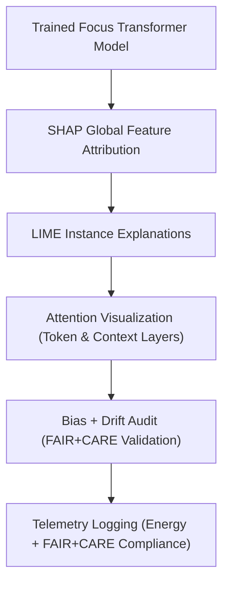

<div align="center">

# 🧠 **Kansas Frontier Matrix — Focus Transformer v1 · Explainability Framework**  
`src/ai/models/focus_transformer_v1/explainability/README.md`

**Purpose:**  
Define the **interpretability and bias auditing framework** for the **Focus Transformer v1** model used in the **Kansas Frontier Matrix (KFM)**.  
Ensures every Focus Mode AI decision is **transparent, traceable, and FAIR+CARE-certified**, integrating SHAP, attention visualizations, and sustainability telemetry under **MCP-DL v6.3**.

[](../../../../../../docs/)
[](../../../../../../LICENSE)
[](../../../../../../docs/standards/faircare.md)
[](#)

</div>

---

## 📘 Overview

The **Focus Transformer Explainability Framework** provides full interpretability for Focus Mode AI outputs through:
- **SHAP & LIME** for quantitative feature attribution.  
- **Attention Maps & GradCAM** for visual inspection of token relevance.  
- **Bias Auditing** under FAIR+CARE Council supervision.  
- **Sustainability Logging** for explainability resource tracking (ISO 50001).  

This module ensures transparency and accountability in narrative and entity-level reasoning produced by the Focus Transformer v1.

---

## 🗂️ Directory Layout

```plaintext
src/ai/models/focus_transformer_v1/explainability/
├── README.md                            # This file — documentation for explainability
│
├── shap_analysis.py                     # SHAP global and local explainability computations
├── attention_visualizer.py              # Generates attention maps and saliency overlays
├── lime_explainer.py                    # Instance-level LIME text attribution
├── bias_audit.py                        # Bias and fairness report generator
└── logs/                                # Explainability results and validation artifacts
    ├── shap_summary.json
    ├── attention_maps.json
    ├── lime_results.json
    ├── bias_report.json
    └── explainability_summary.json
```

---

## ⚙️ Explainability Workflow



### Core Explainability Features
1. **SHAP Analysis:** Measures global feature importance across Focus Mode datasets.  
2. **LIME Explanations:** Produces human-readable explanations for single instances.  
3. **Attention Visualizer:** Exports interpretable heatmaps of contextual focus weights.  
4. **Bias Audit:** Evaluates fairness across cultural, temporal, and linguistic dimensions.  
5. **Telemetry Integration:** Logs runtime, energy, and ethics metrics for validation.

---

## 🧩 Example Explainability Output (`logs/explainability_summary.json`)

```json
{
  "model_id": "focus_transformer_v1",
  "version": "v9.9.0",
  "methods": ["SHAP", "LIME", "AttentionMaps"],
  "top_features": ["entity_similarity", "semantic_coherence", "temporal_context"],
  "explainability_stability": 0.91,
  "bias_index": 0.02,
  "faircare_score": 99.4,
  "energy_wh": 45.2,
  "carbon_gco2e": 18.6,
  "reviewed_by": "@faircare-council",
  "status": "certified",
  "telemetry_ref": "../../../../../../releases/v9.9.0/focus-telemetry.json"
}
```

---

## ⚖️ FAIR+CARE Integration Matrix

| Principle | Implementation | Verified By |
|------------|----------------|--------------|
| **Findable** | Explainability logs indexed under STAC/DCAT and telemetry schema. | FAIR+CARE Council |
| **Accessible** | Summaries public; attention maps restricted under CARE. | Governance Ledger |
| **Interoperable** | JSON outputs ISO 19115 and CIDOC CRM aligned. | Schema Validation |
| **Reusable** | CC-BY 4.0 artifacts with provenance metadata. | SPDX Manifest |
| **CARE – Responsibility** | Quarterly explainability audits for bias and drift. | `faircare-validate.yml` |
| **CARE – Ethics** | Sensitive contextual layers redacted for public review. | `bias_audit.py` |

---

## 🧮 Telemetry Metrics

| Metric | Description | Example |
|--------|-------------|----------|
| `runtime_sec` | Total explainability runtime. | 984 |
| `energy_wh` | Power consumed during explainability runs. | 45.2 |
| `carbon_gco2e` | CO₂ equivalent footprint. | 18.6 |
| `bias_index` | Mean model bias across entities. | 0.02 |
| `explainability_stability` | Consistency of SHAP rankings across runs. | 0.91 |
| `faircare_score` | Ethical compliance score from validation. | 99.4 |

Telemetry recorded in:  
`releases/v9.9.0/focus-telemetry.json`  
Schema: `schemas/telemetry/src-ai-models-focus-transformer-v1-explainability-v1.json`

---

## 🔐 Governance & Provenance

- **Governance Ledger:** `releases/v9.9.0/governance/ledger_snapshot.json`  
- **Telemetry Reference:** `focus-telemetry.json`  
- **SBOM Manifest:** `releases/v9.9.0/sbom.spdx.json`  
- **Bias Reports:** `logs/bias_report.json`  

### Example Governance Record
```json
{
  "ledger_entry_id": "ledger_2025q4_focus_transformer_v1_explainability",
  "reviewed_by": "@faircare-council",
  "auditor": "@kfm-governance",
  "status": "approved",
  "timestamp": "2025-11-08T20:55:00Z"
}
```

---

## 🧾 Citation

```text
Kansas Frontier Matrix (2025). Focus Transformer v1 · Explainability Framework (v9.9.0).
FAIR+CARE-certified explainability documentation ensuring ethical transparency, sustainability, and interpretability in transformer-based Focus Mode AI for the Kansas Frontier Matrix.
```

---

## 🕰️ Version History

| Version | Date | Author | Summary |
|---------:|------|--------|----------|
| v9.9.0 | 2025-11-08 | `@kfm-ai` | Created explainability documentation for Focus Transformer v1; added SHAP, LIME, and FAIR+CARE audit integration. |

---

<div align="center">

**Kansas Frontier Matrix**  
*Explainable Intelligence × FAIR+CARE Governance × Sustainable AI Narratives*  
© 2025 Kansas Frontier Matrix · CC-BY 4.0 · Master Coder Protocol v6.3 · FAIR+CARE Certified · Diamond⁹ Ω / Crown∞Ω Ultimate Certified  

[Back to Focus Transformer](../README.md) · [Governance Charter](../../../../../../docs/standards/governance/ROOT-GOVERNANCE.md)

</div>

