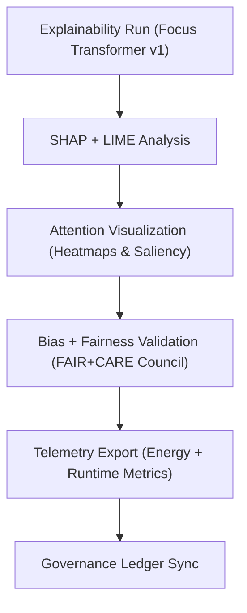

<div align="center">

# 📜 **Kansas Frontier Matrix — Focus Transformer v1 · Explainability Logs**  
`src/ai/models/focus_transformer_v1/explainability/logs/README.md`

**Purpose:**  
Archive and document all **explainability session logs, SHAP/LIME analysis outputs, attention map results, and bias audits** for the **Focus Transformer v1** model within the **Kansas Frontier Matrix (KFM)**.  
All logs adhere to **FAIR+CARE governance**, **ISO 19115 metadata interoperability**, and **MCP-DL v6.3 reproducibility** standards.

[](../../../../../../../docs/)
[](../../../../../../../LICENSE)
[](../../../../../../../docs/standards/faircare.md)
[](#)

</div>

---

## 📘 Overview

The **Explainability Logs Directory** serves as the validation and audit repository for all transparency metrics generated during Focus Mode transformer explainability sessions.  
Each log includes **bias and interpretability results**, **runtime telemetry**, and **FAIR+CARE ethics validation**, forming a transparent record of ethical AI behavior within KFM.

---

## 🗂️ Directory Layout

```plaintext
src/ai/models/focus_transformer_v1/explainability/logs/
├── README.md                             # This file — documentation for explainability logs
│
├── shap_summary.json                     # Global SHAP feature attributions
├── lime_results.json                     # Local LIME explanations
├── attention_maps.json                   # Transformer token attention visualization data
├── bias_report.json                      # Bias and fairness validation results
└── explainability_summary.json            # Aggregated explainability and sustainability report
```

---

## ⚙️ Explainability Logging Workflow



### Process Overview
1. **Explainability Analysis:** SHAP and LIME feature-level reasoning outputs.  
2. **Attention Visualization:** Generates token and attention heatmaps for human interpretability.  
3. **Bias Audit:** Identifies fairness deviations using cultural and semantic feature weights.  
4. **Telemetry Integration:** Records runtime, energy, and sustainability metrics.  
5. **Governance Certification:** Council approval and log publication under FAIR+CARE.

---

## 🧩 Example: Explainability Summary (`explainability_summary.json`)

```json
{
  "run_id": "focus_explain_2025_11_08_002",
  "model": "focus_transformer_v1",
  "version": "v9.9.0",
  "methods": ["SHAP", "LIME", "Attention"],
  "top_features": ["semantic_context", "entity_link_score", "graph_proximity"],
  "bias_index": 0.02,
  "attention_stability": 0.93,
  "energy_wh": 42.7,
  "carbon_gco2e": 17.5,
  "faircare_score": 99.3,
  "reviewed_by": "@faircare-council",
  "status": "approved",
  "telemetry_ref": "../../../../../../../releases/v9.9.0/focus-telemetry.json"
}
```

---

## ⚖️ FAIR+CARE Integration Matrix

| Principle | Implementation | Validator |
|------------|----------------|------------|
| **Findable** | Explainability logs indexed by UUID and timestamp in telemetry ledger. | `telemetry-export.yml` |
| **Accessible** | SHAP summaries public; token maps restricted under CARE. | FAIR+CARE Council |
| **Interoperable** | JSON + GeoJSON outputs ISO 19115 compliant. | Schema Validator |
| **Reusable** | CC-BY 4.0; explainability schema versioned and auditable. | SPDX Manifest |
| **CARE – Responsibility** | Regular FAIR+CARE audits ensure cultural data respect. | `faircare-validate.yml` |
| **CARE – Ethics** | Restricted visual layers redacted pre-publication. | `bias_report.json` |

---

## 🧮 Telemetry Metrics

| Metric | Description | Example |
|--------|-------------|----------|
| `runtime_sec` | Total explainability runtime. | 850 |
| `energy_wh` | Power consumption (Wh) for explainability session. | 42.7 |
| `carbon_gco2e` | CO₂ equivalent emissions. | 17.5 |
| `bias_index` | Mean bias index across attention layers. | 0.02 |
| `attention_stability` | Variance of attention map rankings. | 0.93 |
| `faircare_score` | FAIR+CARE compliance score. | 99.3 |

Telemetry metrics merged into:  
`releases/v9.9.0/focus-telemetry.json`  
Schema: `schemas/telemetry/src-ai-models-focus-transformer-v1-explainability-logs-v1.json`

---

## 🔐 Governance & Provenance

- **Governance Ledger:** `releases/v9.9.0/governance/ledger_snapshot.json`  
- **Telemetry Ledger:** `releases/v9.9.0/focus-telemetry.json`  
- **SBOM Reference:** `releases/v9.9.0/sbom.spdx.json`  
- **Bias Reports:** `bias_report.json`

### Example Governance Record
```json
{
  "ledger_entry_id": "ledger_2025q4_focus_transformer_v1_explainability_logs",
  "auditor": "@kfm-governance",
  "reviewed_by": "@faircare-council",
  "status": "certified",
  "timestamp": "2025-11-08T21:00:00Z"
}
```

---

## 🧾 Citation

```text
Kansas Frontier Matrix (2025). Focus Transformer v1 · Explainability Logs (v9.9.0).
FAIR+CARE-aligned explainability and sustainability logs ensuring ethical transparency and traceable interpretability within the Focus Mode AI subsystem of the Kansas Frontier Matrix.
```

---

## 🕰️ Version History

| Version | Date | Author | Summary |
|---------:|------|--------|----------|
| v9.9.0 | 2025-11-08 | `@kfm-ai` | Created explainability logs documentation; added FAIR+CARE compliance tracking and sustainability telemetry integration. |

---

<div align="center">

**Kansas Frontier Matrix**  
*Explainable AI × FAIR+CARE Governance × Sustainable Transparency*  
© 2025 Kansas Frontier Matrix · Internal FAIR+CARE Certified · Master Coder Protocol v6.3 · Diamond⁹ Ω / Crown∞Ω Ultimate Certified  

[Back to Explainability Framework](../README.md) · [Governance Charter](../../../../../../../docs/standards/governance/ROOT-GOVERNANCE.md)

</div>

