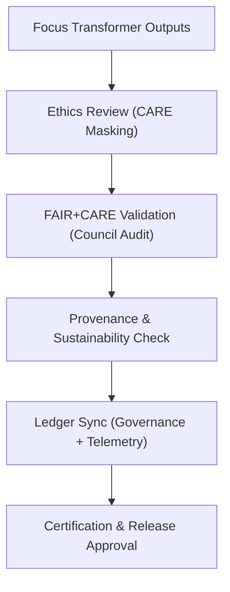

<div align="center">

# ⚖️ **Kansas Frontier Matrix — Focus Transformer v1 · Governance Framework**  
`src/ai/models/focus_transformer_v1/governance/README.md`

**Purpose:**  
Outline the **ethical oversight, compliance validation, and FAIR+CARE audit framework** for the **Focus Transformer v1** model in the **Kansas Frontier Matrix (KFM)**.  
This governance layer ensures that every transformer operation and output adheres to **FAIR+CARE**, **ISO 19115**, and **ISO 50001** principles under **MCP-DL v6.3** reproducibility standards.

[](../../../../../../docs/)
[](../../../../../../LICENSE)
[](../../../../../../docs/standards/faircare.md)
[](#)

</div>

---

## 📘 Overview

The **Focus Transformer v1 Governance Framework** defines KFM’s ethical and operational safeguards for large-scale, transformer-based narrative generation.  
It governs cultural data use, sustainability tracking, and transparency for every Focus Mode AI interaction.

Governance functions include:
- **Ethical data governance** and CARE-tag enforcement for restricted content.  
- **Sustainability auditing** using ISO 50001 energy and emission metrics.  
- **FAIR+CARE Council review** and certification of all model releases.  
- **Provenance and ledger registration** for traceable decision-making.  

---

## 🗂️ Directory Layout

```plaintext
src/ai/models/focus_transformer_v1/governance/
├── README.md                             # This file — governance framework documentation
│
├── governance_validation.json            # FAIR+CARE and ethics audit certification record
├── care_masking_report.json              # Cultural and sensitive data redaction documentation
├── council_audit_summary.json            # Council-level review and oversight records
├── provenance_trace.json                 # PROV-O lineage record for datasets and outputs
├── ledger_sync_log.json                  # Governance Ledger synchronization events
└── sustainability_report.json            # Energy and carbon footprint audit report
```

---

## ⚙️ Governance Workflow



### Key Stages
1. **Ethics Review:** Identifies and redacts restricted cultural content.  
2. **FAIR+CARE Validation:** Conducts formal Council audit and ethics compliance review.  
3. **Provenance Verification:** Confirms data lineage and metadata accuracy under PROV-O.  
4. **Sustainability Audit:** Logs energy, carbon, and bias metrics for transparency.  
5. **Ledger Registration:** Records certification results into Governance and Telemetry Ledgers.  

---

## 🧩 Example: Governance Validation Record (`governance_validation.json`)

```json
{
  "governance_id": "gov_focus_transformer_v1_2025_11_08_001",
  "workflow": "focus_transformer_v1_audit_v9.9.0",
  "datasets_reviewed": 4,
  "faircare_score": 99.4,
  "bias_index": 0.02,
  "energy_wh": 3750.4,
  "carbon_gco2e": 1550.2,
  "ethics_status": "approved",
  "reviewed_by": "@faircare-council",
  "auditor": "@kfm-governance",
  "timestamp": "2025-11-08T21:02:00Z",
  "telemetry_ref": "../../../../../../releases/v9.9.0/focus-telemetry.json"
}
```

---

## ⚖️ FAIR+CARE Compliance Matrix

| Principle | Implementation | Validation Reference |
|------------|----------------|-----------------------|
| **Findable** | Governance artifacts indexed in SBOM manifest and Ledger. | `manifest_ref` |
| **Accessible** | Public ethics reports; restricted cultural datasets under CARE. | FAIR+CARE Council |
| **Interoperable** | Metadata aligned with CIDOC CRM + PROV-O ontologies. | `provenance_trace.json` |
| **Reusable** | Open governance structure and telemetry schema. | SPDX Manifest |
| **CARE – Responsibility** | Quarterly reviews on bias, energy, and ethics metrics. | `faircare-validate.yml` |
| **CARE – Ethics** | CARE masking report verifies redacted cultural knowledge. | `care_masking_report.json` |

---

## 🧮 Sustainability Metrics (`sustainability_report.json`)

| Metric | Description | Example |
|--------|-------------|----------|
| `energy_wh` | Power consumption across all model operations. | 3750.4 |
| `carbon_gco2e` | CO₂ equivalent emissions. | 1550.2 |
| `runtime_min` | Total runtime measured during training and audit. | 720 |
| `faircare_score` | Combined ethical compliance rating. | 99.4 |
| `status` | Council certification outcome. | certified |

Telemetry linked to:  
`releases/v9.9.0/focus-telemetry.json`  
Schema: `schemas/telemetry/src-ai-models-focus-transformer-v1-governance-v1.json`

---

## 🔐 Provenance & Governance Integration

- **Governance Ledger:** `releases/v9.9.0/governance/ledger_snapshot.json`  
- **Telemetry Reference:** `focus-telemetry.json`  
- **SBOM Manifest:** `releases/v9.9.0/sbom.spdx.json`  
- **FAIR+CARE Validation:** `governance_validation.json`

### Example Provenance Record
```json
{
  "artifact_id": "focus_transformer_v1",
  "linked_inputs": [
    "datasets/focus_cultural_texts.json",
    "datasets/focus_graph_embeddings.npy"
  ],
  "linked_outputs": [
    "explainability/logs/explainability_summary.json",
    "outputs/focusmode_narrative.json"
  ],
  "auditor": "@kfm-governance",
  "approved_by": "@faircare-council",
  "status": "certified",
  "timestamp": "2025-11-08T21:03:00Z"
}
```

---

## 🧾 Citation

```text
Kansas Frontier Matrix (2025). Focus Transformer v1 · Governance Framework (v9.9.0).
Defines FAIR+CARE-compliant governance protocols, sustainability metrics, and ethical audit validation for the Focus Mode AI transformer in the Kansas Frontier Matrix.
```

---

## 🕰️ Version History

| Version | Date | Author | Summary |
|---------:|------|--------|----------|
| v9.9.0 | 2025-11-08 | `@kfm-governance` | Created governance documentation for Focus Transformer v1; added ethics, sustainability, and provenance audit integration. |

---

<div align="center">

**Kansas Frontier Matrix**  
*Responsible AI × FAIR+CARE Certification × Sustainable Cultural Intelligence*  
© 2025 Kansas Frontier Matrix · CC-BY 4.0 · Master Coder Protocol v6.3 · FAIR+CARE Certified · Diamond⁹ Ω / Crown∞Ω Ultimate Certified  

[Back to Focus Transformer](../README.md) · [Governance Charter](../../../../../../docs/standards/governance/ROOT-GOVERNANCE.md)

</div>

