<div align="center">

# ⚖️ **Kansas Frontier Matrix — Focus Transformer v1 · Governance Framework**  
`src/ai/models/focus_transformer_v1/governance/README.md`

**Purpose:**  
Define the **FAIR+CARE-aligned ethical governance, audit, and compliance structure** for the **Focus Transformer v1** model within the **Kansas Frontier Matrix (KFM)**.  
This governance module enforces transparency, sustainability, and reproducibility per **ISO 19115**, **ISO 50001**, and **MCP-DL v6.3** standards, ensuring Focus Mode AI operates with integrity and accountability.

[](../../../../../../docs/)
[](../../../../../../LICENSE)
[](../../../../../../docs/standards/faircare.md)
[](#)

</div>

---

## 📘 Overview

The **Focus Transformer v1 Governance Framework** establishes the ethical backbone of KFM’s transformer-based contextual reasoning system.  
It governs data use, explainability reviews, energy accountability, and governance ledger registration across all transformer operations.

Governance objectives:
- ⚖️ Enforce **FAIR+CARE Council** ethical oversight.  
- 🔍 Validate provenance and sustainability telemetry.  
- 🧩 Certify cultural and environmental data under CARE tags.  
- ♻️ Ensure low-carbon, energy-efficient AI workflows.  
- 🧾 Synchronize results to FAIR+CARE and ISO-ledger frameworks.

---

## 🗂️ Directory Layout

```plaintext
src/ai/models/focus_transformer_v1/governance/
├── README.md                             # This file — governance documentation
│
├── model_card.md                         # FAIR+CARE-certified model card and performance record
├── governance_validation.json             # FAIR+CARE and sustainability audit results
├── care_masking_report.json               # Sensitive data redaction validation
├── council_audit_summary.json             # Summary of FAIR+CARE Council review
├── provenance_trace.json                  # PROV-O compliant data lineage chain
├── ledger_sync_log.json                   # Governance ledger synchronization history
└── sustainability_report.json             # ISO 50001 sustainability and energy metrics
```

---

## ⚙️ Governance Workflow

```mermaid
flowchart TD
  A["Focus Transformer Model Output"] --> B["CARE Tag & Redaction Check"]
  B --> C["FAIR+CARE Validation · Ethics Audit"]
  C --> D["Provenance Trace & Sustainability Assessment"]
  D --> E["Governance Ledger + Telemetry Synchronization"]
  E --> F["Council Certification · Release Approval"]
```



### Workflow Summary
1. **CARE Validation:** Ensures restricted data masking and redaction before publication.  
2. **Ethics Review:** Reviews AI-generated narratives for cultural sensitivity.  
3. **Provenance Trace:** Links data lineage from raw input → transformer → output.  
4. **Sustainability Audit:** Records energy and carbon metrics for ISO 50001 compliance.  
5. **Ledger Sync:** Logs certified results to FAIR+CARE and telemetry governance systems.

---

## 🧩 Example Governance Record (`governance_validation.json`)

```json
{
  "governance_id": "gov_focus_transformer_v1_2025_11_08",
  "workflow": "focus_transformer_v1_audit_v9.9.0",
  "datasets_reviewed": 5,
  "models_validated": 1,
  "faircare_score": 99.4,
  "bias_index": 0.02,
  "energy_wh": 3750.4,
  "carbon_gco2e": 1550.2,
  "ethics_status": "certified",
  "reviewed_by": "@faircare-council",
  "auditor": "@kfm-governance",
  "timestamp": "2025-11-08T21:04:00Z",
  "telemetry_ref": "../../../../../../releases/v9.9.0/focus-telemetry.json"
}
```

---

## ⚖️ FAIR+CARE & ISO Compliance Matrix

| Principle | Implementation | Validation Reference |
|------------|----------------|-----------------------|
| **Findable** | Governance and telemetry entries UUID-registered in SBOM manifest. | `manifest_ref` |
| **Accessible** | Certified model cards and audit reports publicly released. | `model_card.md` |
| **Interoperable** | Metadata follows PROV-O and CIDOC CRM ontologies. | `provenance_trace.json` |
| **Reusable** | All governance logs open-licensed and reproducible. | SPDX Manifest |
| **CARE – Responsibility** | Regular FAIR+CARE Council oversight with energy audit. | `council_audit_summary.json` |
| **CARE – Ethics** | CARE tagging ensures sensitive content remains masked. | `care_masking_report.json` |

---

## 🧮 Sustainability Metrics (`sustainability_report.json`)

| Metric | Description | Example |
|--------|-------------|----------|
| `energy_wh` | Total transformer energy usage. | 3750.4 |
| `carbon_gco2e` | CO₂ equivalent emissions from transformer operations. | 1550.2 |
| `runtime_min` | Model runtime duration (training + audit). | 720 |
| `faircare_score` | Composite FAIR+CARE compliance percentage. | 99.4 |
| `ethics_status` | Council review result. | certified |

Telemetry recorded in:  
`releases/v9.9.0/focus-telemetry.json`  
Schema: `schemas/telemetry/src-ai-models-focus-transformer-v1-governance-v1.json`

---

## 🔐 Provenance & Governance Integration

- **Governance Ledger:** `releases/v9.9.0/governance/ledger_snapshot.json`  
- **Telemetry Ledger:** `releases/v9.9.0/focus-telemetry.json`  
- **SBOM Manifest:** `releases/v9.9.0/sbom.spdx.json`  
- **FAIR+CARE Validation:** `governance_validation.json`
- **Model Card:** `model_card.md`

### Example Provenance Trace
```json
{
  "artifact_id": "focus_transformer_v1",
  "linked_inputs": [
    "datasets/focus_cultural_texts.json",
    "datasets/focus_graph_embeddings.npy"
  ],
  "linked_outputs": [
    "explainability/logs/explainability_summary.json",
    "outputs/focusmode_narrative.json"
  ],
  "auditor": "@kfm-governance",
  "approved_by": "@faircare-council",
  "status": "certified",
  "timestamp": "2025-11-08T21:05:00Z"
}
```

---

## 🧾 Citation

```text
Kansas Frontier Matrix (2025). Focus Transformer v1 · Governance Framework (v9.9.0).
FAIR+CARE-certified and ISO-aligned governance documentation ensuring ethical transparency, reproducibility, and sustainability in Focus Mode transformer operations.
```

---

## 🕰️ Version History

| Version | Date | Author | Summary |
|---------:|------|--------|----------|
| v9.9.0 | 2025-11-08 | `@kfm-governance` | Updated Focus Transformer governance directory to include model_card.md and enhanced provenance references. |

---

<div align="center">

**Kansas Frontier Matrix**  
*Governed AI × FAIR+CARE Ethics × Sustainable Intelligence*  
© 2025 Kansas Frontier Matrix · CC-BY 4.0 · Master Coder Protocol v6.3 · FAIR+CARE Certified · Diamond⁹ Ω / Crown∞Ω Ultimate Certified  

[Back to Focus Transformer](../README.md) · [Model Card](model_card.md) · [Governance Charter](../../../../../../docs/standards/governance/ROOT-GOVERNANCE.md)

</div>
