<div align="center">

# ⚖️ Kansas Frontier Matrix — **Focus Transformer v1 Governance & Ethics Module**
`src/ai/models/focus_transformer_v1/governance/README.md`

**Purpose:** Documents the ethics validation, provenance linkage, and FAIR+CARE governance integration for the **Focus Transformer v1** model.  
Ensures every model action, inference, and update adheres to transparent, ethical, and reproducible AI governance principles in alignment with FAIR+CARE, MCP-DL, and ISO standards.

[](../../../../../../.github/workflows/governance-validate.yml)  
[](../../../../../../docs/standards/faircare-validation.md)  
[](../../../../../../docs/architecture/repo-focus.md)

</div>

---

## 📚 Overview

The **Governance Module** for Focus Transformer v1 provides traceability, ethical validation, and immutable provenance for all aspects of the model lifecycle — including training, inference, explainability, and bias auditing.  
It enforces MCP-DL documentation standards, FAIR+CARE ethical governance, and digital lineage integration with the Immutable Governance Ledger.

**Core Objectives:**
- ⚖️ Ensure ethical AI operation under FAIR+CARE and ISO 23894 guidelines  
- 🧠 Record and audit model metadata, explainability reports, and telemetry  
- 🔍 Maintain reproducible lineage of datasets, outputs, and configurations  
- 🧾 Generate governance and bias validation reports for public transparency  
- 🔗 Synchronize all audits and telemetry with the Immutable Governance Ledger  

---

## 🗂️ Directory Layout

```plaintext
src/ai/models/focus_transformer_v1/governance/
├── README.md                     # This file — documentation for AI ethics and governance module
│
├── bias_audit.json               # FAIR+CARE-aligned bias and ethics audit results
├── checksum_record.json          # File-level SHA-256 digests and verification metadata
├── lineage_ref.json              # Provenance chain reference linking AI model outputs to the governance ledger
├── license.txt                   # SPDX-aligned license and reuse policy
└── ethics_review.json            # CARE principle evaluation and AI ethics scoring
```

**File Descriptions:**

- **`bias_audit.json`** — Reports on model fairness, representational balance, and CARE-compliance for Focus Mode outputs.  
  Evaluates bias by region, topic, and linguistic diversity.  

- **`checksum_record.json`** — Contains SHA-256 checksums for every model artifact (weights, tokenizer, explainability logs).  
  Ensures reproducibility and data integrity.  

- **`lineage_ref.json`** — Provides linkage between training, inference, and explainability processes, maintaining a JSON-LD provenance chain compatible with the Immutable Governance Ledger.  

- **`license.txt`** — Declares model licensing and attribution per SPDX v2.3 standards.  

- **`ethics_review.json`** — Quantitative and qualitative assessment of CARE principles (Collective Benefit, Authority, Responsibility, Ethics).  

---

## ⚙️ Example Workflows

### ⚖️ Run FAIR+CARE Bias Audit
```bash
python src/governance/validators/faircare_validate.py \
  --input src/ai/models/focus_transformer_v1/governance/bias_audit.json \
  --output reports/fair/ai-bias-validation.json
```

### 🔗 Register Model Lineage
```bash
python src/governance/lineage/provenance_linker.py \
  --input src/ai/models/focus_transformer_v1/governance/lineage_ref.json \
  --output reports/audit/ai-model-lineage.json
```

### 🧾 Update Immutable Governance Ledger
```bash
python src/governance/lineage/ledger_sync.py \
  --input reports/audit/ai-model-lineage.json \
  --output reports/audit/governance-ledger.json
```

### 🧠 Ethics Compliance Review
```bash
python src/governance/audit/report_builder.py \
  --input src/ai/models/focus_transformer_v1/governance/ethics_review.json \
  --output reports/audit/ai-ethics-summary.json
```

---

## 🧩 Governance Integration Workflow

```mermaid
flowchart TD
    A["Model Training & Evaluation"] --> B["Bias Audit & Ethics Review"]
    B --> C["Lineage Registration (Checksum + Provenance)"]
    C --> D["Immutable Governance Ledger Sync"]
    D --> E["FAIR+CARE Dashboard · Transparency Portal"]
```



**Workflow Summary:**
1. Model lifecycle events (training, explainability, telemetry) validated under FAIR+CARE.  
2. Bias and ethics reports generated and attached to governance records.  
3. Provenance and checksum metadata linked through JSON-LD chain.  
4. Immutable Governance Ledger updated for traceable AI accountability.  

---

## 🧠 FAIR+CARE Integration

| Governance Artifact | Description | FAIR+CARE Dimension | Output |
|----------------------|--------------|----------------------|---------|
| `bias_audit.json` | Bias detection and ethical balance audit | Responsibility, Ethics | `reports/fair/ai-bias-validation.json` |
| `ethics_review.json` | CARE Principle evaluation for social benefit and inclusivity | Collective Benefit, Authority | `reports/audit/ai-ethics-summary.json` |
| `lineage_ref.json` | Provenance link between training, outputs, and governance ledger | Transparency, Reproducibility | `reports/audit/ai-model-lineage.json` |
| `checksum_record.json` | File-level integrity validation via SHA-256 | Accountability, Integrity | `reports/audit/checksum-verification.json` |

Governance synchronization ensures:
```
reports/audit/governance-ledger.json
releases/v9.4.0/focus-telemetry.json
```

---

## 🧩 Ethics & Bias Scoring Example (bias_audit.json)

```json
{
  "model_id": "focus_transformer_v1",
  "version": "1.0.3",
  "bias_score": 0.021,
  "fairness_index": 0.98,
  "ethics_alignment": {
    "collective_benefit": 0.95,
    "authority_to_control": 0.96,
    "responsibility": 0.93,
    "ethics": 0.97
  },
  "validated_by": "faircare-validate.yml",
  "timestamp": "2025-11-02T00:00:00Z",
  "checksum_sha256": "e9a1c23f8c9b6f29d1b12b9e2a53aa68f05f28b9a4ce42f2e6a57bc1b1a86d5a",
  "status": "active"
}
```

---

## 🧩 Standards Alignment

| Standard | Purpose | Implementation |
|-----------|----------|----------------|
| **MCP-DL v6.4.3** | Documentation-first AI ethics integration | This README + bias_audit.json |
| **FAIR+CARE** | Ethical governance and transparency validation | All JSON artifacts + FAIR+CARE scorecard |
| **ISO 23894** | AI governance and lifecycle risk management | Drift, bias, and ethics tracking |
| **IEEE 7007** | Ontological transparency in AI systems | JSON-LD provenance and explainability |
| **SPDX 2.3** | License traceability and open-data compliance | `license.txt` |
| **CIDOC CRM / DCAT** | Provenance and heritage data interoperability | `lineage_ref.json` export schema |

---

## 🛡️ Security, Provenance & Observability

- **Integrity:** All governance artifacts checksum-verified using SHA-256.  
- **Provenance:** Governance data linked through JSON-LD and DCAT exports.  
- **Reproducibility:** Bias, ethics, and lineage audits repeatable via governance workflows.  
- **Telemetry:** All governance events appended to Immutable Ledger for traceability.  

Telemetry Schema:  
`schemas/telemetry/ai-pipelines-v1.json`

Telemetry Outputs:
```
reports/audit/ai-governance-events.json
releases/v9.4.0/focus-telemetry.json
```

---

## 🧾 Version History

| Version | Date | Author | Summary |
|----------|------|---------|----------|
| v1.0.3 | 2025-11-02 | @kfm-governance | Added directory layout, FAIR+CARE bias and ethics audit details, and governance ledger linkage. |
| v1.0.2 | 2025-10-30 | @kfm-ethics | Expanded CARE Principle scoring and provenance chain mapping. |
| v1.0.1 | 2025-10-28 | @bartytime4life | Integrated license traceability and checksum verification pipeline. |
| v1.0.0 | 2025-10-25 | @kfm-ai | Established governance submodule for Focus Transformer v1 under MCP-DL v6.4.3. |

---

<div align="center">

**Kansas Frontier Matrix — Immutable AI Governance for Ethical Transparency**  
*“Every model accountable. Every ledger permanent. Every decision explainable.”* 🔗  
📍 `src/ai/models/focus_transformer_v1/governance/README.md` — FAIR+CARE-certified documentation for the governance and ethics subsystem of Focus Transformer v1.

</div>
