<div align="center">

# 📜 **Kansas Frontier Matrix — Model Card: Focus Transformer v1**  
`src/ai/models/focus_transformer_v1/governance/model_card.md`

**Purpose:**  
Provide a comprehensive, FAIR+CARE-aligned **Model Card** for the **Focus Transformer v1** model used in the **Kansas Frontier Matrix (KFM)**.  
This document records the model’s purpose, performance, governance compliance, and sustainability metrics under **MCP-DL v6.3**, ensuring full transparency and ethical oversight.

[](../../../../../../docs/)
[](../../../../../../LICENSE)
[](../../../../../../docs/standards/faircare.md)
[](#)

</div>

---

## 🧠 Model Overview

| Field | Description |
|-------|-------------|
| **Model Name** | Focus Transformer v1 |
| **Developer** | Kansas Frontier Matrix AI Division |
| **Framework** | PyTorch + HuggingFace Transformers |
| **Purpose** | Generate ethical, contextual, and explainable AI narratives in Focus Mode. |
| **Version** | v9.9.0 |
| **Architecture** | Multi-modal transformer with graph + text attention fusion. |
| **Reviewer** | @faircare-council |
| **License** | MIT (code) / CC-BY 4.0 (outputs) |
| **CARE Tag** | Restricted |
| **Approval Status** | Certified · FAIR+CARE Approved |
| **Telemetry Reference** | `releases/v9.9.0/focus-telemetry.json` |

---

## 🧩 Intended Use

- Synthesize context-aware narratives within Focus Mode UI.  
- Summarize and interpret data across historical, geospatial, and textual sources.  
- Enhance cultural data transparency while preserving ethical restrictions.  

### ✅ Appropriate Use
- FAIR+CARE-compliant cultural heritage summarization.  
- Academic, heritage, or research visualization contexts.  

### ⚠️ Limitations
- Not for use in automated decision-making about individuals or communities.  
- Restricted datasets may yield generalized or masked summaries.  
- Requires FAIR+CARE Council review for public dissemination.

---

## 🗂️ Training Data Summary

| Data Type | Description | FAIR+CARE Tag | Source |
|------------|--------------|----------------|--------|
| Graph Embeddings | Entity vectors from Neo4j cultural graph. | Restricted | KFM Graph API |
| Text Corpus | Curated cultural narratives and archives. | Restricted | KHS + KFM Archives |
| Metadata | STAC/DCAT provenance records. | Public | KFM STAC Registry |
| Explainability Samples | SHAP and attention-weight validation data. | Restricted | Internal Evaluation |

---

## ⚙️ Model Architecture

```mermaid
flowchart TD
  A["Graph & Text Inputs"] --> B["Multi-Modal Encoder (Attention Fusion)"]
  B --> C["Transformer Layers (24x · 16 Heads)"]
  C --> D["Ethics Filter (CARE Masking Layer)"]
  D --> E["Context Decoder (Narrative Generator)"]
  E --> F["Focus Mode Outputs + Telemetry Logging"]
```



---

## 📊 Performance Metrics

| Metric | Value | Description |
|--------|-------|-------------|
| Accuracy | 98.4% | Weighted validation accuracy |
| F1 Score | 0.942 | Model performance stability |
| Bias Index | 0.02 | Bias detection metric |
| Explainability Stability | 0.91 | Attention-weight variance consistency |
| FAIR+CARE Score | 99.4% | Governance audit compliance |
| Energy (Wh) | 3750.4 | ISO 50001 telemetry record |
| Carbon Output (gCO₂e) | 1550.2 | Sustainability footprint |
| Drift Flag | False | Model stability under temporal testing |

---

## ⚖️ FAIR+CARE Governance Matrix

| Principle | Implementation | Verification |
|------------|----------------|---------------|
| **Findable** | Metadata stored in SBOM manifest and STAC registry. | SPDX Manifest |
| **Accessible** | FAIR+CARE-compliant open model card; restricted weights. | `governance_validation.json` |
| **Interoperable** | CIDOC CRM + PROV-O metadata alignment. | `provenance_trace.json` |
| **Reusable** | Open licensing; versioned documentation. | `manifest_ref` |
| **CARE – Collective Benefit** | Model supports cultural education and heritage preservation. | `care_masking_report.json` |
| **CARE – Authority to Control** | FAIR+CARE Council regulates Focus Mode access. | Governance Ledger |
| **CARE – Responsibility** | Logs energy, bias, and audit telemetry. | `focus-telemetry.json` |
| **CARE – Ethics** | Masks sacred and restricted data prior to generation. | `governance_validation.json` |

---

## 🧮 Telemetry & Sustainability Metrics

| Metric | Target | Result | Verified By |
|--------|--------|--------|--------------|
| Energy (Wh) | ≤ 4000 | 3750.4 | ISO 50001 Audit |
| Carbon (gCO₂e) | ≤ 1600 | 1550.2 | FAIR+CARE Council |
| Runtime (min) | — | 720 | Telemetry |
| FAIR+CARE Score | ≥ 95% | 99.4% | Governance Audit |
| Ethics Violations | 0 | 0 | Governance Ledger |

---

## 🧠 Cultural Ethics Review Summary

- **Sensitive content** filtered through CARE masking module.  
- **Restricted data** generalized before narrative output.  
- **Audited and approved** by FAIR+CARE Council, 2025-Q4.  
- **Compliance tags** embedded in transformer output metadata.  

---

## 🔐 Provenance & Governance

- **Governance Ledger:** `releases/v9.9.0/governance/ledger_snapshot.json`  
- **Telemetry Ledger:** `releases/v9.9.0/focus-telemetry.json`  
- **SBOM Reference:** `releases/v9.9.0/sbom.spdx.json`  
- **CARE Audit Log:** `care_masking_report.json`  

### Example Ledger Record
```json
{
  "ledger_id": "ledger_2025q4_focus_transformer_v1_modelcard",
  "approved_by": "@faircare-council",
  "auditor": "@kfm-governance",
  "status": "certified",
  "timestamp": "2025-11-08T21:05:00Z"
}
```

---

## 🧾 Citation

```text
Kansas Frontier Matrix (2025). Model Card: Focus Transformer v1 (v9.9.0).
FAIR+CARE-certified, ISO-aligned model documentation ensuring ethical transparency, cultural respect, and sustainability in Focus Mode AI systems.
```

---

## 🕰️ Version History

| Version | Date | Author | Summary |
|---------:|------|--------|----------|
| v9.9.0 | 2025-11-08 | `@kfm-governance` | Created FAIR+CARE model card for Focus Transformer v1; added sustainability metrics and ethics compliance integration. |

---

<div align="center">

**Kansas Frontier Matrix**  
*Ethical AI × FAIR+CARE Certification × Sustainable Data Governance*  
© 2025 Kansas Frontier Matrix · CC-BY 4.0 · Master Coder Protocol v6.3 · FAIR+CARE Certified · Diamond⁹ Ω / Crown∞Ω Ultimate Certified  

[Back to Governance Framework](../README.md) · [Governance Charter](../../../../../../docs/standards/governance/ROOT-GOVERNANCE.md)

</div>

