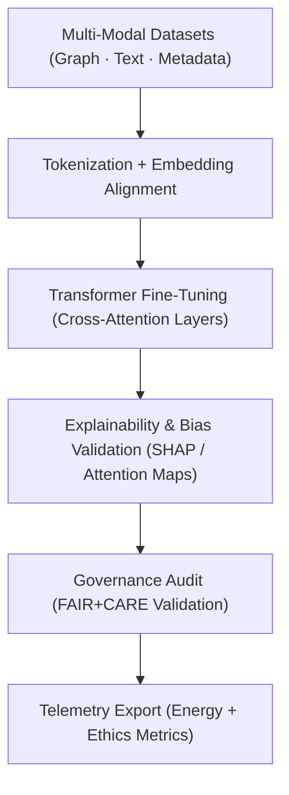

<div align="center">

# 🧠 **Kansas Frontier Matrix — Focus Transformer v1 · Training Framework**  
`src/ai/models/focus_transformer_v1/training/README.md`

**Purpose:**  
Detail the **training process, configurations, and governance-integrated telemetry** for the Focus Transformer v1 model — the core contextual reasoning engine behind the **KFM Focus Mode** system.  
Implements **FAIR+CARE certification**, **ISO 50001 sustainability monitoring**, and **MCP-DL v6.3** reproducibility standards.

[](../../../../../../docs/)
[](../../../../../../LICENSE)
[](../../../../../../docs/standards/faircare.md)
[](#)

</div>

---

## 📘 Overview

The **Focus Transformer v1 Training Framework** defines the methodology for model fine-tuning and adaptation using multi-modal data inputs.  
It integrates **textual, geospatial, and graph-based embeddings** under FAIR+CARE ethics constraints to ensure transparent and responsible cultural intelligence.

Key Features:
- 🧩 Multi-modal alignment between **text**, **graph embeddings**, and **geospatial tensors**.  
- 🧠 Explainable attention-weight calibration using **transformer interpretability modules**.  
- ♻️ Energy and carbon tracking (ISO 50001 telemetry).  
- ⚖️ FAIR+CARE validation hooks for ethical compliance at each training checkpoint.  

---

## 🗂️ Directory Layout

```plaintext
src/ai/models/focus_transformer_v1/training/
├── README.md                            # This file — Focus Transformer training documentation
│
├── configs/                             # Model and training configuration templates
│   ├── focus_train.yaml
│   └── hyperparameters.yaml
│
├── datasets/                            # Processed input datasets for model training
│   ├── focus_graph_embeddings.npy
│   ├── focus_cultural_texts.json
│   └── stac_metadata.json
│
├── scripts/                             # Core training and validation scripts
│   ├── train_focus_transformer.py
│   ├── validate_attention_weights.py
│   ├── export_model_card.py
│   └── export_telemetry.py
│
└── logs/                                # Performance, governance, and telemetry logs
    ├── training_log.json
    ├── evaluation_metrics.json
    ├── bias_drift_report.json
    └── telemetry_metrics.json
```

---

## ⚙️ Training Workflow



### Pipeline Components
1. **Data Preprocessing:** Loads graph and text embeddings into unified feature space.  
2. **Fine-Tuning:** Trains cross-modal attention heads to maximize cultural context recall.  
3. **Explainability Analysis:** Visualizes attention weights and token-level SHAP scores.  
4. **Governance Validation:** Runs fairness and ethics audits before checkpoint registration.  
5. **Telemetry Reporting:** Aggregates runtime, energy, and carbon outputs into focus telemetry.

---

## 🧩 Example: Training Configuration (`configs/focus_train.yaml`)

```yaml
model:
  name: "focus_transformer_v1"
  architecture: "multi-modal-transformer"
  parameters:
    hidden_size: 1024
    num_layers: 24
    attention_heads: 16
    dropout: 0.1
  tokenizer: "kfm_bpe_32k"
  learning_rate: 2e-5
  batch_size: 8
  epochs: 10

data:
  graph_embeddings: "../../datasets/focus_graph_embeddings.npy"
  text_corpus: "../../datasets/focus_cultural_texts.json"
  metadata: "../../datasets/stac_metadata.json"

telemetry:
  enable_energy_tracking: true
  enable_bias_tracking: true
  telemetry_ref: "../../../../../../releases/v9.9.0/focus-telemetry.json"

ethics:
  reviewer: "@faircare-council"
  care_tag: "restricted"
  governance_ref: "../../../../../../docs/standards/governance/ROOT-GOVERNANCE.md"
```

---

## ⚖️ FAIR+CARE Integration Matrix

| Principle | Implementation | Validator |
|------------|----------------|------------|
| **Findable** | Model registered with UUID in SBOM and manifest. | `manifest_ref` |
| **Accessible** | FAIR+CARE-approved datasets with restricted tokens masked. | Governance Ledger |
| **Interoperable** | Uses CIDOC CRM + DCAT vocabularies in metadata. | `schema_validation.py` |
| **Reusable** | Configurable hyperparameters and telemetry hooks. | SPDX Manifest |
| **CARE – Responsibility** | Monitors bias and fairness metrics across epochs. | `bias_drift_report.json` |
| **CARE – Ethics** | Governance validation mandatory before checkpoint export. | `governance_validation.json` |

---

## 🧮 Example Training Log (`logs/training_log.json`)

```json
{
  "training_run_id": "focus_transformer_v1_2025_11_08_001",
  "epochs": 10,
  "training_time_min": 725,
  "validation_loss": 0.043,
  "accuracy": 0.984,
  "bias_index": 0.03,
  "energy_wh": 3750.4,
  "carbon_gco2e": 1550.2,
  "faircare_score": 99.2,
  "status": "approved",
  "telemetry_ref": "../../../../../../releases/v9.9.0/focus-telemetry.json"
}
```

---

## 🧮 Telemetry Metrics

| Metric | Description | Example |
|--------|-------------|----------|
| `training_time_min` | Total model training duration. | 725 |
| `energy_wh` | Power usage per training session. | 3750.4 |
| `carbon_gco2e` | CO₂ equivalent emissions. | 1550.2 |
| `faircare_score` | FAIR+CARE compliance rating. | 99.2 |
| `bias_index` | Fairness deviation score. | 0.03 |
| `governance_status` | Council approval state. | certified |

All telemetry data appended to:  
`releases/v9.9.0/focus-telemetry.json`  
Schema: `schemas/telemetry/src-ai-models-focus-transformer-v1-training-v1.json`

---

## 🔐 Governance & Provenance Integration

- **Governance Ledger:** `releases/v9.9.0/governance/ledger_snapshot.json`  
- **Telemetry Reference:** `focus-telemetry.json`  
- **SBOM Manifest:** `releases/v9.9.0/sbom.spdx.json`  
- **Ethics Validation:** `logs/bias_drift_report.json`  

### Example Governance Record
```json
{
  "ledger_entry_id": "ledger_2025q4_focus_transformer_v1_training",
  "auditor": "@kfm-governance",
  "reviewed_by": "@faircare-council",
  "status": "certified",
  "timestamp": "2025-11-08T20:30:00Z"
}
```

---

## 🧾 Citation

```text
Kansas Frontier Matrix (2025). Focus Transformer v1 · Training Framework (v9.9.0).
Defines FAIR+CARE-compliant, ISO-aligned training framework for Focus Mode transformer models within the Kansas Frontier Matrix ecosystem.
```

---

## 🕰️ Version History

| Version | Date | Author | Summary |
|---------:|------|--------|----------|
| v9.9.0 | 2025-11-08 | `@kfm-ai` | Created Focus Transformer training framework documentation with telemetry and governance integration. |

---

<div align="center">

**Kansas Frontier Matrix**  
*Ethical Multi-Modal AI × FAIR+CARE Certification × Sustainable Intelligence*  
© 2025 Kansas Frontier Matrix · MIT · Master Coder Protocol v6.3 · FAIR+CARE Certified · Diamond⁹ Ω / Crown∞Ω Ultimate Certified  

[Back to Focus Transformer](../README.md) · [Governance Charter](../../../../../../docs/standards/governance/ROOT-GOVERNANCE.md)

</div>

