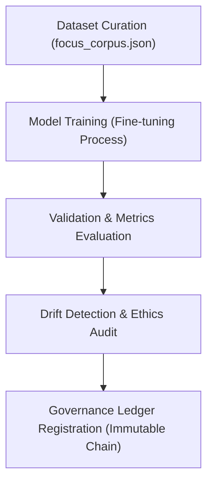

<div align="center">

# 🏋️ Kansas Frontier Matrix — **Focus Transformer v1 Training & Evaluation Module**
`src/ai/models/focus_transformer_v1/training/README.md`

**Purpose:** Describes the complete model training, evaluation, and ethics validation workflow for Focus Transformer v1.  
Implements reproducible AI development with integrated FAIR+CARE auditing, telemetry logging, and governance synchronization to ensure transparency and accountability at every stage of model creation.

[](../../../../../../.github/workflows/ai-train.yml)  
[](../../../../../../docs/standards/faircare-validation.md)  
[](../../../../../../docs/architecture/repo-focus.md)

</div>

---

## 📚 Overview

The **Training Module** governs the end-to-end development of Focus Transformer v1, from dataset preparation and fine-tuning through validation, evaluation, and ethics auditing.  
It ensures every training run adheres to FAIR+CARE principles, uses verifiable data sources, and logs provenance metadata to the Immutable Governance Ledger.

**Core Objectives:**
- 🧩 Fine-tune Focus Transformer on curated Kansas historical corpora  
- 🧠 Evaluate performance, bias, and confidence metrics ethically  
- ⚖️ Record lineage and dataset provenance for reproducibility  
- 🔍 Emit telemetry for each training and validation phase  
- 🧾 Integrate evaluation metrics into FAIR+CARE and governance dashboards  

---

## 🗂️ Directory Layout

```plaintext
src/ai/models/focus_transformer_v1/training/
├── README.md                   # This file — documentation and governance overview
│
├── focus_corpus.json           # Curated corpus of Kansas historical and cultural texts
├── dataset_manifest.json       # Provenance metadata for dataset sources (STAC/DCAT compliant)
├── training_log.txt            # Log of training events, epochs, loss curves, and metrics
├── metrics.json                # Validation metrics (accuracy, perplexity, bias, loss)
├── drift_report.json           # Model drift and ethics stability analysis
└── provenance_record.json      # Governance lineage linkages for training inputs and outputs
```

---

## ⚙️ Training & Evaluation Workflow

### 🧠 Train Focus Transformer
```bash
python src/ai/training/train_model.py \
  --model focus_transformer_v1 \
  --dataset src/ai/models/focus_transformer_v1/training/focus_corpus.json \
  --output src/ai/models/focus_transformer_v1
```

### 📊 Evaluate Model Metrics
```bash
python src/ai/training/evaluate_model.py \
  --model src/ai/models/focus_transformer_v1 \
  --output src/ai/models/focus_transformer_v1/training/metrics.json
```

### ⚠️ Run Drift Detection
```bash
python src/ai/training/drift_detection.py \
  --baseline releases/v9.3.3/models.json \
  --current releases/v9.4.0/models.json \
  --output src/ai/models/focus_transformer_v1/training/drift_report.json
```

### 🧾 Register Provenance
```bash
python src/governance/lineage/provenance_linker.py \
  --input src/ai/models/focus_transformer_v1/training/provenance_record.json \
  --output reports/audit/ai-training-lineage.json
```

---

## 🧩 FAIR+CARE & Governance Integration

Each stage of training is validated for ethical, transparent, and reproducible compliance.

| Stage | Description | Output |
|--------|--------------|---------|
| **Dataset Preparation** | Verifies provenance and FAIR+CARE ethical sourcing | `dataset_manifest.json` |
| **Model Training** | Records epochs, loss, and parameter states | `training_log.txt` |
| **Validation Metrics** | Captures performance, bias, and interpretability metrics | `metrics.json` |
| **Drift & Bias Auditing** | Monitors AI stability and ethical degradation | `drift_report.json` |
| **Governance Registration** | Updates provenance and ledger records | `provenance_record.json` |

All results are logged in:
```
reports/audit/governance-ledger.json
releases/v9.4.0/focus-telemetry.json
```

---

## 🧠 Model Evaluation Metrics

Example from `metrics.json`:
```json
{
  "model_id": "focus_transformer_v1",
  "accuracy": 0.934,
  "loss": 1.172,
  "perplexity": 3.86,
  "bias_score": 0.027,
  "ethics_score": 0.98,
  "explainability_score": 0.94,
  "validated_by": "faircare-validate.yml",
  "timestamp": "2025-11-02T00:00:00Z"
}
```

---

## 🔗 Training Provenance Workflow



**Workflow Summary:**
1. Dataset curated from verified, FAIR+CARE-compliant sources.  
2. Model fine-tuned with transparent hyperparameters and ethics monitoring.  
3. Evaluation produces both quantitative and ethical performance scores.  
4. Telemetry and lineage recorded for reproducibility.  
5. Immutable Governance Ledger updated with metadata and checksums.  

---

## 🧩 Standards & Compliance Mapping

| Standard | Purpose | Implementation |
|-----------|----------|----------------|
| **MCP-DL v6.4.3** | Documentation-driven AI lifecycle | This README + training logs |
| **FAIR+CARE** | Ethical dataset sourcing and model validation | Manifest and bias audit integration |
| **ISO 23894** | AI risk management and lifecycle validation | Drift detection and ethical scoring |
| **IEEE 7007** | Explainability and ontological transparency | SHAP/LIME output integration |
| **DCAT / JSON-LD** | Provenance and metadata structure | `provenance_record.json` lineage schema |

---

## 🛡️ Integrity, Provenance & Observability

- **Integrity:** Training artifacts are checksum-verified and versioned.  
- **Provenance:** `dataset_manifest.json` links datasets to FAIR+CARE records.  
- **Telemetry:** Real-time training telemetry integrated with governance ledger.  
- **Ethics:** CARE audits ensure balanced, representative data sampling.  

Telemetry Schema:  
`schemas/telemetry/ai-pipelines-v1.json`

Telemetry Outputs:
```
reports/ai/training-events.json
releases/v9.4.0/focus-telemetry.json
```

---

## 🧾 Version History

| Version | Date | Author | Summary |
|----------|------|---------|----------|
| v1.0.3 | 2025-11-02 | @kfm-ai | Added directory layout, ethical metrics tracking, and governance lineage integration. |
| v1.0.2 | 2025-10-30 | @kfm-ethics | Enhanced bias audit and dataset manifest schema. |
| v1.0.1 | 2025-10-28 | @bartytime4life | Integrated drift detection and AI stability telemetry. |
| v1.0.0 | 2025-10-25 | @kfm-focus | Established training pipeline and FAIR+CARE validation for Focus Transformer v1. |

---

<div align="center">

**Kansas Frontier Matrix — Ethical Model Development Framework**  
*“Every dataset verified. Every epoch accountable. Every model governed.”* 🔗  
📍 `src/ai/models/focus_transformer_v1/training/README.md` — FAIR+CARE-aligned documentation for the training and evaluation pipeline of Focus Transformer v1.

</div>
