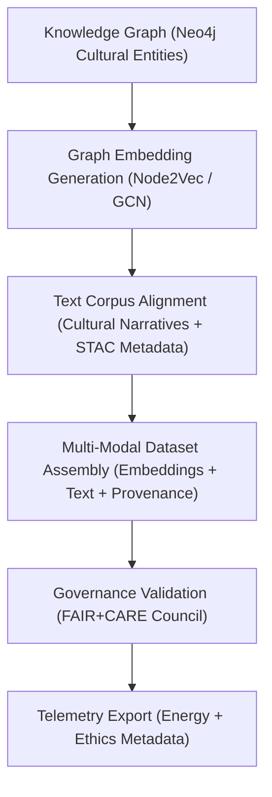

<div align="center">

# 📂 **Kansas Frontier Matrix — Focus Transformer v1 · Training Datasets**  
`src/ai/models/focus_transformer_v1/training/datasets/README.md`

**Purpose:**  
Document and govern the **multi-modal training datasets** used to fine-tune the **Focus Transformer v1** model in the **Kansas Frontier Matrix (KFM)**.  
These datasets fuse **graph embeddings**, **cultural text corpora**, and **metadata streams** under FAIR+CARE governance, ensuring **ethical transparency, reproducibility, and sustainability** per **MCP-DL v6.3** standards.

[](../../../../../../../docs/)
[](../../../../../../../LICENSE)
[](../../../../../../../docs/standards/faircare.md)
[](#)

</div>

---

## 📘 Overview

The **Focus Transformer Training Datasets** integrate graph, text, and geospatial data to create an ethically governed corpus for AI narrative generation in Focus Mode.  
Each dataset is carefully validated for provenance, cultural representation, and sustainability under **FAIR+CARE Council** oversight.

Key features:
- 🧠 **Multi-modal structure:** Graph embeddings + text + metadata alignment.  
- 🗺️ **Ontology-driven labeling:** CIDOC CRM and PROV-O compatible entity mapping.  
- ⚖️ **FAIR+CARE certification:** Cultural data governance and bias control.  
- ♻️ **ISO 50001 telemetry:** Monitors carbon footprint of dataset preparation.

---

## 🗂️ Directory Layout

```plaintext
src/ai/models/focus_transformer_v1/training/datasets/
├── README.md                            # This file — training dataset documentation
│
├── focus_graph_embeddings.npy           # Graph-derived embeddings for Neo4j entity context
├── focus_cultural_texts.json            # Curated and tokenized cultural narratives
├── stac_metadata.json                   # STAC/DCAT metadata for provenance traceability
├── metadata.json                        # Dataset schema, ethics, and validation metadata
└── checksum_registry.json               # SHA-256 hashes and governance validation records
```

---

## ⚙️ Data Composition Workflow



### Data Sources
- **Graph Inputs:** KFM Neo4j entity embeddings (`focus_graph_embeddings.npy`).  
- **Text Inputs:** Cultural documents, oral histories, and archival text.  
- **Metadata Inputs:** STAC/DCAT metadata for provenance tracking and ontology validation.  

---

## 🧩 Example Metadata Record (`metadata.json`)

```json
{
  "dataset_id": "focus_transformer_training_data_v9.9.0",
  "description": "Multi-modal dataset combining Neo4j graph embeddings, cultural text corpora, and provenance metadata for Focus Transformer training.",
  "records": 210560,
  "modalities": ["graph", "text", "metadata"],
  "ontology_alignment": ["CIDOC CRM", "PROV-O", "DCAT 3.0"],
  "faircare_status": "certified",
  "bias_score": 0.03,
  "energy_wh": 225.4,
  "carbon_gco2e": 92.3,
  "reviewed_by": "@faircare-council",
  "governance_ref": "../../../../../../../docs/standards/governance/ROOT-GOVERNANCE.md"
}
```

---

## ⚖️ FAIR+CARE Compliance Matrix

| Principle | Implementation | Verification |
|------------|----------------|---------------|
| **Findable** | Datasets registered with STAC/DCAT UUIDs and checksum hashes. | `stac-validate.yml` |
| **Accessible** | Metadata public; restricted cultural texts protected. | Governance Ledger |
| **Interoperable** | JSON-LD + GeoJSON + Parquet standards; ISO 19115 compliant. | Schema Validator |
| **Reusable** | CC-BY 4.0; validated provenance and ethical audit trails. | SPDX Manifest |
| **CARE – Responsibility** | Council review of text curation and representation fairness. | `faircare-validate.yml` |
| **CARE – Ethics** | Redacted sensitive narratives per CARE charter. | `checksum_registry.json` |

---

## 🧮 Sustainability & Telemetry Metrics

| Metric | Description | Example |
|--------|-------------|----------|
| `records` | Number of combined training records. | 210,560 |
| `modalities` | Data types used in training corpus. | Graph, Text, Metadata |
| `bias_score` | Average bias index detected. | 0.03 |
| `energy_wh` | Power used in dataset assembly. | 225.4 |
| `carbon_gco2e` | Carbon equivalent of preparation. | 92.3 |
| `faircare_score` | FAIR+CARE compliance score. | 99.0 |

Telemetry appended to:  
`releases/v9.9.0/focus-telemetry.json`  
Schema: `schemas/telemetry/src-ai-models-focus-transformer-v1-training-datasets-v1.json`

---

## 🔐 Provenance & Governance Integration

- **Governance Ledger:** `releases/v9.9.0/governance/ledger_snapshot.json`  
- **Checksum Registry:** `checksum_registry.json`  
- **SBOM Manifest:** `releases/v9.9.0/sbom.spdx.json`  
- **Telemetry Reference:** `focus-telemetry.json`

### Example Governance Record
```json
{
  "ledger_id": "ledger_2025q4_focus_transformer_v1_training_datasets",
  "reviewed_by": "@faircare-council",
  "auditor": "@kfm-governance",
  "status": "approved",
  "timestamp": "2025-11-08T20:38:00Z"
}
```

---

## 🧾 Citation

```text
Kansas Frontier Matrix (2025). Focus Transformer v1 · Training Datasets (v9.9.0).
FAIR+CARE-certified multi-modal dataset documentation ensuring ethical, explainable, and sustainable data preparation for Focus Mode AI within the Kansas Frontier Matrix.
```

---

## 🕰️ Version History

| Version | Date | Author | Summary |
|---------:|------|--------|----------|
| v9.9.0 | 2025-11-08 | `@kfm-ai` | Created Focus Transformer training dataset documentation; added FAIR+CARE governance metadata and telemetry schema. |

---

<div align="center">

**Kansas Frontier Matrix**  
*Multi-Modal Data × FAIR+CARE Ethics × Sustainable AI Training*  
© 2025 Kansas Frontier Matrix · CC-BY 4.0 · Master Coder Protocol v6.3 · FAIR+CARE Certified · Diamond⁹ Ω / Crown∞Ω Ultimate Certified  

[Back to Training Framework](../README.md) · [Governance Charter](../../../../../../../docs/standards/governance/ROOT-GOVERNANCE.md)

</div>

