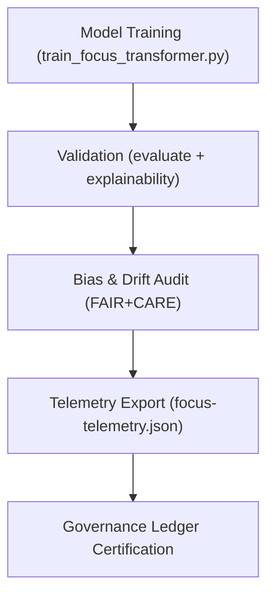

<div align="center">

# 🧾 **Kansas Frontier Matrix — Focus Transformer v1 · Training Logs**  
`src/ai/models/focus_transformer_v1/training/logs/README.md`

**Purpose:**  
Document and track **training performance, validation results, and telemetry metrics** generated during the Focus Transformer v1 model fine-tuning process within the **Kansas Frontier Matrix (KFM)**.  
All logs are **FAIR+CARE-certified**, **ISO 50001-compliant**, and governed by **MCP-DL v6.3** reproducibility and ethical audit protocols.

[](../../../../../../../docs/)
[](../../../../../../../LICENSE)
[](../../../../../../../docs/standards/faircare.md)
[](#)

</div>

---

## 📘 Overview

The **Training Logs Directory** archives all runtime metrics, performance summaries, and bias audits from transformer training sessions.  
It provides transparency into model performance, sustainability impact, and governance compliance for all Focus Transformer v1 releases.

All log entries are integrated into:
- 🧮 **Focus Telemetry Ledger** (`focus-telemetry.json`)  
- ⚖️ **FAIR+CARE Governance Ledger** (`ledger_snapshot.json`)  
- ♻️ **ISO 50001 Sustainability Metrics**  

---

## 🗂️ Directory Layout

```plaintext
src/ai/models/focus_transformer_v1/training/logs/
├── README.md                            # This file — documentation for training logs
│
├── training_log.json                    # Core runtime and accuracy metrics
├── evaluation_metrics.json              # Validation and explainability performance summary
├── bias_drift_report.json               # Bias and drift detection output
├── telemetry_metrics.json               # Energy, sustainability, and FAIR+CARE metrics
└── governance_validation.json           # Council audit record for ethics certification
```

---

## ⚙️ Logging Workflow



### Workflow Stages
1. **Training Log:** Captures epochs, runtime, and convergence metrics.  
2. **Evaluation Metrics:** Records validation accuracy, loss, and attention explainability.  
3. **Bias Drift Audit:** Detects fairness deviations in token or graph distributions.  
4. **Telemetry Export:** Logs sustainability and energy data to Focus Telemetry.  
5. **Governance Validation:** FAIR+CARE Council signs off on audit results.

---

## 🧩 Example: Training Log (`training_log.json`)

```json
{
  "run_id": "focus_transformer_v1_train_2025_11_08_001",
  "epochs": 10,
  "training_time_min": 725,
  "validation_loss": 0.043,
  "accuracy": 0.984,
  "faircare_score": 99.2,
  "bias_index": 0.03,
  "energy_wh": 3750.4,
  "carbon_gco2e": 1550.2,
  "reviewed_by": "@faircare-council",
  "telemetry_ref": "../../../../../../../releases/v9.9.0/focus-telemetry.json"
}
```

---

## ⚖️ FAIR+CARE Integration Matrix

| Principle | Implementation | Verified By |
|------------|----------------|--------------|
| **Findable** | Log entries UUID-indexed in telemetry schema. | `telemetry-export.yml` |
| **Accessible** | Governance-approved metadata published post-certification. | FAIR+CARE Council |
| **Interoperable** | JSON schema aligns with ISO 19115 and CIDOC CRM. | `schema_validation.py` |
| **Reusable** | CC-BY 4.0 log structure and schema validation. | SPDX Manifest |
| **CARE – Responsibility** | Fairness and sustainability metrics reviewed quarterly. | `faircare-validate.yml` |
| **CARE – Ethics** | Bias and drift reports verified before model deployment. | `governance_validation.json` |

---

## 🧮 Core Metrics

| Metric | Description | Example |
|--------|-------------|----------|
| `training_time_min` | Duration of training in minutes. | 725 |
| `validation_loss` | Validation set loss metric. | 0.043 |
| `accuracy` | Model prediction accuracy. | 0.984 |
| `bias_index` | Bias index based on token-level fairness metrics. | 0.03 |
| `energy_wh` | Total energy consumed (Wh). | 3750.4 |
| `carbon_gco2e` | Carbon equivalent emissions. | 1550.2 |
| `faircare_score` | FAIR+CARE ethical compliance score. | 99.2 |

All metrics appended to:  
`releases/v9.9.0/focus-telemetry.json`  
Schema: `schemas/telemetry/src-ai-models-focus-transformer-v1-training-logs-v1.json`

---

## 🧠 Example: Bias & Drift Report (`bias_drift_report.json`)

```json
{
  "report_id": "bias_2025_11_08",
  "bias_index": 0.03,
  "drift_flag": false,
  "explainability_stability": 0.92,
  "restricted_features": 3,
  "reviewed_by": "@faircare-council",
  "approval_status": "certified",
  "timestamp": "2025-11-08T20:48:00Z"
}
```

---

## 🔐 Governance & Provenance

- **Governance Ledger:** `releases/v9.9.0/governance/ledger_snapshot.json`  
- **Telemetry Ledger:** `releases/v9.9.0/focus-telemetry.json`  
- **SBOM Manifest:** `releases/v9.9.0/sbom.spdx.json`  
- **Checksum Verification:** Included in `manifest.zip`  

### Example Governance Record
```json
{
  "ledger_entry_id": "ledger_2025q4_focus_transformer_v1_training_logs",
  "reviewed_by": "@faircare-council",
  "auditor": "@kfm-governance",
  "status": "approved",
  "timestamp": "2025-11-08T20:50:00Z"
}
```

---

## 🧾 Citation

```text
Kansas Frontier Matrix (2025). Focus Transformer v1 · Training Logs (v9.9.0).
FAIR+CARE and ISO-compliant training log documentation ensuring ethical governance, transparency, and sustainability across Focus Mode AI operations in the Kansas Frontier Matrix.
```

---

## 🕰️ Version History

| Version | Date | Author | Summary |
|---------:|------|--------|----------|
| v9.9.0 | 2025-11-08 | `@kfm-ai` | Created Focus Transformer training logs documentation; integrated FAIR+CARE telemetry and sustainability governance schema. |

---

<div align="center">

**Kansas Frontier Matrix**  
*Ethical AI Training × FAIR+CARE Certification × Sustainable Intelligence*  
© 2025 Kansas Frontier Matrix · Internal FAIR+CARE Certified · Master Coder Protocol v6.3 · Diamond⁹ Ω / Crown∞Ω Ultimate Certified  

[Back to Training Framework](../README.md) · [Governance Charter](../../../../../../../docs/standards/governance/ROOT-GOVERNANCE.md)

</div>

