<div align="center">

# ⚙️ **Kansas Frontier Matrix — Focus Transformer v1 · Training Scripts**  
`src/ai/models/focus_transformer_v1/training/scripts/README.md`

**Purpose:**  
Document and describe the **training, validation, and telemetry export scripts** used in the fine-tuning and governance of the **Focus Transformer v1 model** for the **Kansas Frontier Matrix (KFM)**.  
All scripts are **FAIR+CARE-certified**, **ISO 50001-compliant**, and align with **MCP-DL v6.3** for ethical AI reproducibility.

[](../../../../../../../docs/)
[](../../../../../../../LICENSE)
[](../../../../../../../docs/standards/faircare.md)
[](#)

</div>

---

## 📘 Overview

The **Focus Transformer Training Scripts** define the automated AI lifecycle for Focus Mode contextual reasoning.  
They perform data loading, training, bias validation, explainability analysis, and telemetry synchronization, ensuring ethical and transparent model development.

Main responsibilities:
- Load and preprocess multi-modal datasets (graph, text, metadata).  
- Train transformer-based architecture using FAIR+CARE-regulated hyperparameters.  
- Validate model explainability and attention behavior.  
- Export energy and governance telemetry for Council audits.

---

## 🗂️ Directory Layout

```plaintext
src/ai/models/focus_transformer_v1/training/scripts/
├── README.md                             # This file — documentation for training scripts
│
├── train_focus_transformer.py            # Main training pipeline (multi-modal fine-tuning)
├── validate_attention_weights.py         # Explainability & interpretability validation
├── export_model_card.py                  # Generates FAIR+CARE model card metadata
├── export_telemetry.py                   # Exports energy & sustainability metrics
└── utils/                                # Shared utilities for data and training
    ├── data_loader.py
    ├── embedding_utils.py
    ├── evaluation_tools.py
    └── telemetry_utils.py
```

---

## ⚙️ Script Workflow Overview

```mermaid
flowchart TD
  A["Load Multi-Modal Datasets (Graph · Text · Metadata)"] --> B["Train Transformer (Cross-Attention Layers)"]
  B --> C["Validate Attention Maps (Bias / Fairness Check)"]
  C --> D["Explainability Metrics Export (SHAP / Attention Heatmaps)"]
  D --> E["Telemetry Logging (Energy + Ethics Metrics)"]
  E --> F["Governance Ledger Sync (FAIR+CARE Certification)"]
```



### Script Responsibilities
| Script | Function | Output |
|--------|-----------|--------|
| `train_focus_transformer.py` | Fine-tunes transformer with FAIR+CARE-compliant parameters. | `training_log.json` |
| `validate_attention_weights.py` | Ensures ethical interpretability and bias transparency. | `evaluation_metrics.json` |
| `export_model_card.py` | Builds metadata record for FAIR+CARE Council review. | `model_card.md` |
| `export_telemetry.py` | Logs runtime, energy, and carbon footprint. | `telemetry_metrics.json` |

---

## 🧩 Example: Training Script (`train_focus_transformer.py`)

```python
import torch
from transformers import Trainer, TrainingArguments
from model import FocusTransformer
from utils.data_loader import load_multimodal_dataset

dataset = load_multimodal_dataset("../../datasets")
model = FocusTransformer()

training_args = TrainingArguments(
    output_dir="../../checkpoints/",
    learning_rate=2e-5,
    per_device_train_batch_size=8,
    num_train_epochs=10,
    logging_dir="../../logs/",
    report_to="none"
)

trainer = Trainer(model=model, args=training_args, train_dataset=dataset)
trainer.train()
torch.save(model.state_dict(), "../../checkpoints/focus_transformer_v1.ckpt")
```

---

## 🧮 Example: Telemetry Export Script (`export_telemetry.py`)

```python
import json, time, psutil

def record_energy(runtime_sec, power_watts=200):
    """Estimate energy consumption (Wh)."""
    return (power_watts * runtime_sec) / 3600

def export_telemetry(log_path, runtime_sec):
    """Export telemetry metrics to FAIR+CARE ledger."""
    energy = record_energy(runtime_sec)
    telemetry = {
        "session_id": f"focus_transformer_train_{int(time.time())}",
        "energy_wh": round(energy, 2),
        "carbon_gco2e": round(energy * 0.41, 2),
        "timestamp": time.strftime("%Y-%m-%dT%H:%M:%SZ")
    }
    with open(log_path, "w") as f:
        json.dump(telemetry, f, indent=2)
    return telemetry

# Example usage:
export_telemetry("../../logs/telemetry_metrics.json", runtime_sec=43200)
```

---

## ⚖️ FAIR+CARE Integration Matrix

| Principle | Implementation | Validation |
|------------|----------------|-------------|
| **Findable** | All logs indexed via UUID in telemetry schema. | `telemetry-export.yml` |
| **Accessible** | Open-source scripts under MIT license. | FAIR+CARE Council |
| **Interoperable** | YAML + JSON outputs compatible with ISO 19115 metadata. | Schema Validation |
| **Reusable** | Modular and reusable training components. | SPDX Manifest |
| **CARE – Responsibility** | Training and explainability telemetry tracked per run. | `telemetry_metrics.json` |
| **CARE – Ethics** | Audited by FAIR+CARE Council before publication. | `governance_validation.json` |

---

## 🧮 Telemetry Metrics

| Metric | Description | Example |
|--------|-------------|----------|
| `training_runtime_sec` | Duration of training. | 43200 |
| `energy_wh` | Energy usage during model training. | 3750.4 |
| `carbon_gco2e` | Equivalent CO₂ emissions. | 1550.2 |
| `bias_score` | Fairness index. | 0.03 |
| `faircare_score` | FAIR+CARE compliance level. | 99.2 |

All telemetry records stored in:  
`releases/v9.9.0/focus-telemetry.json`  
Schema: `schemas/telemetry/src-ai-models-focus-transformer-v1-training-scripts-v1.json`

---

## 🔐 Governance & Provenance

- **Governance Ledger:** `releases/v9.9.0/governance/ledger_snapshot.json`  
- **Telemetry Ledger:** `releases/v9.9.0/focus-telemetry.json`  
- **SBOM Manifest:** `releases/v9.9.0/sbom.spdx.json`  
- **Ethics Report:** `logs/bias_drift_report.json`

### Example Governance Record
```json
{
  "ledger_entry_id": "ledger_2025q4_focus_transformer_v1_training_scripts",
  "reviewed_by": "@faircare-council",
  "auditor": "@kfm-governance",
  "status": "approved",
  "timestamp": "2025-11-08T20:42:00Z"
}
```

---

## 🧾 Citation

```text
Kansas Frontier Matrix (2025). Focus Transformer v1 · Training Scripts (v9.9.0).
FAIR+CARE and ISO-compliant training automation scripts enabling ethical, transparent, and sustainable transformer training within the Kansas Frontier Matrix ecosystem.
```

---

## 🕰️ Version History

| Version | Date | Author | Summary |
|---------:|------|--------|----------|
| v9.9.0 | 2025-11-08 | `@kfm-ai` | Created Focus Transformer training scripts documentation; added FAIR+CARE telemetry and governance integration. |

---

<div align="center">

**Kansas Frontier Matrix**  
*Transparent Transformer Training × FAIR+CARE Governance × Sustainable Intelligence*  
© 2025 Kansas Frontier Matrix · MIT · Master Coder Protocol v6.3 · FAIR+CARE Certified · Diamond⁹ Ω / Crown∞Ω Ultimate Certified  

[Back to Training Framework](../README.md) · [Governance Charter](../../../../../../../docs/standards/governance/ROOT-GOVERNANCE.md)

</div>

