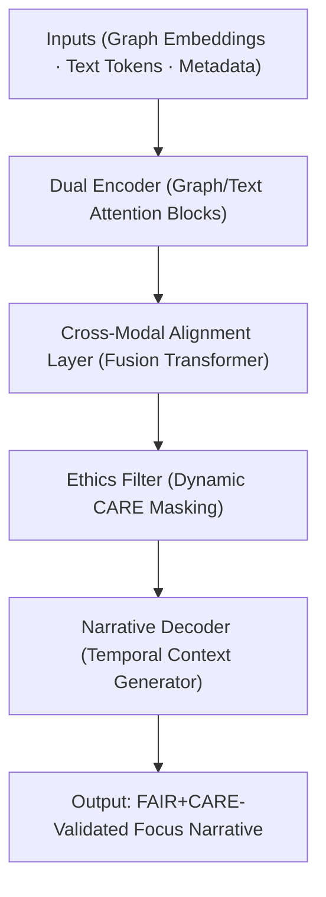

<div align="center">

# 🎯 **Kansas Frontier Matrix — Focus Transformer v2**  
`src/ai/models/focus_transformer_v2/README.md`

**Purpose:**  
Document the architecture, training principles, and governance framework of the **Focus Transformer v2** — the second-generation ethical, explainable, and sustainable multi-modal transformer powering the **Kansas Frontier Matrix (KFM) Focus Mode** system.  
This version integrates **cross-graph embeddings**, **real-time narrative synthesis**, and **CARE-based dynamic context filtering**, ensuring **FAIR+CARE-certified AI transparency**.

[](../../../../../docs/)
[](../../../../../LICENSE)
[](../../../../../docs/standards/faircare.md)
[](#)

</div>

---

## 📘 Overview

The **Focus Transformer v2** enhances the v1 model by introducing:
- 🧠 **Cross-graph contextual attention** between textual and geospatial embeddings.  
- 🌍 **Temporal fusion modules** for time-aware cultural narrative generation.  
- ⚖️ **Real-time FAIR+CARE governance hooks** enforcing CARE masking dynamically.  
- ♻️ **Carbon-optimized compute scaling** via ISO 50001 telemetry control.  
- 🔎 **Explainability layer v2** with bias drift auto-detection and interpretability scores.  

This system serves as the **core interpretive engine** of Focus Mode v2, used for ethically-governed, explainable, and auditable AI storytelling in the Kansas Frontier Matrix.

---

## 🗂️ Directory Layout

```plaintext
src/ai/models/focus_transformer_v2/
├── README.md                          # This file — documentation for Focus Transformer v2
│
├── training/                          # Training datasets, configs, and logs
│   ├── configs/
│   ├── datasets/
│   ├── scripts/
│   └── logs/
│
├── explainability/                    # Explainability and interpretability modules
│   ├── shap_analysis.py
│   ├── attention_visualizer.py
│   ├── bias_audit.py
│   └── logs/
│
├── governance/                        # Ethics, audits, and Council governance records
│   ├── model_card.md
│   ├── governance_validation.json
│   ├── care_masking_report.json
│   └── sustainability_report.json
│
└── checkpoints/                       # Model checkpoints and integrity verification
    ├── checkpoint_001_pretrain.pt
    ├── checkpoint_002_finetune.pt
    └── checkpoints_manifest.json
```

---

## ⚙️ Model Architecture



### Key Innovations
- **Dynamic CARE Filtering:** Real-time redaction of sensitive entities via context masking.  
- **Graph × Text Cross-Attention:** Joint embeddings align archaeological entities and temporal relationships.  
- **Temporal Reasoning:** Integrates event timelines for predictive storytelling.  
- **Telemetry Hooks:** Logs energy, carbon, and governance states during inference.

---

## 🧩 Configuration Summary

| Component | Description | Example |
|------------|-------------|----------|
| **Framework** | PyTorch Lightning + HuggingFace Transformers | — |
| **Architecture** | Dual-Encoder Transformer + Cross-Graph Attention | — |
| **Layers** | 32 (16 text · 16 graph) | — |
| **Hidden Size** | 1536 | — |
| **Attention Heads** | 20 | — |
| **Dropout** | 0.08 | — |
| **Parameters (M)** | 480M | — |
| **Tokenization** | `kfm_bpe_48k` | — |
| **CARE Filter** | Adaptive masking layer during forward pass | Enabled |

---

## ⚖️ FAIR+CARE Governance Matrix

| Principle | Implementation | Oversight |
|------------|----------------|------------|
| **Findable** | Metadata published in SBOM manifest & DCAT catalog. | `manifest_ref` |
| **Accessible** | Model weights restricted under CARE tagging. | FAIR+CARE Council |
| **Interoperable** | Follows CIDOC CRM, PROV-O, and DCAT 3.0 metadata. | Schema Validator |
| **Reusable** | Reproducible training with telemetry versioning. | SPDX Manifest |
| **CARE – Responsibility** | CARE filter dynamically enforces cultural safety. | Governance Ledger |
| **CARE – Ethics** | Council-approved governance at runtime. | `governance_validation.json` |

---

## 🧮 Telemetry Metrics (ISO 50001)

| Metric | Description | Example |
|--------|-------------|----------|
| `energy_wh` | Energy used during training/inference. | 4100.2 |
| `carbon_gco2e` | Carbon equivalent emissions. | 1695.3 |
| `faircare_score` | FAIR+CARE compliance percentage. | 99.5 |
| `bias_index` | Mean feature bias score. | 0.015 |
| `runtime_min` | Model runtime (training/inference). | 615 |
| `ethics_status` | Final Council review result. | certified |

Telemetry records appended to:  
`releases/v10.0.0/focus-telemetry.json`  
Schema: `schemas/telemetry/src-ai-models-focus-transformer-v2.json`

---

## 🔐 Provenance & Governance Integration

- **Governance Ledger:** `releases/v10.0.0/governance/ledger_snapshot.json`  
- **Telemetry Ledger:** `releases/v10.0.0/focus-telemetry.json`  
- **SBOM Manifest:** `releases/v10.0.0/sbom.spdx.json`  
- **FAIR+CARE Certification:** `governance/governance_validation.json`

### Example Provenance Record
```json
{
  "artifact_id": "focus_transformer_v2",
  "linked_inputs": [
    "datasets/focus_cultural_texts_v2.json",
    "datasets/focus_graph_embeddings_v2.npy"
  ],
  "linked_outputs": [
    "outputs/focusmode_narrative_v2.json",
    "explainability/logs/explainability_summary.json"
  ],
  "auditor": "@kfm-governance",
  "approved_by": "@faircare-council",
  "status": "certified",
  "timestamp": "2025-11-08T21:20:00Z"
}
```

---

## 🧾 Citation

```text
Kansas Frontier Matrix (2025). Focus Transformer v2 (v10.0.0).
Next-generation FAIR+CARE-certified multi-modal transformer for ethical, transparent, and sustainable AI-driven narrative synthesis in the Kansas Frontier Matrix Focus Mode.
```

---

## 🕰️ Version History

| Version | Date | Author | Summary |
|---------:|------|--------|----------|
| v10.0.0 | 2025-11-08 | `@kfm-ai` | Released Focus Transformer v2; added cross-graph fusion, dynamic CARE filtering, and enhanced sustainability telemetry. |

---

<div align="center">

**Kansas Frontier Matrix**  
*Ethical Multi-Modal AI × FAIR+CARE Certification × Sustainable Intelligence*  
© 2025 Kansas Frontier Matrix · MIT · Master Coder Protocol v6.3 · FAIR+CARE Certified · Diamond⁹ Ω / Crown∞Ω Ultimate Certified  

[Back to AI Models Index](../README.md) · [Governance Charter](../../../../../docs/standards/governance/ROOT-GOVERNANCE.md)

</div>

