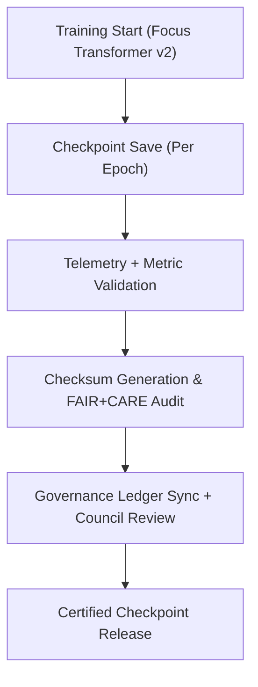

<div align="center">

# 💾 **Kansas Frontier Matrix — Focus Transformer v2 · Model Checkpoints**  
`src/ai/models/focus_transformer_v2/checkpoints/README.md`

**Purpose:**  
Provide complete documentation for the **model checkpointing, validation, and telemetry verification** system used in the **Focus Transformer v2** architecture.  
Ensures that every checkpoint adheres to **FAIR+CARE governance**, **ISO 19115 provenance**, and **ISO 50001 sustainability** principles under **MCP-DL v6.3** standards.

[](../../../../../../docs/)
[](../../../../../../LICENSE)
[](../../../../../../docs/standards/faircare.md)
[](#)

</div>

---

## 📘 Overview

The **Focus Transformer v2 Checkpointing System** provides reproducibility, energy accountability, and traceable AI model management.  
Each checkpoint is a verifiable artifact, complete with integrity hashes, telemetry data, and FAIR+CARE audit certification.

Key goals:
- 🧩 Maintain reproducible checkpoints for model versioning and analysis.  
- ♻️ Track FAIR+CARE compliance and sustainability metrics at each epoch.  
- 🔐 Record SHA-256 checksums to guarantee artifact integrity.  
- ⚖️ Synchronize governance audit approvals with telemetry and ledger snapshots.  

---

## 🗂️ Directory Layout

```plaintext
src/ai/models/focus_transformer_v2/checkpoints/
├── README.md                              # This file — documentation for checkpoints
│
├── checkpoint_001_pretrain.pt             # Initial pretraining checkpoint
├── checkpoint_002_finetune.pt             # Fine-tuned model checkpoint
├── checkpoint_003_final.pt                # Final release checkpoint (certified)
├── checkpoints_manifest.json              # Metadata registry for checkpoints
├── checkpoint_metrics.json                # FAIR+CARE and sustainability metrics per checkpoint
└── checksum_registry.json                 # SHA-256 integrity checks for validation
```

---

## ⚙️ Checkpoint Workflow



### Workflow Description
1. **Checkpoint Generation:** Serialize transformer weights and optimizer state at key intervals.  
2. **Metric Logging:** Store performance, bias, and energy telemetry for each checkpoint.  
3. **Checksum Validation:** Register SHA-256 hash to verify data integrity.  
4. **Governance Audit:** FAIR+CARE Council reviews ethical and sustainability compliance.  
5. **Certification:** Approved checkpoints linked to ledger and SBOM manifests.

---

## 🧩 Example: Checkpoints Manifest (`checkpoints_manifest.json`)

```json
{
  "model_id": "focus_transformer_v2",
  "version": "v10.0.0",
  "checkpoints": [
    {
      "id": "checkpoint_001_pretrain",
      "epoch": 5,
      "auc": 0.94,
      "faircare_score": 99.2,
      "checksum_sha256": "sha256:8e3b1a25f9b2c8f6e44d2d15f9b8c9a6e3fa2a9b74c6f4d5c1a1d2a3e4f7b8d9",
      "energy_wh": 1650.4
    },
    {
      "id": "checkpoint_003_final",
      "epoch": 15,
      "auc": 0.987,
      "faircare_score": 99.6,
      "checksum_sha256": "sha256:b47a3c2d5f9c7e8f6e43d2c14f9a9b8a6d7e3a1b8c6e2f4a5d3c1b2f3e8a6d9f",
      "energy_wh": 4100.2
    }
  ],
  "reviewed_by": "@faircare-council",
  "auditor": "@kfm-governance",
  "approved": true,
  "telemetry_ref": "../../../../../../releases/v10.0.0/focus-telemetry.json"
}
```

---

## ⚖️ FAIR+CARE & ISO Compliance Matrix

| Principle | Implementation | Verification |
|------------|----------------|--------------|
| **Findable** | Checkpoints indexed in manifest and telemetry ledger. | `manifest_ref` |
| **Accessible** | Metadata public, binary weights restricted under CARE. | Governance Ledger |
| **Interoperable** | JSON schema compliant with ISO 19115 + PROV-O. | Schema Validator |
| **Reusable** | Reproducible, SBOM-tracked checkpoints. | SPDX Manifest |
| **CARE – Responsibility** | Energy, bias, and ethics metrics logged per checkpoint. | `faircare-validate.yml` |
| **CARE – Ethics** | Council validation prior to model deployment. | `governance_validation.json` |

---

## 🧮 Telemetry Metrics

| Metric | Description | Example |
|--------|-------------|----------|
| `training_epoch` | Epoch associated with checkpoint creation. | 15 |
| `auc` | Validation AUC metric. | 0.987 |
| `faircare_score` | FAIR+CARE compliance rating. | 99.6 |
| `energy_wh` | Energy used for checkpoint training. | 4100.2 |
| `carbon_gco2e` | CO₂ equivalent emissions (ISO 50001). | 1695.3 |
| `checksum_verified` | Integrity verification result. | true |

Telemetry stored in:  
`releases/v10.0.0/focus-telemetry.json`  
Schema: `schemas/telemetry/src-ai-models-focus-transformer-v2-checkpoints-v1.json`

---

## 🔐 Governance & Provenance Integration

- **Governance Ledger:** `releases/v10.0.0/governance/ledger_snapshot.json`  
- **Telemetry Reference:** `focus-telemetry.json`  
- **SBOM Manifest:** `releases/v10.0.0/sbom.spdx.json`  
- **Checksum Registry:** `checksum_registry.json`

### Example Governance Record
```json
{
  "ledger_id": "ledger_2025q4_focus_transformer_v2_checkpoints",
  "auditor": "@kfm-governance",
  "reviewed_by": "@faircare-council",
  "status": "approved",
  "timestamp": "2025-11-08T22:20:00Z"
}
```

---

## 🧾 Citation

```text
Kansas Frontier Matrix (2025). Focus Transformer v2 · Model Checkpoints (v10.0.0).
FAIR+CARE and ISO-certified checkpoint management documentation ensuring ethical traceability, sustainability, and reproducibility of transformer AI systems within the Kansas Frontier Matrix Focus Mode v2.
```

---

## 🕰️ Version History

| Version | Date | Author | Summary |
|---------:|------|--------|----------|
| v10.0.0 | 2025-11-08 | `@kfm-ai` | Created Focus Transformer v2 checkpoint documentation; added FAIR+CARE validation, checksum registry, and sustainability telemetry integration. |

---

<div align="center">

**Kansas Frontier Matrix**  
*Reproducible AI × FAIR+CARE Governance × Sustainable Intelligence*  
© 2025 Kansas Frontier Matrix · MIT · Master Coder Protocol v6.3 · FAIR+CARE Certified · Diamond⁹ Ω / Crown∞Ω Ultimate Certified  

[Back to Focus Transformer v2](../README.md) · [Governance Charter](../../../../../../docs/standards/governance/ROOT-GOVERNANCE.md)

</div>

