<div align="center">

# 🧠 **Kansas Frontier Matrix — Focus Transformer v2 · Explainability Framework**  
`src/ai/models/focus_transformer_v2/explainability/README.md`

**Purpose:**  
Define the **explainability, bias audit, and interpretability architecture** for the **Focus Transformer v2** model powering the **Kansas Frontier Matrix (KFM)** Focus Mode system.  
Implements **cross-attention interpretability**, **FAIR+CARE validation**, and **ISO 50001 sustainability tracking** to ensure responsible, transparent, and ethical AI narratives under **MCP-DL v6.3**.

[](../../../../../../docs/)
[](../../../../../../LICENSE)
[](../../../../../../docs/standards/faircare.md)
[](#)

</div>

---

## 📘 Overview

The **Focus Transformer v2 Explainability Framework** builds upon v1’s interpretability engine with:
- 🧩 **Cross-Attention Explainability:** Visualizes semantic bridges between graph and text tokens.  
- ⚖️ **Dynamic Bias Tracking:** Detects emergent bias or drift across contexts.  
- 🌱 **Sustainability-Aware Explainability:** Integrates ISO 50001 telemetry for explainability runs.  
- 🧠 **Multi-Resolution Attention Maps:** Provides interpretability across hierarchical layers.  

All explainability outputs are **FAIR+CARE-certified** and automatically reviewed by the **KFM Governance Council**.

---

## 🗂️ Directory Layout

```plaintext
src/ai/models/focus_transformer_v2/explainability/
├── README.md                            # This file — explainability framework documentation
│
├── shap_analysis.py                     # SHAP feature importance across multi-modal embeddings
├── attention_visualizer.py              # Token-level attention visualization for graph/text fusion
├── bias_audit.py                        # Bias and fairness validation with cross-layer analysis
├── lime_explainer.py                    # Local interpretability of narrative generation
└── logs/                                # Explainability and governance output logs
    ├── shap_summary.json
    ├── attention_maps.json
    ├── lime_results.json
    ├── bias_report.json
    └── explainability_summary.json
```

---

## ⚙️ Explainability Workflow

```mermaid
flowchart TD
  A["Focus Transformer v2 Inference"] --> B["Cross-Attention SHAP Attribution"]
  B --> C["LIME Local Interpretability"]
  C --> D["Attention Visualization (Graph ↔ Text)"]
  D --> E["Bias + Drift Audit (FAIR+CARE Review)"]
  E --> F["Telemetry Export + Governance Ledger Sync"]
```



### Workflow Summary
1. **Cross-Attention Explainability:** Analyzes how graph-text alignments influence narrative focus.  
2. **LIME Explanations:** Provides localized interpretability per narrative token or phrase.  
3. **Bias & Drift Audit:** Evaluates fairness across cultural, spatial, and linguistic domains.  
4. **Governance Sync:** FAIR+CARE Council audit results recorded in governance ledger.  
5. **Telemetry Integration:** Logs runtime, energy, and compliance data.

---

## 🧩 Example: Explainability Summary (`logs/explainability_summary.json`)

```json
{
  "model": "focus_transformer_v2",
  "version": "v10.0.0",
  "methods": ["SHAP", "LIME", "Cross-Attention"],
  "top_features": ["entity_similarity", "temporal_relevance", "context_density"],
  "bias_index": 0.015,
  "attention_stability": 0.95,
  "explainability_stability": 0.92,
  "energy_wh": 49.2,
  "carbon_gco2e": 20.2,
  "faircare_score": 99.6,
  "reviewed_by": "@faircare-council",
  "status": "certified",
  "telemetry_ref": "../../../../../../releases/v10.0.0/focus-telemetry.json"
}
```

---

## ⚖️ FAIR+CARE Integration Matrix

| Principle | Implementation | Oversight |
|------------|----------------|------------|
| **Findable** | Logs indexed in FAIR+CARE ledger with telemetry linkage. | `telemetry-export.yml` |
| **Accessible** | Summaries open; attention maps restricted under CARE. | FAIR+CARE Council |
| **Interoperable** | JSON/GeoJSON outputs follow ISO 19115 + PROV-O. | Schema Validation |
| **Reusable** | CC-BY 4.0 licensed interpretability artifacts. | SPDX Manifest |
| **CARE – Responsibility** | Quarterly governance reviews on explainability drift. | `bias_audit.py` |
| **CARE – Ethics** | Culturally sensitive embeddings redacted pre-publication. | `attention_visualizer.py` |

---

## 🧮 Telemetry Metrics (ISO 50001)

| Metric | Description | Example |
|--------|-------------|----------|
| `runtime_sec` | Duration of explainability run. | 905 |
| `energy_wh` | Power usage during SHAP/LIME computations. | 49.2 |
| `carbon_gco2e` | CO₂ equivalent emissions. | 20.2 |
| `bias_index` | Mean detected bias index. | 0.015 |
| `faircare_score` | FAIR+CARE compliance percentage. | 99.6 |
| `attention_stability` | Variance in attention map feature rankings. | 0.95 |

Telemetry exported to:  
`releases/v10.0.0/focus-telemetry.json`  
Schema: `schemas/telemetry/src-ai-models-focus-transformer-v2-explainability-v1.json`

---

## 🔐 Governance & Provenance Integration

- **Governance Ledger:** `releases/v10.0.0/governance/ledger_snapshot.json`  
- **Telemetry Reference:** `focus-telemetry.json`  
- **SBOM Manifest:** `releases/v10.0.0/sbom.spdx.json`  
- **Bias Reports:** `logs/bias_report.json`

### Example Governance Record
```json
{
  "ledger_entry_id": "ledger_2025q4_focus_transformer_v2_explainability",
  "reviewed_by": "@faircare-council",
  "auditor": "@kfm-governance",
  "status": "approved",
  "timestamp": "2025-11-08T22:00:00Z"
}
```

---

## 🧾 Citation

```text
Kansas Frontier Matrix (2025). Focus Transformer v2 · Explainability Framework (v10.0.0).
FAIR+CARE and ISO-compliant explainability system for cross-modal transformer interpretability, ensuring ethical, transparent, and sustainable AI reasoning in the Kansas Frontier Matrix.
```

---

## 🕰️ Version History

| Version | Date | Author | Summary |
|---------:|------|--------|----------|
| v10.0.0 | 2025-11-08 | `@kfm-ai` | Created Focus Transformer v2 explainability documentation with cross-attention interpretability and FAIR+CARE integration. |

---

<div align="center">

**Kansas Frontier Matrix**  
*Explainable AI × FAIR+CARE Ethics × Sustainable Intelligence*  
© 2025 Kansas Frontier Matrix · CC-BY 4.0 · Master Coder Protocol v6.3 · FAIR+CARE Certified · Diamond⁹ Ω / Crown∞Ω Ultimate Certified  

[Back to Focus Transformer v2](../README.md) · [Governance Charter](../../../../../../docs/standards/governance/ROOT-GOVERNANCE.md)

</div>

