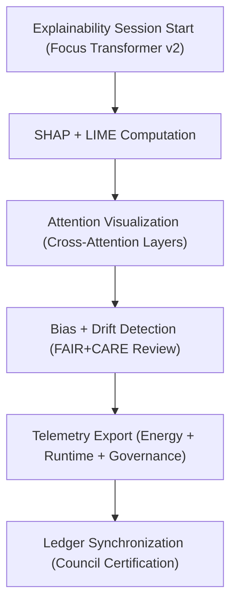

<div align="center">

# 📜 **Kansas Frontier Matrix — Focus Transformer v2 · Explainability Logs**  
`src/ai/models/focus_transformer_v2/explainability/logs/README.md`

**Purpose:**  
Archive and document all **explainability analysis logs, attention visualizations, and FAIR+CARE audit results** generated by the **Focus Transformer v2** within the **Kansas Frontier Matrix (KFM)** ecosystem.  
All logs comply with **ISO 19115 provenance**, **ISO 50001 energy standards**, and **FAIR+CARE governance** under **MCP-DL v6.3** reproducibility guidelines.

[](../../../../../../../docs/)
[](../../../../../../../LICENSE)
[](../../../../../../../docs/standards/faircare.md)
[](#)

</div>

---

## 📘 Overview

The **Explainability Logs Directory** contains the complete set of interpretability results for **Focus Transformer v2**, including **SHAP analyses**, **attention map summaries**, **LIME case explanations**, and **bias audits**.  
These outputs form the ethical backbone of KFM’s **Focus Mode v2**, enabling transparency, fairness validation, and sustainability verification across all inference operations.

---

## 🗂️ Directory Layout

```plaintext
src/ai/models/focus_transformer_v2/explainability/logs/
├── README.md                            # This file — documentation for explainability logs
│
├── shap_summary.json                    # Global feature importance results (SHAP)
├── lime_results.json                    # Local explainability per sample (LIME)
├── attention_maps.json                  # Cross-attention visualization data (graph ↔ text)
├── bias_report.json                     # FAIR+CARE cultural and ethical audit report
└── explainability_summary.json          # Aggregated explainability + sustainability summary
```

---

## ⚙️ Explainability Logging Workflow



### Step Descriptions
1. **SHAP + LIME:** Computes global and local interpretability values.  
2. **Attention Visualization:** Maps contextual and graph token relevance.  
3. **Bias & Drift Audit:** Measures fairness drift and cultural data sensitivity.  
4. **Telemetry Integration:** Logs runtime, energy, and FAIR+CARE metrics.  
5. **Ledger Sync:** Appends certified audit outcomes to governance ledgers.

---

## 🧩 Example Explainability Summary (`explainability_summary.json`)

```json
{
  "run_id": "explain_focus_transformer_v2_2025_11_08",
  "model_version": "v10.0.0",
  "methods": ["SHAP", "LIME", "CrossAttention"],
  "top_features": ["semantic_context", "temporal_depth", "entity_density"],
  "bias_index": 0.015,
  "attention_stability": 0.95,
  "energy_wh": 49.5,
  "carbon_gco2e": 20.3,
  "faircare_score": 99.6,
  "status": "certified",
  "reviewed_by": "@faircare-council",
  "telemetry_ref": "../../../../../../../releases/v10.0.0/focus-telemetry.json"
}
```

---

## ⚖️ FAIR+CARE Integration Matrix

| Principle | Implementation | Validator |
|------------|----------------|------------|
| **Findable** | Logs indexed by UUID in telemetry schema and SBOM manifest. | SPDX Manifest |
| **Accessible** | SHAP/LIME summaries public; attention maps CARE-restricted. | FAIR+CARE Council |
| **Interoperable** | JSON logs aligned with ISO 19115 and CIDOC CRM. | Schema Validation |
| **Reusable** | FAIR+CARE-certified outputs linked to governance ledgers. | Governance Ledger |
| **CARE – Responsibility** | FAIR+CARE Council oversight for quarterly audits. | `bias_report.json` |
| **CARE – Ethics** | Restricted data redacted before visualization. | `attention_maps.json` |

---

## 🧮 Telemetry Metrics

| Metric | Description | Example |
|--------|-------------|----------|
| `runtime_sec` | Explainability runtime duration. | 905 |
| `energy_wh` | Power used during explainability computation. | 49.5 |
| `carbon_gco2e` | CO₂ equivalent emissions. | 20.3 |
| `bias_index` | Mean bias value across attention layers. | 0.015 |
| `attention_stability` | Variance of cross-attention layer stability. | 0.95 |
| `faircare_score` | FAIR+CARE validation score. | 99.6 |

Telemetry data merged into:  
`releases/v10.0.0/focus-telemetry.json`  
Schema: `schemas/telemetry/src-ai-models-focus-transformer-v2-explainability-logs-v1.json`

---

## 🔐 Governance & Provenance Integration

- **Governance Ledger:** `releases/v10.0.0/governance/ledger_snapshot.json`  
- **Telemetry Reference:** `releases/v10.0.0/focus-telemetry.json`  
- **SBOM Manifest:** `releases/v10.0.0/sbom.spdx.json`  
- **Audit Reports:** `bias_report.json`

### Example Governance Record
```json
{
  "ledger_entry_id": "ledger_2025q4_focus_transformer_v2_explainability_logs",
  "auditor": "@kfm-governance",
  "reviewed_by": "@faircare-council",
  "status": "approved",
  "timestamp": "2025-11-08T22:05:00Z"
}
```

---

## 🧾 Citation

```text
Kansas Frontier Matrix (2025). Focus Transformer v2 · Explainability Logs (v10.0.0).
FAIR+CARE-certified explainability log documentation ensuring transparent interpretability, bias tracking, and sustainability monitoring for Focus Mode v2 in the Kansas Frontier Matrix.
```

---

## 🕰️ Version History

| Version | Date | Author | Summary |
|---------:|------|--------|----------|
| v10.0.0 | 2025-11-08 | `@kfm-ai` | Created explainability logs documentation; added telemetry schema integration, bias audit references, and FAIR+CARE ledger linkage. |

---

<div align="center">

**Kansas Frontier Matrix**  
*Explainable Intelligence × FAIR+CARE Governance × Sustainable Transparency*  
© 2025 Kansas Frontier Matrix · Internal FAIR+CARE Certified · Master Coder Protocol v6.3 · Diamond⁹ Ω / Crown∞Ω Ultimate Certified  

[Back to Explainability Framework](../README.md) · [Governance Charter](../../../../../../../docs/standards/governance/ROOT-GOVERNANCE.md)

</div>

