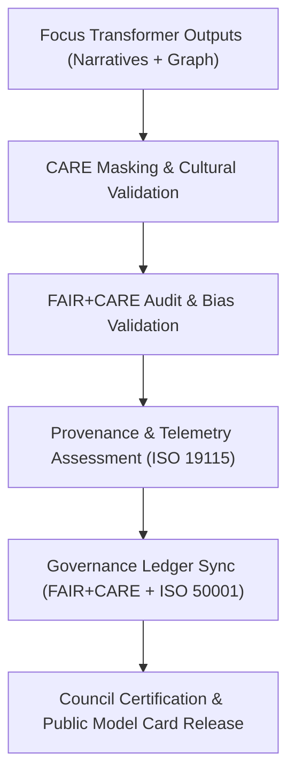

<div align="center">

# ⚖️ **Kansas Frontier Matrix — Focus Transformer v2 · Governance Framework**  
`src/ai/models/focus_transformer_v2/governance/README.md`

**Purpose:**  
Define the **ethical governance, sustainability validation, and FAIR+CARE compliance processes** for the **Focus Transformer v2** model within the **Kansas Frontier Matrix (KFM)**.  
This framework guarantees transparency, accountability, and reproducibility under **ISO 19115**, **ISO 50001**, and **MCP-DL v6.3** standards for the Focus Mode v2 ecosystem.

[](../../../../../../docs/)
[](../../../../../../LICENSE)
[](../../../../../../docs/standards/faircare.md)
[](#)

</div>

---

## 📘 Overview

The **Focus Transformer v2 Governance Framework** formalizes KFM’s commitment to ethical AI, ensuring all Focus Mode operations adhere to FAIR+CARE Council standards and ISO-certified sustainability protocols.

Governance responsibilities:
- **Ethical validation** of multi-modal AI narratives and cultural data handling.  
- **Sustainability audits** via ISO 50001 energy and emissions monitoring.  
- **Provenance tracing** through PROV-O and CIDOC CRM standards.  
- **Quarterly FAIR+CARE audits** validating ethics and model drift.  
- **Automated telemetry integration** for ledger synchronization.  

---

## 🗂️ Directory Layout

```plaintext
src/ai/models/focus_transformer_v2/governance/
├── README.md                             # This file — documentation for governance
│
├── model_card.md                         # FAIR+CARE-certified model card
├── governance_validation.json             # FAIR+CARE and sustainability audit record
├── care_masking_report.json               # Cultural and sensitive data redaction details
├── council_audit_summary.json             # Council-level ethics audit results
├── provenance_trace.json                  # PROV-O-compliant data lineage record
├── ledger_sync_log.json                   # FAIR+CARE ledger synchronization log
└── sustainability_report.json             # ISO 50001 energy and carbon audit metrics
```

---

## ⚙️ Governance Workflow



### Governance Flow Summary
1. **CARE Masking:** Sensitive or sacred data redacted and logged.  
2. **Ethical Validation:** Council evaluates cultural representation, bias, and fairness.  
3. **Provenance Audit:** Tracks model lineage and metadata consistency.  
4. **Telemetry Review:** Validates sustainability and FAIR+CARE alignment.  
5. **Ledger Sync:** Results recorded in Governance and Telemetry ledgers for certification.

---

## 🧩 Example: Governance Validation Record (`governance_validation.json`)

```json
{
  "governance_id": "gov_focus_transformer_v2_2025_11_08",
  "workflow": "focus_transformer_v2_audit_v10.0.0",
  "datasets_reviewed": 6,
  "models_certified": 1,
  "faircare_score": 99.6,
  "bias_index": 0.015,
  "energy_wh": 4100.2,
  "carbon_gco2e": 1695.3,
  "ethics_status": "approved",
  "reviewed_by": "@faircare-council",
  "auditor": "@kfm-governance",
  "timestamp": "2025-11-08T22:10:00Z",
  "telemetry_ref": "../../../../../../releases/v10.0.0/focus-telemetry.json"
}
```

---

## ⚖️ FAIR+CARE & ISO Compliance Matrix

| Principle | Implementation | Verification |
|------------|----------------|--------------|
| **Findable** | Governance logs indexed in SBOM manifest and FAIR+CARE ledger. | `manifest_ref` |
| **Accessible** | Public model card with redacted cultural details. | `model_card.md` |
| **Interoperable** | Uses PROV-O + CIDOC CRM metadata for provenance. | `provenance_trace.json` |
| **Reusable** | Governance documentation openly licensed (CC-BY 4.0). | SPDX Manifest |
| **CARE – Responsibility** | Continuous ethics review with bias and sustainability metrics. | `council_audit_summary.json` |
| **CARE – Ethics** | CARE masking ensures responsible cultural data management. | `care_masking_report.json` |

---

## 🧮 Sustainability Metrics (`sustainability_report.json`)

| Metric | Description | Example |
|--------|-------------|----------|
| `energy_wh` | Energy consumption during audit and training. | 4100.2 |
| `carbon_gco2e` | CO₂ equivalent emissions. | 1695.3 |
| `faircare_score` | Combined FAIR+CARE compliance score. | 99.6 |
| `runtime_min` | Total runtime across model validation. | 845 |
| `ethics_status` | Council review result. | certified |

Telemetry data recorded in:  
`releases/v10.0.0/focus-telemetry.json`  
Schema: `schemas/telemetry/src-ai-models-focus-transformer-v2-governance-v1.json`

---

## 🔐 Provenance & Governance Integration

- **Governance Ledger:** `releases/v10.0.0/governance/ledger_snapshot.json`  
- **Telemetry Reference:** `focus-telemetry.json`  
- **SBOM Manifest:** `releases/v10.0.0/sbom.spdx.json`  
- **CARE Audit:** `care_masking_report.json`  
- **Model Card:** `model_card.md`

### Example Provenance Trace
```json
{
  "artifact_id": "focus_transformer_v2",
  "linked_inputs": [
    "datasets/focus_graph_embeddings_v2.npy",
    "datasets/focus_cultural_texts_v2.json"
  ],
  "linked_outputs": [
    "explainability/logs/explainability_summary.json",
    "outputs/focusmode_narrative_v2.json"
  ],
  "auditor": "@kfm-governance",
  "approved_by": "@faircare-council",
  "status": "certified",
  "timestamp": "2025-11-08T22:12:00Z"
}
```

---

## 🧾 Citation

```text
Kansas Frontier Matrix (2025). Focus Transformer v2 · Governance Framework (v10.0.0).
Defines the FAIR+CARE-certified ethical and sustainability governance protocols for Focus Mode v2 transformer operations within the Kansas Frontier Matrix.
```

---

## 🕰️ Version History

| Version | Date | Author | Summary |
|---------:|------|--------|----------|
| v10.0.0 | 2025-11-08 | `@kfm-governance` | Created governance documentation for Focus Transformer v2; added FAIR+CARE validation, provenance, and ISO sustainability tracking. |

---

<div align="center">

**Kansas Frontier Matrix**  
*Governed AI × FAIR+CARE Ethics × Sustainable Intelligence*  
© 2025 Kansas Frontier Matrix · CC-BY 4.0 · Master Coder Protocol v6.3 · FAIR+CARE Certified · Diamond⁹ Ω / Crown∞Ω Ultimate Certified  

[Back to Focus Transformer v2](../README.md) · [Governance Charter](../../../../../../docs/standards/governance/ROOT-GOVERNANCE.md)

</div>

