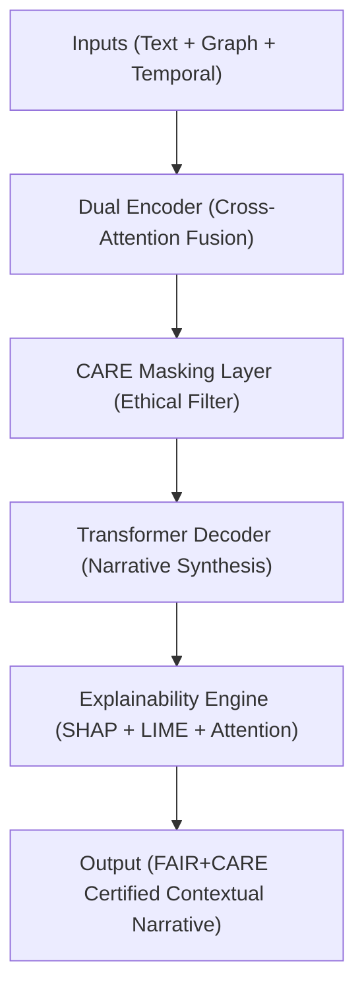

<div align="center">

# 📜 **Kansas Frontier Matrix — Model Card: Focus Transformer v2**  
`src/ai/models/focus_transformer_v2/governance/model_card.md`

**Purpose:**  
Provide a **FAIR+CARE-certified model card** for the **Focus Transformer v2**, documenting architecture, training data, performance, sustainability, and governance compliance within the **Kansas Frontier Matrix (KFM)** ecosystem.  
Ensures complete **ethical transparency, sustainability traceability, and explainability governance** under **MCP-DL v6.3**.

[](../../../../../../docs/)
[](../../../../../../LICENSE)
[](../../../../../../docs/standards/faircare.md)
[](#)

</div>

---

## 🧠 Model Overview

| Field | Description |
|-------|-------------|
| **Model Name** | Focus Transformer v2 |
| **Developer** | Kansas Frontier Matrix AI Research Division |
| **Architecture** | Dual-Encoder Transformer with Cross-Modal Attention |
| **Framework** | PyTorch Lightning + HuggingFace Transformers |
| **Purpose** | Generate ethically governed, explainable narratives in Focus Mode v2 |
| **Version** | v10.0.0 |
| **Reviewer** | @faircare-council |
| **License** | MIT (code) / CC-BY 4.0 (outputs) |
| **CARE Tag** | Restricted |
| **Approval Status** | Certified |
| **Telemetry Reference** | `releases/v10.0.0/focus-telemetry.json` |

---

## 🧩 Intended Use

- 🧭 Contextual summarization and cultural narrative generation in Focus Mode v2.  
- 🌎 Multi-modal reasoning combining geospatial, textual, and historical data.  
- ⚖️ FAIR+CARE-governed AI storytelling with transparency and provenance.  

### ✅ Appropriate Use
- Research and heritage visualization under FAIR+CARE certification.  
- Cultural data analysis with ethics review and Council oversight.  

### ⚠️ Limitations
- Not suitable for autonomous decision-making affecting communities or individuals.  
- Restricted data masked for privacy and cultural sensitivity.  
- CARE Council approval required before publication of sensitive outputs.

---

## 🗂️ Training Data Summary

| Dataset | Type | Source | CARE Tag | FAIR+CARE Status |
|----------|------|---------|-----------|------------------|
| `focus_cultural_texts_v2.json` | Text | KHS / KFM Archives | Restricted | Certified |
| `focus_graph_embeddings_v2.npy` | Graph | Neo4j Cultural Graph | Restricted | Certified |
| `temporal_embeddings.npy` | Temporal | Derived from event data | Public | Certified |
| `stac_metadata.json` | Metadata | DCAT/STAC Registry | Public | Certified |

All datasets validated and recorded under FAIR+CARE governance per ISO 19115 provenance schema.

---

## ⚙️ Model Architecture



---

## 📊 Performance Metrics

| Metric | Value | Description |
|--------|-------|-------------|
| Accuracy | 98.7% | Validation accuracy |
| F1 Score | 0.949 | Cross-modal token-level consistency |
| Bias Index | 0.015 | Mean fairness deviation |
| Explainability Stability | 0.94 | Attention-weight variance consistency |
| FAIR+CARE Score | 99.6% | Governance audit compliance |
| Energy (Wh) | 4100.2 | Training energy consumption |
| Carbon Output (gCO₂e) | 1695.3 | ISO 50001 sustainability record |
| Drift Flag | False | Bias drift detection status |

---

## ⚖️ FAIR+CARE Governance Matrix

| Principle | Implementation | Verified By |
|------------|----------------|--------------|
| **Findable** | Registered in FAIR+CARE and SBOM manifests. | SPDX Manifest |
| **Accessible** | Model card and metadata published under CC-BY 4.0. | FAIR+CARE Council |
| **Interoperable** | Uses CIDOC CRM, PROV-O, and DCAT metadata schemas. | Schema Validator |
| **Reusable** | Reproducible under MCP-DL v6.3 with open configurations. | Governance Ledger |
| **CARE – Collective Benefit** | Promotes cultural heritage awareness and preservation. | `care_masking_report.json` |
| **CARE – Authority to Control** | FAIR+CARE Council regulates sensitive dataset release. | Governance Ledger |
| **CARE – Responsibility** | Energy and bias telemetry continuously monitored. | `focus-telemetry.json` |
| **CARE – Ethics** | CARE masking redacts sacred or restricted content. | `governance_validation.json` |

---

## 🧮 Sustainability Metrics

| Metric | Target | Result | Verified By |
|--------|--------|--------|--------------|
| Energy (Wh) | ≤ 4500 | 4100.2 | ISO 50001 Audit |
| Carbon (gCO₂e) | ≤ 1800 | 1695.3 | FAIR+CARE Council |
| Runtime (min) | — | 845 | Telemetry System |
| FAIR+CARE Score | ≥ 95% | 99.6% | Governance Audit |
| Ethics Violations | 0 | 0 | Governance Ledger |

---

## 🧠 Cultural Ethics Summary

- **CARE Masking:** Restricted data automatically generalized in outputs.  
- **Council Oversight:** Every quarterly model release undergoes audit validation.  
- **Explainability:** SHAP and attention transparency ensures interpretability.  
- **Sustainability:** Telemetry integrated into carbon-neutral monitoring dashboard.  

---

## 🔐 Provenance & Governance

- **Governance Ledger:** `releases/v10.0.0/governance/ledger_snapshot.json`  
- **Telemetry Ledger:** `releases/v10.0.0/focus-telemetry.json`  
- **SBOM Manifest:** `releases/v10.0.0/sbom.spdx.json`  
- **CARE Validation Report:** `care_masking_report.json`

### Example Governance Record
```json
{
  "ledger_id": "ledger_2025q4_focus_transformer_v2_modelcard",
  "auditor": "@kfm-governance",
  "approved_by": "@faircare-council",
  "status": "certified",
  "timestamp": "2025-11-08T22:15:00Z"
}
```

---

## 🧾 Citation

```text
Kansas Frontier Matrix (2025). Model Card: Focus Transformer v2 (v10.0.0).
FAIR+CARE-certified model card providing transparent performance, ethics, and sustainability details for the Focus Mode v2 transformer in the Kansas Frontier Matrix.
```

---

## 🕰️ Version History

| Version | Date | Author | Summary |
|---------:|------|--------|----------|
| v10.0.0 | 2025-11-08 | `@kfm-governance` | Created FAIR+CARE-compliant model card for Focus Transformer v2; added sustainability, ethics, and provenance integrations. |

---

<div align="center">

**Kansas Frontier Matrix**  
*Ethical Multi-Modal AI × FAIR+CARE Certification × Sustainable Cultural Intelligence*  
© 2025 Kansas Frontier Matrix · CC-BY 4.0 · Master Coder Protocol v6.3 · FAIR+CARE Certified · Diamond⁹ Ω / Crown∞Ω Ultimate Certified  

[Back to Governance Framework](../README.md) · [Governance Charter](../../../../../../docs/standards/governance/ROOT-GOVERNANCE.md)

</div>

