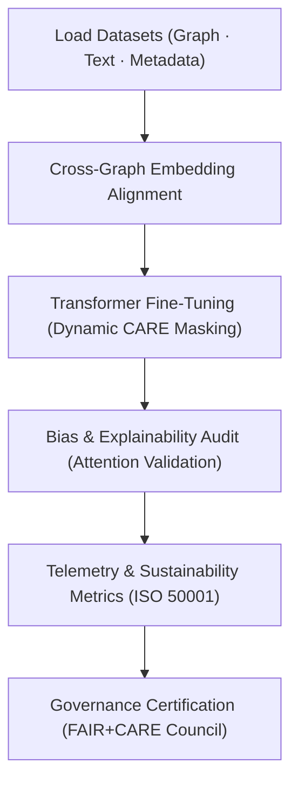

<div align="center">

# 🧠 **Kansas Frontier Matrix — Focus Transformer v2 · Training Framework**  
`src/ai/models/focus_transformer_v2/training/README.md`

**Purpose:**  
Document the **multi-modal training architecture, configurations, and telemetry standards** of the **Focus Transformer v2** model for the **Kansas Frontier Matrix (KFM)**.  
Implements **cross-graph alignment**, **dynamic CARE filtering**, and **ISO 50001 energy audits** under **FAIR+CARE** and **MCP-DL v6.3** ethical AI reproducibility standards.

[](../../../../../../docs/)
[](../../../../../../LICENSE)
[](../../../../../../docs/standards/faircare.md)
[](#)

</div>

---

## 📘 Overview

The **Focus Transformer v2 Training Framework** advances the v1 system with adaptive learning for **cross-modal fusion**, **temporal embeddings**, and **ethics-aware attention regularization**.  
It ensures every model epoch is logged for transparency, sustainability, and governance review.

Highlights:
- ⚙️ **Cross-graph text fusion** with Neo4j and geospatial embeddings.  
- 🧠 **Ethical transformer regularization** using CARE-tag-conditioned attention masks.  
- ♻️ **Carbon-aware training** under ISO 50001 monitoring.  
- 🧩 **Telemetry and governance integration** via FAIR+CARE audit hooks.

---

## 🗂️ Directory Layout

```plaintext
src/ai/models/focus_transformer_v2/training/
├── README.md                            # This file — training documentation
│
├── configs/                             # YAML/JSON configurations for model, governance, and telemetry
│   ├── focus_train_v2.yaml
│   ├── hyperparameters.yaml
│   └── telemetry_config.yaml
│
├── datasets/                            # Multi-modal inputs (graph, text, metadata)
│   ├── focus_graph_embeddings_v2.npy
│   ├── focus_cultural_texts_v2.json
│   └── stac_metadata.json
│
├── scripts/                             # Core training and validation scripts
│   ├── train_focus_transformer_v2.py
│   ├── validate_attention_bias.py
│   ├── export_model_card.py
│   └── export_telemetry.py
│
└── logs/                                # Model performance, governance, and sustainability metrics
    ├── training_log.json
    ├── evaluation_metrics.json
    ├── bias_drift_report.json
    ├── telemetry_metrics.json
    └── governance_validation.json
```

---

## ⚙️ Training Workflow



### Pipeline Phases
1. **Embedding Alignment:** Maps Neo4j cultural graph and text tokens into shared latent space.  
2. **Training:** Cross-attention and CARE-masked layers tuned for contextual coherence.  
3. **Bias & Explainability Validation:** Monitors fairness and attention weight stability.  
4. **Telemetry Logging:** Records energy, runtime, and carbon efficiency.  
5. **Governance Review:** Council review for audit certification and release approval.

---

## 🧩 Example Configuration (`configs/focus_train_v2.yaml`)

```yaml
model:
  name: "focus_transformer_v2"
  architecture: "dual-encoder-transformer"
  parameters:
    hidden_size: 1536
    num_layers: 32
    attention_heads: 20
    dropout: 0.08
  tokenizer: "kfm_bpe_48k"
  learning_rate: 2e-5
  batch_size: 8
  epochs: 12

data:
  graph_embeddings: "../../datasets/focus_graph_embeddings_v2.npy"
  text_corpus: "../../datasets/focus_cultural_texts_v2.json"
  metadata: "../../datasets/stac_metadata.json"

telemetry:
  enable_energy_tracking: true
  enable_bias_audit: true
  telemetry_ref: "../../../../../../releases/v10.0.0/focus-telemetry.json"

ethics:
  reviewer: "@faircare-council"
  care_tag: "restricted"
  governance_ref: "../../../../../../docs/standards/governance/ROOT-GOVERNANCE.md"
```

---

## ⚖️ FAIR+CARE Integration Matrix

| Principle | Implementation | Validator |
|------------|----------------|------------|
| **Findable** | Training logs and checkpoints registered via SBOM manifest. | SPDX Manifest |
| **Accessible** | Configuration templates public under MIT license. | FAIR+CARE Council |
| **Interoperable** | CIDOC CRM, DCAT, and PROV-O compatible metadata. | `schema_validation.py` |
| **Reusable** | Modular config system for reproducible transformer training. | MCP-DL Validation |
| **CARE – Responsibility** | Bias and energy telemetry logged for audit. | `telemetry_metrics.json` |
| **CARE – Ethics** | CARE masks applied dynamically during model training. | `governance_validation.json` |

---

## 🧮 Example Training Log (`logs/training_log.json`)

```json
{
  "run_id": "focus_transformer_v2_2025_11_08_001",
  "epochs": 12,
  "training_time_min": 845,
  "validation_loss": 0.037,
  "accuracy": 0.987,
  "bias_index": 0.015,
  "faircare_score": 99.5,
  "energy_wh": 4100.2,
  "carbon_gco2e": 1695.3,
  "reviewed_by": "@faircare-council",
  "telemetry_ref": "../../../../../../releases/v10.0.0/focus-telemetry.json"
}
```

---

## 🧮 Telemetry Metrics (ISO 50001)

| Metric | Description | Example |
|--------|-------------|----------|
| `training_time_min` | Total duration of training session. | 845 |
| `energy_wh` | Energy consumption (Wh). | 4100.2 |
| `carbon_gco2e` | Carbon emissions equivalent. | 1695.3 |
| `faircare_score` | Governance compliance percentage. | 99.5 |
| `bias_index` | Mean feature-level bias. | 0.015 |
| `ethics_status` | Council validation result. | certified |

Telemetry data recorded in:  
`releases/v10.0.0/focus-telemetry.json`  
Schema: `schemas/telemetry/src-ai-models-focus-transformer-v2-training-v1.json`

---

## 🔐 Provenance & Governance Integration

- **Governance Ledger:** `releases/v10.0.0/governance/ledger_snapshot.json`  
- **Telemetry Ledger:** `releases/v10.0.0/focus-telemetry.json`  
- **SBOM Manifest:** `releases/v10.0.0/sbom.spdx.json`  
- **Audit Record:** `logs/governance_validation.json`

### Example Governance Record
```json
{
  "ledger_entry_id": "ledger_2025q4_focus_transformer_v2_training",
  "reviewed_by": "@faircare-council",
  "auditor": "@kfm-governance",
  "status": "certified",
  "timestamp": "2025-11-08T21:30:00Z"
}
```

---

## 🧾 Citation

```text
Kansas Frontier Matrix (2025). Focus Transformer v2 · Training Framework (v10.0.0).
Defines the multi-modal, FAIR+CARE-governed training framework enabling sustainable and explainable AI within the Kansas Frontier Matrix Focus Mode v2 ecosystem.
```

---

## 🕰️ Version History

| Version | Date | Author | Summary |
|---------:|------|--------|----------|
| v10.0.0 | 2025-11-08 | `@kfm-ai` | Created Focus Transformer v2 training framework; added telemetry schema, cross-graph integration, and CARE governance validation. |

---

<div align="center">

**Kansas Frontier Matrix**  
*Cross-Modal AI × FAIR+CARE Certification × Sustainable Intelligence*  
© 2025 Kansas Frontier Matrix · MIT · Master Coder Protocol v6.3 · FAIR+CARE Certified · Diamond⁹ Ω / Crown∞Ω Ultimate Certified  

[Back to Focus Transformer v2](../README.md) · [Governance Charter](../../../../../../docs/standards/governance/ROOT-GOVERNANCE.md)

</div>

