<div align="center">

# 📂 **Kansas Frontier Matrix — Focus Transformer v2 · Training Datasets**  
`src/ai/models/focus_transformer_v2/training/datasets/README.md`

**Purpose:**  
Document the **multi-modal dataset collection, validation, and governance controls** used for training the **Focus Transformer v2** model within the **Kansas Frontier Matrix (KFM)**.  
These datasets integrate text, graph, and geospatial embeddings under **FAIR+CARE ethical standards** and **ISO 19115 provenance rules** to ensure transparency, accountability, and sustainability in AI model training.

[](../../../../../../../docs/)
[](../../../../../../../LICENSE)
[](../../../../../../../docs/standards/faircare.md)
[](#)

</div>

---

## 📘 Overview

The **Focus Transformer v2 Training Datasets** expand upon v1 by adding **temporal embeddings**, **context-linked cultural entities**, and **geospatial reasoning features** derived from Kansas historical archives and environmental data.  
Each dataset undergoes FAIR+CARE review for cultural sensitivity and sustainability impact.

Core Features:
- 🧩 **Cross-modal fusion:** Graph (Neo4j) + text (cultural narratives) + metadata (STAC/DCAT).  
- ⚖️ **Governed by FAIR+CARE:** Ethics validation for all input sources.  
- ♻️ **Telemetry-integrated data preparation:** Tracks energy, carbon, and governance metrics.  
- 🧠 **Ontology-compliant:** Structured by CIDOC CRM, DCAT 3.0, and PROV-O.  

---

## 🗂️ Directory Layout

```plaintext
src/ai/models/focus_transformer_v2/training/datasets/
├── README.md                              # This file — documentation for training datasets
│
├── focus_graph_embeddings_v2.npy           # Graph embeddings from Neo4j cultural graph
├── focus_cultural_texts_v2.json            # Preprocessed text corpus with cultural context
├── stac_metadata.json                      # STAC/DCAT dataset metadata with provenance
├── temporal_embeddings.npy                 # Temporal alignment vectors for event reasoning
├── metadata.json                           # FAIR+CARE and schema validation metadata
└── checksum_registry.json                  # SHA-256 hashes for dataset integrity
```

---

## ⚙️ Dataset Generation Workflow

```mermaid
flowchart TD
  A["Source Data (Neo4j · Archives · STAC/DCAT)"] --> B["Feature Engineering (Graph + Text + Temporal)"]
  B --> C["FAIR+CARE Validation (Ethics + Governance Council)"]
  C --> D["Telemetry Tracking (Energy + Carbon Metrics)"]
  D --> E["Export Certified Dataset (GeoParquet / JSON / NPY)"]
```



### Data Sources
| Source | Description | FAIR+CARE Tag | Provenance |
|---------|-------------|---------------|-------------|
| **Neo4j Graph** | Nodes: entities, places, time periods; edges: cultural relations. | Restricted | `graph_neo4j_dump_2025Q4.json` |
| **Cultural Texts** | Corpus of heritage narratives, oral histories, and reports. | Restricted | `focus_cultural_texts_v2.json` |
| **STAC/DCAT Metadata** | Dataset catalogs and geospatial footprints. | Public | `stac_metadata.json` |
| **Temporal Layers** | Time embeddings for event reasoning (preprocessed). | Public | `temporal_embeddings.npy` |

---

## 🧩 Example Dataset Metadata (`metadata.json`)

```json
{
  "dataset_id": "focus_transformer_v2_training_data_v10.0.0",
  "description": "Governed, multi-modal dataset integrating graph, text, and temporal embeddings for Focus Transformer v2 training.",
  "records": 258430,
  "modalities": ["graph", "text", "temporal", "metadata"],
  "ontology_alignment": ["CIDOC CRM", "PROV-O", "DCAT 3.0"],
  "faircare_status": "certified",
  "bias_score": 0.014,
  "energy_wh": 310.6,
  "carbon_gco2e": 126.3,
  "reviewed_by": "@faircare-council",
  "governance_ref": "../../../../../../../docs/standards/governance/ROOT-GOVERNANCE.md"
}
```

---

## ⚖️ FAIR+CARE Governance Matrix

| Principle | Implementation | Verification |
|------------|----------------|---------------|
| **Findable** | Indexed via STAC/DCAT UUID and manifest checksum. | `manifest_ref` |
| **Accessible** | Public metadata; restricted corpus content masked. | Governance Ledger |
| **Interoperable** | JSON-LD and GeoParquet schemas follow ISO 19115. | Schema Validator |
| **Reusable** | CC-BY 4.0 datasets with provenance logs. | SPDX Manifest |
| **CARE – Responsibility** | FAIR+CARE Council validates ethical sourcing. | `faircare-validate.yml` |
| **CARE – Ethics** | Sacred or private cultural data masked. | `checksum_registry.json` |

---

## 🧮 Telemetry Metrics

| Metric | Description | Example |
|--------|-------------|----------|
| `records` | Total dataset size. | 258,430 |
| `modalities` | Data types used in model training. | Graph, Text, Temporal |
| `bias_score` | Detected bias index. | 0.014 |
| `energy_wh` | Energy consumed during dataset generation. | 310.6 |
| `carbon_gco2e` | Carbon footprint in grams CO₂ equivalent. | 126.3 |
| `faircare_score` | FAIR+CARE compliance percentage. | 99.6 |

Telemetry logged to:  
`releases/v10.0.0/focus-telemetry.json`  
Schema: `schemas/telemetry/src-ai-models-focus-transformer-v2-training-datasets-v1.json`

---

## 🔐 Provenance & Governance Integration

- **Governance Ledger:** `releases/v10.0.0/governance/ledger_snapshot.json`  
- **Telemetry Ledger:** `releases/v10.0.0/focus-telemetry.json`  
- **SBOM Manifest:** `releases/v10.0.0/sbom.spdx.json`  
- **Checksum Registry:** `checksum_registry.json`

### Example Governance Record
```json
{
  "ledger_entry_id": "ledger_2025q4_focus_transformer_v2_training_datasets",
  "reviewed_by": "@faircare-council",
  "auditor": "@kfm-governance",
  "status": "certified",
  "timestamp": "2025-11-08T21:40:00Z"
}
```

---

## 🧾 Citation

```text
Kansas Frontier Matrix (2025). Focus Transformer v2 · Training Datasets (v10.0.0).
FAIR+CARE-certified multi-modal dataset documentation integrating graph, text, and temporal data for sustainable and ethically governed transformer training within the Kansas Frontier Matrix.
```

---

## 🕰️ Version History

| Version | Date | Author | Summary |
|---------:|------|--------|----------|
| v10.0.0 | 2025-11-08 | `@kfm-ai` | Created training dataset documentation for Focus Transformer v2 with FAIR+CARE validation, sustainability telemetry, and CIDOC CRM compliance. |

---

<div align="center">

**Kansas Frontier Matrix**  
*Multi-Modal Data × FAIR+CARE Governance × Sustainable AI Training*  
© 2025 Kansas Frontier Matrix · CC-BY 4.0 · Master Coder Protocol v6.3 · FAIR+CARE Certified · Diamond⁹ Ω / Crown∞Ω Ultimate Certified  

[Back to Training Framework](../README.md) · [Governance Charter](../../../../../../../docs/standards/governance/ROOT-GOVERNANCE.md)

</div>

