<div align="center">

# 🧾 **Kansas Frontier Matrix — Focus Transformer v2 · Training Logs**  
`src/ai/models/focus_transformer_v2/training/logs/README.md`

**Purpose:**  
Document all **training performance, bias metrics, and sustainability telemetry logs** generated during Focus Transformer v2 model training for the **Kansas Frontier Matrix (KFM)**.  
These logs support **FAIR+CARE governance**, **ISO 50001 energy transparency**, and **MCP-DL v6.3 reproducibility** for Focus Mode AI v2.

[](../../../../../../../docs/)
[](../../../../../../../LICENSE)
[](../../../../../../../docs/standards/faircare.md)
[](#)

</div>

---

## 📘 Overview

The **Focus Transformer v2 Training Logs** provide complete traceability for every model training and fine-tuning session.  
They record validation accuracy, bias drift, and sustainability metrics, ensuring transparency and ethical governance throughout the model lifecycle.

Logs feed into:
- 🧠 **Telemetry Ledger** → sustainability + fairness metrics.  
- ⚖️ **Governance Ledger** → FAIR+CARE Council certifications.  
- ♻️ **SBOM Manifest** → traceable model provenance and reproducibility.  

---

## 🗂️ Directory Layout

```plaintext
src/ai/models/focus_transformer_v2/training/logs/
├── README.md                            # This file — training logs documentation
│
├── training_log.json                    # Core training statistics and metrics
├── evaluation_metrics.json              # Validation, accuracy, and fairness results
├── bias_drift_report.json               # Bias and explainability audit outcomes
├── telemetry_metrics.json               # ISO 50001 energy and sustainability telemetry
└── governance_validation.json           # FAIR+CARE Council audit and ethics certification
```

---

## ⚙️ Training Log Workflow

```mermaid
flowchart TD
  A["Model Training (train_focus_transformer_v2.py)"] --> B["Validation & Evaluation (Accuracy / Bias)"]
  B --> C["Explainability & Drift Detection (LIME / SHAP)"]
  C --> D["Telemetry Export (Energy · Carbon · Ethics)"]
  D --> E["Governance Ledger Sync (FAIR+CARE Certification)"]
```



### Workflow Stages
1. **Model Training:** Logs epoch, loss, and attention map stability.  
2. **Validation:** Captures metrics such as AUROC, F1, and explainability scores.  
3. **Bias Audit:** Quantifies fairness drift and sensitive data correlations.  
4. **Telemetry Export:** Logs sustainability metrics (energy, runtime, CO₂).  
5. **Governance Certification:** FAIR+CARE Council approves audit results.

---

## 🧩 Example: Training Log (`training_log.json`)

```json
{
  "run_id": "focus_transformer_v2_train_2025_11_08_001",
  "epochs": 12,
  "training_time_min": 845,
  "validation_loss": 0.037,
  "accuracy": 0.987,
  "f1_score": 0.946,
  "bias_index": 0.015,
  "faircare_score": 99.5,
  "energy_wh": 4100.2,
  "carbon_gco2e": 1695.3,
  "reviewed_by": "@faircare-council",
  "telemetry_ref": "../../../../../../../releases/v10.0.0/focus-telemetry.json"
}
```

---

## ⚖️ FAIR+CARE Compliance Matrix

| Principle | Implementation | Verified By |
|------------|----------------|--------------|
| **Findable** | Log entries UUID-registered and SBOM-linked. | FAIR+CARE Council |
| **Accessible** | Governance-reviewed metrics publicly visible post-certification. | `governance_validation.json` |
| **Interoperable** | JSON schema aligned with ISO 19115 + PROV-O. | Schema Validator |
| **Reusable** | CC-BY 4.0 JSON format, schema validated. | SPDX Manifest |
| **CARE – Responsibility** | Bias and sustainability data logged and reviewed quarterly. | `faircare-validate.yml` |
| **CARE – Ethics** | Model behavior audited before public release. | `bias_drift_report.json` |

---

## 🧮 Example: Bias & Drift Report (`bias_drift_report.json`)

```json
{
  "report_id": "bias_audit_focus_transformer_v2_2025_11_08",
  "bias_index": 0.015,
  "drift_detected": false,
  "attention_stability": 0.94,
  "restricted_features": 1,
  "explainability_variance": 0.06,
  "reviewed_by": "@faircare-council",
  "status": "certified",
  "timestamp": "2025-11-08T21:50:00Z"
}
```

---

## 🧮 Telemetry Metrics

| Metric | Description | Example |
|--------|-------------|----------|
| `training_time_min` | Duration of training. | 845 |
| `energy_wh` | Energy consumption. | 4100.2 |
| `carbon_gco2e` | Carbon footprint equivalent (gCO₂e). | 1695.3 |
| `faircare_score` | FAIR+CARE ethical compliance score. | 99.5 |
| `bias_index` | Mean bias score across epochs. | 0.015 |
| `ethics_status` | Governance Council approval status. | certified |

Telemetry recorded in:  
`releases/v10.0.0/focus-telemetry.json`  
Schema: `schemas/telemetry/src-ai-models-focus-transformer-v2-training-logs-v1.json`

---

## 🔐 Governance & Provenance Integration

- **Governance Ledger:** `releases/v10.0.0/governance/ledger_snapshot.json`  
- **Telemetry Ledger:** `releases/v10.0.0/focus-telemetry.json`  
- **SBOM Manifest:** `releases/v10.0.0/sbom.spdx.json`  
- **CARE Validation:** `governance_validation.json`

### Example Governance Record
```json
{
  "ledger_entry_id": "ledger_2025q4_focus_transformer_v2_training_logs",
  "auditor": "@kfm-governance",
  "reviewed_by": "@faircare-council",
  "status": "approved",
  "timestamp": "2025-11-08T21:55:00Z"
}
```

---

## 🧾 Citation

```text
Kansas Frontier Matrix (2025). Focus Transformer v2 · Training Logs (v10.0.0).
FAIR+CARE-certified, ISO-compliant logging framework documenting transparency, ethical performance, and sustainability metrics for transformer training in the Kansas Frontier Matrix Focus Mode v2.
```

---

## 🕰️ Version History

| Version | Date | Author | Summary |
|---------:|------|--------|----------|
| v10.0.0 | 2025-11-08 | `@kfm-ai` | Created Focus Transformer v2 training logs documentation; integrated FAIR+CARE and sustainability telemetry tracking. |

---

<div align="center">

**Kansas Frontier Matrix**  
*Ethical Transformer Training × FAIR+CARE Certification × Sustainable Intelligence*  
© 2025 Kansas Frontier Matrix · Internal FAIR+CARE Certified · Master Coder Protocol v6.3 · Diamond⁹ Ω / Crown∞Ω Ultimate Certified  

[Back to Training Framework](../README.md) · [Governance Charter](../../../../../../../docs/standards/governance/ROOT-GOVERNANCE.md)

</div>

