<div align="center">

# ⚙️ **Kansas Frontier Matrix — Focus Transformer v2 · Training Scripts**  
`src/ai/models/focus_transformer_v2/training/scripts/README.md`

**Purpose:**  
Document the **Python scripts** responsible for training, validating, and governing the **Focus Transformer v2** multi-modal model.  
These scripts integrate **cross-graph attention**, **dynamic CARE masking**, and **FAIR+CARE governance telemetry**, ensuring **ISO 50001 sustainability compliance** and **MCP-DL v6.3 reproducibility** across all Focus Mode v2 workflows.

[](../../../../../../../docs/)
[](../../../../../../../LICENSE)
[](../../../../../../../docs/standards/faircare.md)
[](#)

</div>

---

## 📘 Overview

The **Training Scripts Module** orchestrates the end-to-end model lifecycle for the **Focus Transformer v2** system.  
It manages **data ingestion**, **model training**, **explainability validation**, and **telemetry export**, embedding ethical checks and sustainability logging within every process.

Core Functions:
- 🧩 Load multi-modal graph + text datasets for cross-encoder training.  
- 🧠 Fine-tune the transformer model using dynamic CARE-tag-based attention filters.  
- ⚙️ Validate interpretability and fairness using attention/bias metrics.  
- ♻️ Export FAIR+CARE-compliant telemetry and governance audit logs.  

---

## 🗂️ Directory Layout

```plaintext
src/ai/models/focus_transformer_v2/training/scripts/
├── README.md                             # This file — documentation for scripts
│
├── train_focus_transformer_v2.py         # Main multi-modal fine-tuning pipeline
├── validate_attention_bias.py            # Validates interpretability and fairness
├── export_model_card.py                  # Generates FAIR+CARE model documentation
├── export_telemetry.py                   # Logs energy, runtime, and sustainability metrics
└── utils/                                # Reusable script utilities
    ├── data_loader.py
    ├── embedding_utils.py
    ├── evaluation_tools.py
    └── telemetry_utils.py
```

---

## ⚙️ Workflow Overview

```mermaid
flowchart TD
  A["Multi-Modal Datasets (Graph · Text · Temporal)"] --> B["train_focus_transformer_v2.py"]
  B --> C["validate_attention_bias.py"]
  C --> D["export_model_card.py"]
  D --> E["export_telemetry.py"]
  E --> F["Governance Ledger Sync (FAIR+CARE Certification)"]
```



### Script Descriptions
| Script | Function | Output |
|--------|-----------|---------|
| `train_focus_transformer_v2.py` | Fine-tunes transformer using cross-modal data. | `training_log.json` |
| `validate_attention_bias.py` | Monitors explainability and fairness metrics. | `evaluation_metrics.json` |
| `export_model_card.py` | Creates governance-approved model documentation. | `model_card.md` |
| `export_telemetry.py` | Logs ISO 50001-compliant sustainability metrics. | `telemetry_metrics.json` |

---

## 🧩 Example: Training Script (`train_focus_transformer_v2.py`)

```python
import torch
from transformers import Trainer, TrainingArguments
from model import FocusTransformerV2
from utils.data_loader import load_multimodal_dataset

# Load Data
dataset = load_multimodal_dataset("../../datasets")
model = FocusTransformerV2()

# Training Configuration
training_args = TrainingArguments(
    output_dir="../../checkpoints/",
    learning_rate=2e-5,
    per_device_train_batch_size=8,
    num_train_epochs=12,
    logging_dir="../../logs/",
    report_to="none"
)

# Train and Save
trainer = Trainer(model=model, args=training_args, train_dataset=dataset)
trainer.train()
torch.save(model.state_dict(), "../../checkpoints/focus_transformer_v2_final.pt")
```

---

## 🧮 Example: Telemetry Export Script (`export_telemetry.py`)

```python
import json, time, psutil

def record_energy(runtime_sec, power_watts=220):
    """Estimate energy consumption in Wh."""
    return (power_watts * runtime_sec) / 3600

def export_telemetry(log_path, runtime_sec):
    """Export FAIR+CARE-compliant telemetry record."""
    energy_wh = record_energy(runtime_sec)
    telemetry = {
        "session": f"focus_transformer_v2_train_{int(time.time())}",
        "energy_wh": round(energy_wh, 2),
        "carbon_gco2e": round(energy_wh * 0.41, 2),
        "timestamp": time.strftime("%Y-%m-%dT%H:%M:%SZ")
    }
    with open(log_path, "w") as f:
        json.dump(telemetry, f, indent=2)
    return telemetry

# Example run:
export_telemetry("../../logs/telemetry_metrics.json", runtime_sec=40500)
```

---

## ⚖️ FAIR+CARE Integration Matrix

| Principle | Implementation | Validator |
|------------|----------------|------------|
| **Findable** | All logs indexed by UUID in telemetry schema. | `telemetry-export.yml` |
| **Accessible** | Scripts released under open MIT license. | FAIR+CARE Council |
| **Interoperable** | Output metadata aligns with ISO 19115 + DCAT standards. | Schema Validator |
| **Reusable** | Modular, reusable script utilities and telemetry hooks. | SPDX Manifest |
| **CARE – Responsibility** | Logs ethical and energy metrics for each session. | `telemetry_metrics.json` |
| **CARE – Ethics** | Governance approval embedded before publication. | `governance_validation.json` |

---

## 🧮 Telemetry Metrics

| Metric | Description | Example |
|--------|-------------|----------|
| `runtime_sec` | Total duration of training. | 40500 |
| `energy_wh` | Power used for transformer fine-tuning. | 4100.2 |
| `carbon_gco2e` | CO₂ emissions equivalent. | 1695.3 |
| `bias_index` | Average feature-level bias. | 0.015 |
| `faircare_score` | FAIR+CARE audit score. | 99.5 |

Telemetry recorded in:  
`releases/v10.0.0/focus-telemetry.json`  
Schema: `schemas/telemetry/src-ai-models-focus-transformer-v2-training-scripts-v1.json`

---

## 🔐 Governance & Provenance Integration

- **Governance Ledger:** `releases/v10.0.0/governance/ledger_snapshot.json`  
- **Telemetry Ledger:** `releases/v10.0.0/focus-telemetry.json`  
- **SBOM Manifest:** `releases/v10.0.0/sbom.spdx.json`  
- **Ethics Validation:** `logs/governance_validation.json`  

### Example Governance Record
```json
{
  "ledger_entry_id": "ledger_2025q4_focus_transformer_v2_training_scripts",
  "reviewed_by": "@faircare-council",
  "auditor": "@kfm-governance",
  "status": "approved",
  "timestamp": "2025-11-08T21:42:00Z"
}
```

---

## 🧾 Citation

```text
Kansas Frontier Matrix (2025). Focus Transformer v2 · Training Scripts (v10.0.0).
Comprehensive FAIR+CARE-governed automation scripts ensuring sustainable, explainable, and ethically audited transformer training within the Kansas Frontier Matrix Focus Mode v2 system.
```

---

## 🕰️ Version History

| Version | Date | Author | Summary |
|---------:|------|--------|----------|
| v10.0.0 | 2025-11-08 | `@kfm-ai` | Created training script documentation for Focus Transformer v2; added telemetry schema, CARE validation, and governance integration. |

---

<div align="center">

**Kansas Frontier Matrix**  
*Transparent AI × FAIR+CARE Ethics × Sustainable Intelligence*  
© 2025 Kansas Frontier Matrix · MIT · Master Coder Protocol v6.3 · FAIR+CARE Certified · Diamond⁹ Ω / Crown∞Ω Ultimate Certified  

[Back to Training Framework](../README.md) · [Governance Charter](../../../../../../../docs/standards/governance/ROOT-GOVERNANCE.md)

</div>

