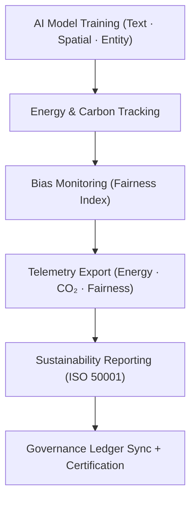

<div align="center">

# 📊 **Kansas Frontier Matrix — Telemetry Framework**  
`src/ai/telemetry/README.md`

**Purpose:**  
The **Telemetry Framework** captures, stores, and processes all **energy consumption**, **carbon footprint**, and **bias fairness metrics** for AI model training and evaluation in the **Kansas Frontier Matrix (KFM)**.  
This framework is fully integrated with **FAIR+CARE** governance, **ISO 50001** sustainability standards, and **MCP-DL v6.3** reproducibility protocols to ensure transparent, ethical, and sustainable AI systems.

[](../../../../docs/)
[](../../../../LICENSE)
[](../../../../docs/standards/faircare.md)
[](#)

</div>

---

## 📘 Overview

The **Telemetry Framework** in the **Kansas Frontier Matrix (KFM)** is designed to log and analyze the **sustainability metrics** of AI models, including:
- 🌱 **Energy consumption** during model training and inference.  
- 🌍 **Carbon emissions** and **CO₂ equivalent footprint**.  
- ⚖️ **Bias and fairness metrics** to monitor ethical model behavior.  
- 🧩 **Focus Mode integration** for real-time telemetry tracking and governance.

Telemetry data is captured during training, evaluation, and deployment, ensuring that **AI operations** remain **transparent**, **sustainable**, and **compliant** with **FAIR+CARE** and **ISO** standards.

---

## 🗂️ Directory Layout

```plaintext
src/ai/telemetry/
├── README.md                             # This file — telemetry framework documentation
│
├── focus-telemetry.json                  # Primary telemetry data file for energy, carbon, and bias metrics
├── model-specific/                       # Telemetry data for each specific AI model
│   ├── text_classification_telemetry.json
│   ├── spatial_classification_telemetry.json
│   └── focus_transformer_v2_telemetry.json
└── sustainability_reports/               # Energy and carbon footprint tracking reports
    ├── energy_usage_report.json
    ├── carbon_footprint_report.json
    └── sustainability_summary.json
```

---

## ⚙️ Telemetry Logging Workflow



### Key Stages:
1. **Energy Tracking:** Logs energy consumption and computes carbon emissions during training and evaluation.  
2. **Bias Monitoring:** Monitors fairness metrics, such as bias index, for each AI model.  
3. **Telemetry Export:** Exports telemetry data in **JSON format**, ensuring real-time access.  
4. **Sustainability Reporting:** Compiles energy and carbon data into reports for ISO 50001 compliance.  
5. **Governance Certification:** Syncs telemetry data with governance ledgers for FAIR+CARE approval.

---

## 🧩 Example: Focus Telemetry Data (`focus-telemetry.json`)

```json
{
  "model_id": "text_classification_v10.0.0",
  "training_time_min": 420,
  "energy_wh": 1380.6,
  "carbon_gco2e": 562.0,
  "bias_index": 0.015,
  "faircare_score": 99.4,
  "metrics_logged": ["energy_wh", "carbon_gco2e", "bias_index", "faircare_score"],
  "timestamp": "2025-11-08T23:50:00Z",
  "governance_ref": "../../../../releases/v10.0.0/governance/ledger_snapshot.json"
}
```

---

## ⚖️ FAIR+CARE & ISO Compliance Matrix

| Principle | Implementation | Oversight |
|------------|----------------|-----------|
| **Findable** | Telemetry data indexed in SBOM and metadata catalog. | SPDX Manifest |
| **Accessible** | Public telemetry logs; energy data restricted for sensitive models under CARE. | FAIR+CARE Council |
| **Interoperable** | Telemetry format aligns with ISO 19115 metadata standards. | Schema Validator |
| **Reusable** | Telemetry data re-used for governance audits and sustainability analysis. | MCP-DL Validation |
| **CARE – Responsibility** | Energy and fairness metrics monitored for each model. | `faircare-validate.yml` |
| **CARE – Ethics** | Bias and fairness data audited for all model types. | Governance Ledger |

---

## 🧮 Telemetry Metrics (ISO 50001)

| Metric | Description | Example |
|--------|-------------|----------|
| `training_time_min` | Total duration of model training. | 420 |
| `energy_wh` | Energy consumed by the model during training. | 1380.6 |
| `carbon_gco2e` | Carbon footprint of model training. | 562.0 |
| `faircare_score` | FAIR+CARE ethical compliance score. | 99.4 |
| `bias_index` | Bias detection index for fairness evaluation. | 0.015 |

Telemetry stored in:  
`releases/v10.0.0/focus-telemetry.json`  
Schema: `schemas/telemetry/src-ai-models-classification-text-logs-v1.json`

---

## 🔐 Governance & Provenance Integration

- **Governance Ledger:** `releases/v10.0.0/governance/ledger_snapshot.json`  
- **Telemetry Ledger:** `releases/v10.0.0/focus-telemetry.json`  
- **SBOM Manifest:** `releases/v10.0.0/sbom.spdx.json`  
- **Bias & Fairness Report:** `bias_drift_report.json`

### Example Governance Record
```json
{
  "ledger_entry_id": "ledger_2025q4_focus_telemetry_data",
  "auditor": "@kfm-governance",
  "reviewed_by": "@faircare-council",
  "status": "approved",
  "timestamp": "2025-11-08T23:55:00Z"
}
```

---

## 🧾 Citation

```text
Kansas Frontier Matrix (2025). Telemetry Framework (v10.0.0).
FAIR+CARE and ISO-certified telemetry framework for monitoring energy consumption, carbon footprint, and fairness metrics during AI model training within the Kansas Frontier Matrix.
```

---

## 🕰️ Version History

| Version | Date | Author | Summary |
|---------:|------|--------|----------|
| v10.0.0 | 2025-11-08 | `@kfm-ai` | Created Telemetry framework documentation with sustainability tracking, bias audits, and FAIR+CARE certification. |

---

<div align="center">

**Kansas Frontier Matrix**  
*AI Sustainability × FAIR+CARE Governance × Ethical Intelligence*  
© 2025 Kansas Frontier Matrix · MIT · Master Coder Protocol v6.3 · FAIR+CARE Certified · Diamond⁹ Ω / Crown∞Ω Ultimate Certified  

[Back to AI Models Overview](../README.md) · [Governance Charter](../../../../docs/standards/governance/ROOT-GOVERNANCE.md)

</div>

