<div align="center">

# 📊 **Kansas Frontier Matrix — Model-Specific Telemetry Logs**  
`src/ai/telemetry/model-specific/README.md`

**Purpose:**  
Provide **model-specific telemetry logs** for individual AI models used in the **Kansas Frontier Matrix (KFM)**.  
These logs include performance, sustainability, and fairness metrics, with full integration into **FAIR+CARE** governance, **ISO 50001** energy tracking, and **MCP-DL v6.3** reproducibility standards.

[](../../../../docs/)
[](../../../../LICENSE)
[](../../../../docs/standards/faircare.md)
[](#)

</div>

---

## 📘 Overview

The **Model-Specific Telemetry Logs** directory contains telemetry data specific to the AI models used across KFM’s ecosystem, including:
- 🌱 **Energy usage** and **carbon emissions** tracking during training and inference.
- ⚖️ **Bias and fairness metrics** to ensure model decisions remain equitable across all use cases.
- 🔐 **Provenance and governance logs** ensuring compliance with **FAIR+CARE** and **ISO 50001** sustainability standards.

Each model has its own telemetry log file, which is linked to its **Focus Mode** deployment, **Knowledge Graph** integration, and **FAIR+CARE certification**.

---

## 🗂️ Directory Layout

```plaintext
src/ai/telemetry/model-specific/
├── README.md                             # This file — documentation for model-specific telemetry logs
│
├── text_classification_telemetry.json    # Telemetry logs for the Text Classification model
├── spatial_classification_telemetry.json # Telemetry logs for the Spatial Classification model
├── focus_transformer_v2_telemetry.json   # Telemetry logs for the Focus Transformer v2 model
└── entity_classification_telemetry.json  # Telemetry logs for the Entity Classification model
```

---

## ⚙️ Telemetry Workflow

```mermaid
flowchart TD
  A["AI Model Inference (Text · Spatial · Entity)"] --> B["Energy Consumption Monitoring"]
  B --> C["Carbon Emission Calculation"]
  C --> D["Bias & Fairness Tracking"]
  D --> E["Telemetry Data Export (Energy · CO₂ · Fairness)"]
  E --> F["Governance Review & Ledger Sync"]
```



### Key Workflow Stages:
1. **Energy Tracking:** Logs energy usage and calculates carbon emissions for every model run.  
2. **Bias & Fairness Tracking:** Records fairness metrics such as bias index and drift analysis for all models.  
3. **Data Export:** Telemetry data is exported as **JSON**, linked to the **FAIR+CARE ledger**.  
4. **Governance Sync:** Telemetry data is sent to the **Governance Ledger** for FAIR+CARE certification.

---

## 🧩 Example: Focus Transformer v2 Telemetry Data (`focus_transformer_v2_telemetry.json`)

```json
{
  "model_id": "focus_transformer_v2",
  "training_time_min": 420,
  "energy_wh": 4100.2,
  "carbon_gco2e": 1695.3,
  "bias_index": 0.016,
  "faircare_score": 99.5,
  "metrics_logged": ["energy_wh", "carbon_gco2e", "bias_index", "faircare_score"],
  "timestamp": "2025-11-08T23:50:00Z",
  "governance_ref": "../../../../releases/v10.0.0/governance/ledger_snapshot.json"
}
```

---

## ⚖️ FAIR+CARE & ISO Compliance Matrix

| Principle | Implementation | Oversight |
|------------|----------------|------------|
| **Findable** | Telemetry logs indexed and tracked through SBOM and metadata. | SPDX Manifest |
| **Accessible** | Public telemetry logs; restricted data under CARE. | FAIR+CARE Council |
| **Interoperable** | Telemetry format follows ISO 19115 metadata standards. | Schema Validator |
| **Reusable** | Telemetry logs are reusable for auditing and reporting. | MCP-DL Validation |
| **CARE – Responsibility** | Bias and fairness logs monitored for each model. | `faircare-validate.yml` |
| **CARE – Ethics** | Sensitive data redacted from all logged results. | Governance Ledger |

---

## 🧮 Telemetry Metrics (ISO 50001)

| Metric | Description | Example |
|--------|-------------|----------|
| `training_time_min` | Total duration of model training. | 420 |
| `energy_wh` | Energy consumed during training. | 4100.2 |
| `carbon_gco2e` | CO₂ equivalent emissions during model training. | 1695.3 |
| `bias_index` | Fairness deviation index. | 0.016 |
| `faircare_score` | FAIR+CARE compliance score. | 99.5 |

Telemetry recorded in:  
`releases/v10.0.0/focus-telemetry.json`  
Schema: `schemas/telemetry/src-ai-models-classification-text-logs-v1.json`

---

## 🔐 Governance & Provenance Integration

- **Governance Ledger:** `releases/v10.0.0/governance/ledger_snapshot.json`  
- **Telemetry Ledger:** `releases/v10.0.0/focus-telemetry.json`  
- **SBOM Manifest:** `releases/v10.0.0/sbom.spdx.json`  
- **Bias & Fairness Reports:** `bias_drift_report.json`

### Example Governance Record
```json
{
  "ledger_entry_id": "ledger_2025q4_focus_telemetry_data",
  "auditor": "@kfm-governance",
  "reviewed_by": "@faircare-council",
  "status": "approved",
  "timestamp": "2025-11-08T23:55:00Z"
}
```

---

## 🧾 Citation

```text
Kansas Frontier Matrix (2025). Model-Specific Telemetry Logs (v10.0.0).
FAIR+CARE and ISO-certified telemetry framework for monitoring energy, CO₂, and fairness metrics during AI model training and evaluation within the Kansas Frontier Matrix.
```

---

## 🕰️ Version History

| Version | Date | Author | Summary |
|---------:|------|--------|----------|
| v10.0.0 | 2025-11-08 | `@kfm-ai` | Created model-specific telemetry documentation; integrated FAIR+CARE, ISO 50001, and sustainability metrics tracking. |

---

<div align="center">

**Kansas Frontier Matrix**  
*AI Sustainability × FAIR+CARE Ethics × Reproducible Intelligence*  
© 2025 Kansas Frontier Matrix · MIT · Master Coder Protocol v6.3 · FAIR+CARE Certified · Diamond⁹ Ω / Crown∞Ω Ultimate Certified  

[Back to Telemetry Framework](../README.md) · [Governance Charter](../../../../docs/standards/governance/ROOT-GOVERNANCE.md)

</div>

