<div align="center">

# 🌱 **Kansas Frontier Matrix — Sustainability Telemetry Reports**  
`src/ai/telemetry/sustainability_reports/README.md`

**Purpose:**  
Document the **sustainability metrics**, including **energy usage**, **carbon footprint**, and **efficiency tracking**, for AI models in the **Kansas Frontier Matrix (KFM)**.  
These reports align with **ISO 50001**, **FAIR+CARE**, and **MCP-DL v6.3** standards to ensure ethical and sustainable model development and deployment.

[](../../../../docs/)
[](../../../../LICENSE)
[](../../../../docs/standards/faircare.md)
[](#)

</div>

---

## 📘 Overview

The **Sustainability Telemetry Reports** capture **environmental impact metrics** for all AI model training runs within KFM.  
This includes tracking energy usage, carbon emissions, and operational efficiency, ensuring compliance with **ISO 50001** and **FAIR+CARE** standards for sustainability.

Key Components:
- 🌍 **Energy Tracking:** Monitors total energy consumed during model training and evaluation.  
- 🌱 **Carbon Footprint:** Calculates CO₂ equivalent emissions based on energy consumption.  
- ⚖️ **Fairness Audits:** Monitors bias drift, ensuring ethical model behavior in training.  
- 📊 **Efficiency Metrics:** Tracks model runtime and efficiency relative to performance.

---

## 🗂️ Directory Layout

```plaintext
src/ai/telemetry/sustainability_reports/
├── README.md                              # This file — sustainability reports documentation
│
├── energy_usage_report.json               # Total energy usage for model training
├── carbon_footprint_report.json           # CO₂ emissions during model training
├── sustainability_summary.json            # Overall sustainability audit and metrics
```

---

## ⚙️ Sustainability Reporting Workflow

```mermaid
flowchart TD
  A["Model Training (Text · Spatial · Entity)"] --> B["Energy Usage Logging (Wh)"]
  B --> C["Carbon Emission Calculation (gCO₂e)"]
  C --> D["Efficiency & Runtime Metrics"]
  D --> E["Sustainability Reporting (ISO 50001)"]
  E --> F["Governance Review & Ledger Sync"]
```



### Key Workflow Stages:
1. **Energy Logging:** Tracks the total energy consumption during model training and inference.  
2. **Carbon Calculation:** Computes the carbon footprint using energy usage data and conversion factors.  
3. **Efficiency Metrics:** Measures how efficient the model is in terms of energy usage per task completed.  
4. **Reporting:** Generates ISO 50001-compliant reports for internal sustainability audits.  
5. **Governance Sync:** Telemetry is synchronized with the **Governance Ledger** for **FAIR+CARE** certification.

---

## 🧩 Example: Energy Usage Report (`energy_usage_report.json`)

```json
{
  "model_id": "text_classification_v10.0.0",
  "training_time_min": 420,
  "energy_wh": 1380.6,
  "carbon_gco2e": 562.0,
  "efficiency_wh_per_task": 3.3,
  "metrics_logged": ["energy_wh", "carbon_gco2e", "efficiency_wh_per_task"],
  "timestamp": "2025-11-08T23:50:00Z",
  "governance_ref": "../../../../releases/v10.0.0/governance/ledger_snapshot.json"
}
```

---

## ⚖️ FAIR+CARE & ISO 50001 Compliance Matrix

| Principle | Implementation | Verification |
|------------|----------------|--------------|
| **Findable** | Sustainability metrics indexed in SBOM manifest and telemetry ledger. | SPDX Manifest |
| **Accessible** | Public reports for energy and carbon metrics; restricted models under CARE. | FAIR+CARE Council |
| **Interoperable** | JSON schema aligns with ISO 50001 standards for sustainability. | Schema Validator |
| **Reusable** | Metrics available for comparison across training sessions and models. | MCP-DL Validation |
| **CARE – Responsibility** | Sustainability reports audited for bias and drift in model fairness. | `faircare-validate.yml` |
| **CARE – Ethics** | Sensitive data logged with CARE-compliant masking for privacy. | Governance Ledger |

---

## 🧮 Example: Carbon Footprint Report (`carbon_footprint_report.json`)

```json
{
  "report_id": "carbon_footprint_2025_11_08",
  "total_energy_wh": 1380.6,
  "carbon_gco2e": 562.0,
  "carbon_emission_factor_gco2e_per_wh": 0.41,
  "model": "text_classification_v10.0.0",
  "reviewed_by": "@faircare-council",
  "status": "certified",
  "timestamp": "2025-11-08T23:55:00Z"
}
```

---

## 🧮 Telemetry Metrics (ISO 50001)

| Metric | Description | Example |
|--------|-------------|----------|
| `energy_wh` | Total energy consumed during training. | 1380.6 |
| `carbon_gco2e` | CO₂ equivalent emissions. | 562.0 |
| `efficiency_wh_per_task` | Energy efficiency in terms of tasks completed. | 3.3 |
| `training_time_min` | Total model training time. | 420 |

Telemetry recorded in:  
`releases/v10.0.0/focus-telemetry.json`  
Schema: `schemas/telemetry/src-ai-telemetry-sustainability-v1.json`

---

## 🔐 Governance & Provenance Integration

- **Governance Ledger:** `releases/v10.0.0/governance/ledger_snapshot.json`  
- **Telemetry Ledger:** `releases/v10.0.0/focus-telemetry.json`  
- **SBOM Manifest:** `releases/v10.0.0/sbom.spdx.json`  
- **Sustainability Report:** `energy_usage_report.json`, `carbon_footprint_report.json`

### Example Governance Record
```json
{
  "ledger_entry_id": "ledger_2025q4_sustainability_reports",
  "auditor": "@kfm-governance",
  "reviewed_by": "@faircare-council",
  "status": "approved",
  "timestamp": "2025-11-08T23:55:00Z"
}
```

---

## 🧾 Citation

```text
Kansas Frontier Matrix (2025). Sustainability Telemetry Reports (v10.0.0).
FAIR+CARE and ISO 50001-compliant framework for monitoring energy consumption, CO₂ emissions, and model efficiency during AI training and evaluation within the Kansas Frontier Matrix.
```

---

## 🕰️ Version History

| Version | Date | Author | Summary |
|---------:|------|--------|----------|
| v10.0.0 | 2025-11-08 | `@kfm-ai` | Created Sustainability Telemetry Reports documentation with ISO 50001, energy, and carbon emissions tracking. |

---

<div align="center">

**Kansas Frontier Matrix**  
*Sustainable AI × FAIR+CARE Governance × Ethical Intelligence*  
© 2025 Kansas Frontier Matrix · MIT · Master Coder Protocol v6.3 · FAIR+CARE Certified · Diamond⁹ Ω / Crown∞Ω Ultimate Certified  

[Back to Telemetry Framework](../README.md) · [Governance Charter](../../../../docs/standards/governance/ROOT-GOVERNANCE.md)

</div>

