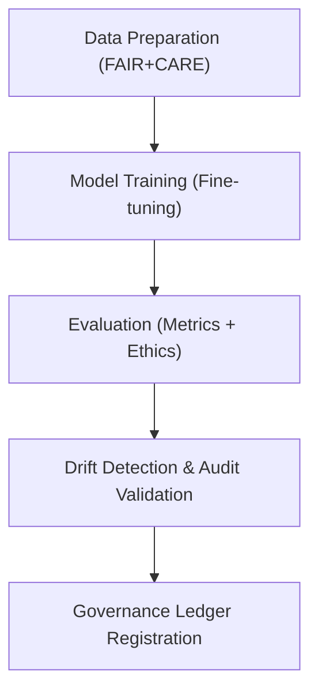

<div align="center">

# 🏋️ Kansas Frontier Matrix — **AI Training & Lifecycle Management**
`src/ai/training/README.md`

**Purpose:** Defines the end-to-end AI model training, evaluation, and governance lifecycle framework for all Kansas Frontier Matrix models.  
Implements transparent, reproducible, and ethically validated training workflows under FAIR+CARE governance standards with telemetry-driven oversight.

[](../../../.github/workflows/ai-train.yml)  
[](../../../docs/standards/faircare-validation.md)  
[](../../../docs/architecture/repo-focus.md)

</div>

---

## 📚 Overview

The **AI Training Module** manages data ingestion, model fine-tuning, evaluation, and bias auditing for all KFM models, including Focus Transformer and Embedding architectures.  
It integrates with FAIR+CARE governance pipelines to ensure ethical dataset sourcing, reproducibility, and continuous validation across AI lifecycles.

**Core Objectives:**
- 🧠 Train and evaluate AI models with full transparency and reproducibility  
- ⚖️ Ensure all models comply with FAIR+CARE principles and CARE ethics  
- 🧾 Log provenance and metadata for each model training session  
- 🔍 Detect drift and track model performance stability over time  
- 🧩 Synchronize all events with Immutable Governance Ledger telemetry  

---

## 🗂️ Directory Layout

```plaintext
src/ai/training/
├── README.md                     # This file — AI training and governance documentation
│
├── train_model.py                # Main entry for model training pipeline (Focus Transformer, Embeddings, etc.)
├── evaluate_model.py             # Evaluates trained models with metrics, accuracy, and bias scores
├── drift_detection.py            # Detects AI drift and performance regression across releases
├── data_prep.py                  # Prepares and validates training datasets under FAIR+CARE standards
└── config/                       # Configuration assets for training reproducibility
    ├── focus_transformer_config.yml  # Config for Focus Transformer fine-tuning
    ├── embeddings_config.yml         # Config for embedding model training
    └── governance_hooks.yml          # Governance synchronization and telemetry schema references
```

---

## ⚙️ Example Workflows

### 🧩 Train Model
```bash
python src/ai/training/train_model.py \
  --model focus_transformer_v1 \
  --dataset data/processed/focus_corpus.json \
  --config src/ai/training/config/focus_transformer_config.yml
```

### 📊 Evaluate Model Performance
```bash
python src/ai/training/evaluate_model.py \
  --model src/ai/models/focus_transformer_v1 \
  --output reports/ai/metrics/focus_v1_metrics.json
```

### ⚠️ Run Drift Detection
```bash
python src/ai/training/drift_detection.py \
  --baseline releases/v9.3.3/models.json \
  --current releases/v9.4.0/models.json \
  --output reports/ai/drift/focus_v1_drift.json
```

### ⚖️ Prepare Dataset with Governance Hooks
```bash
python src/ai/training/data_prep.py \
  --input data/raw/historical_texts/ \
  --output data/processed/focus_corpus.json \
  --governance src/ai/training/config/governance_hooks.yml
```

---

## 🧠 FAIR+CARE & Governance Integration

| Process | Purpose | Output |
|----------|----------|---------|
| **Training Execution** | Model fine-tuning and optimization | `reports/ai/metrics/training-summary.json` |
| **Evaluation Metrics** | Model accuracy, fairness, and ethics validation | `reports/fair/ai-bias-validation.json` |
| **Drift Monitoring** | Detect model drift and performance decay | `reports/ai/drift/detection-results.json` |
| **Governance Logging** | Append metadata and lineage to ledger | `reports/audit/governance-ledger.json` |

Governance outputs feed into:
```
releases/v9.4.0/manifest.zip
releases/v9.4.0/focus-telemetry.json
```

---

## 🧩 Training Pipeline Workflow



**Workflow Summary:**
1. Data curated and verified under FAIR+CARE ethics.  
2. Models fine-tuned with reproducible configurations.  
3. Evaluation metrics and bias audits recorded.  
4. Governance ledger updated with lineage, drift, and checksum data.  

---

## 🧩 Evaluation Metrics Example

```json
{
  "model_id": "focus_transformer_v1",
  "accuracy": 0.934,
  "loss": 1.172,
  "bias_score": 0.028,
  "ethics_score": 0.97,
  "explainability_score": 0.95,
  "validated_by": "faircare-validate.yml",
  "timestamp": "2025-11-02T00:00:00Z",
  "checksum_sha256": "c84eac95f9a63a22e4cfb61a6b4f5efb827cd9184d56e43fa9c8d89dfc9158a9"
}
```

---

## 🧾 Configuration Example (`focus_transformer_config.yml`)

```yaml
model:
  name: "focus_transformer_v1"
  type: "encoder-decoder"
  epochs: 12
  batch_size: 8
  learning_rate: 3e-5
  optimizer: "AdamW"
  loss_function: "CrossEntropy"
data:
  dataset_path: "data/processed/focus_corpus.json"
  tokenizer_path: "src/ai/models/focus_transformer_v1/tokenizer.json"
  validation_split: 0.2
governance:
  bias_audit_ref: "reports/fair/ai-bias-validation.json"
  telemetry_output: "releases/v9.4.0/focus-telemetry.json"
  governance_ledger: "reports/audit/governance-ledger.json"
```

---

## 🧩 Standards & Compliance

| Standard | Purpose | Implementation |
|-----------|----------|----------------|
| **MCP-DL v6.4.3** | Documentation-first training and evaluation | This README + configs |
| **FAIR+CARE** | Ethical dataset governance and transparency | Integrated FAIR+CARE validation hooks |
| **ISO 23894** | Risk management and lifecycle monitoring | Drift detection and ethics scoring |
| **IEEE 7007** | Ontological transparency for model training | Explainability and governance telemetry |
| **JSON-LD / DCAT** | Provenance and metadata interoperability | Configurable dataset lineage exports |

---

## 🛡️ Integrity, Provenance & Observability

- **Integrity:** All training artifacts checksum-signed via SHA-256 and logged in governance manifest.  
- **Provenance:** Training records linked to FAIR+CARE datasets and model registries.  
- **Reproducibility:** Fixed random seeds and versioned configs ensure identical re-training results.  
- **Telemetry:** All events appended to `focus-telemetry.json` for Immutable Ledger auditing.

Telemetry Schema:  
`schemas/telemetry/ai-pipelines-v1.json`

Telemetry Outputs:
```
reports/ai/training-events.json
reports/ai/evaluation-events.json
releases/v9.4.0/focus-telemetry.json
```

---

## 🧾 Version History

| Version | Date | Author | Summary |
|----------|------|---------|----------|
| v9.4.0 | 2025-11-02 | @kfm-ai | Added detailed governance integration and lifecycle telemetry schema. |
| v9.3.3 | 2025-11-01 | @kfm-ethics | Enhanced bias and fairness auditing in training workflow. |
| v9.3.2 | 2025-10-29 | @bartytime4life | Integrated explainability metrics and provenance tracking. |
| v9.3.1 | 2025-10-27 | @kfm-focus | Improved drift detection and evaluation report generation. |
| v9.3.0 | 2025-10-25 | @kfm-architecture | Established baseline AI training and validation architecture under MCP-DL v6.4.3. |

---

<div align="center">

**Kansas Frontier Matrix — Transparent AI Training Framework**  
*“Every epoch governed. Every dataset verified. Every model accountable.”* 🔗  
📍 `src/ai/training/README.md` — FAIR+CARE-certified documentation for ethical and reproducible AI training within the Kansas Frontier Matrix.

</div>
