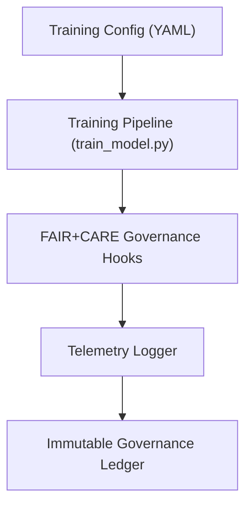

<div align="center">

# ⚙️ Kansas Frontier Matrix — **AI Training Configuration & Governance Hooks**
`src/ai/training/config/README.md`

**Purpose:** Defines standardized configuration templates and governance synchronization hooks used throughout all AI model training pipelines in the Kansas Frontier Matrix.  
Ensures training reproducibility, ethical governance, and FAIR+CARE-aligned telemetry integration across Focus Transformer, Embeddings, and future AI subsystems.

[](../../../../../.github/workflows/ai-train.yml)  
[](../../../../../docs/standards/faircare-validation.md)  
[](../../../../../docs/architecture/repo-focus.md)

</div>

---

## 📚 Overview

The **AI Configuration Directory** provides reproducible configuration files for model training, hyperparameter tuning, data preprocessing, and governance synchronization.  
Each configuration embeds **FAIR+CARE governance hooks** to automatically register metadata, bias audits, and telemetry logs with the Immutable Governance Ledger.

**Core Objectives:**
- 🧩 Maintain consistent, reusable training configurations for all models  
- ⚖️ Integrate FAIR+CARE governance and telemetry references directly in config YAMLs  
- 🧠 Support ethical and reproducible AI model training  
- 🧾 Define baseline hyperparameters and provenance fields for transparency  
- 🔗 Ensure interoperability between config, dataset manifests, and governance systems  

---

## 🗂️ Directory Layout

```plaintext
src/ai/training/config/
├── README.md                        # This file — documentation for AI configuration governance
│
├── focus_transformer_config.yml     # Configuration for Focus Transformer fine-tuning
├── embeddings_config.yml            # Configuration for Embeddings model training
└── governance_hooks.yml             # Governance synchronization settings (FAIR+CARE telemetry)
```

---

## ⚙️ Example Configurations

### 🎯 Focus Transformer Config (`focus_transformer_config.yml`)
```yaml
model:
  name: "focus_transformer_v1"
  type: "encoder-decoder"
  epochs: 12
  batch_size: 8
  learning_rate: 3e-5
  optimizer: "AdamW"
  loss_function: "CrossEntropy"
  explainability: true

data:
  dataset_path: "data/processed/focus_corpus.json"
  tokenizer_path: "src/ai/models/focus_transformer_v1/tokenizer.json"
  validation_split: 0.2
  seed: 42

metrics:
  track_accuracy: true
  track_bias: true
  explainability_ref: "reports/ai/explainability/focus_v1.json"

governance:
  faircare_validation: "faircare-validate.yml"
  bias_audit_ref: "reports/fair/ai-bias-validation.json"
  telemetry_output: "releases/v9.4.0/focus-telemetry.json"
  governance_ledger: "reports/audit/governance-ledger.json"
```

---

### 🧭 Embeddings Config (`embeddings_config.yml`)
```yaml
model:
  name: "embeddings_model_v1"
  type: "bi-encoder"
  vector_dim: 384
  epochs: 8
  batch_size: 16
  learning_rate: 2e-5
  optimizer: "Adam"
  loss_function: "TripletLoss"

data:
  dataset_path: "data/processed/embedding_corpus.json"
  tokenizer_path: "src/ai/models/embeddings/tokenizer.json"
  validation_split: 0.15
  shuffle: true

metrics:
  cosine_similarity: true
  bias_score: true
  ethics_score: true

governance:
  bias_audit_ref: "reports/fair/embedding-bias-validation.json"
  provenance_manifest: "reports/audit/embedding-provenance.json"
  telemetry_output: "releases/v9.4.0/focus-telemetry.json"
  governance_ledger: "reports/audit/governance-ledger.json"
```

---

### 🧾 Governance Hooks (`governance_hooks.yml`)
```yaml
hooks:
  - name: "bias_audit"
    description: "Run CARE-aligned bias audits on model predictions"
    script: "src/governance/validators/faircare_validate.py"
  - name: "checksum_register"
    description: "Register checksums of all model artifacts to governance ledger"
    script: "src/governance/lineage/checksum_register.py"
  - name: "provenance_linker"
    description: "Link dataset and model provenance chains"
    script: "src/governance/lineage/provenance_linker.py"
  - name: "telemetry_sync"
    description: "Sync training events with Immutable Governance Ledger"
    script: "src/governance/lineage/ledger_sync.py"

governance_refs:
  ledger: "reports/audit/governance-ledger.json"
  telemetry: "releases/v9.4.0/focus-telemetry.json"
  faircare_summary: "reports/fair/faircare-summary.json"
```

---

## 🧩 Governance Integration Workflow



**Workflow Summary:**
1. Config YAMLs define training and governance parameters.  
2. Training pipeline automatically invokes FAIR+CARE governance hooks.  
3. Telemetry and audit data generated during training.  
4. Immutable Governance Ledger updated with lineage and checksum data.  

---

## 🧠 FAIR+CARE Integration & Standards

| Standard | Domain | Implementation |
|-----------|---------|----------------|
| **MCP-DL v6.4.3** | Documentation-driven configuration governance | This README + YAML configs |
| **FAIR+CARE** | Ethical AI validation and bias auditing | Embedded governance hooks |
| **ISO 23894** | AI lifecycle and risk management | Drift, reproducibility, bias monitoring |
| **IEEE 7007** | Transparency in AI operations | Explainability and telemetry integration |
| **JSON-LD / DCAT 3.0** | Interoperable provenance linkage | Provenance exports from governance scripts |

---

## 🛡️ Provenance & Observability

- **Integrity:** All configuration files hashed (SHA-256) and logged in governance manifest.  
- **Reproducibility:** Model retraining fully deterministic using recorded YAMLs.  
- **Provenance:** Data and configuration lineage linked in governance reports.  
- **Telemetry:** Training config executions logged for FAIR+CARE audits.  

Telemetry Schema:  
`schemas/telemetry/ai-pipelines-v1.json`

Telemetry Outputs:
```
reports/ai/config-events.json
releases/v9.4.0/focus-telemetry.json
```

---

## 🧾 Version History

| Version | Date | Author | Summary |
|----------|------|---------|----------|
| v9.4.0 | 2025-11-02 | @kfm-ai | Added directory layout and YAML governance hooks for all AI training pipelines. |
| v9.3.3 | 2025-11-01 | @kfm-ethics | Enhanced FAIR+CARE bias audit integration. |
| v9.3.2 | 2025-10-29 | @bartytime4life | Implemented telemetry synchronization within configuration templates. |
| v9.3.1 | 2025-10-27 | @kfm-governance | Added provenance linkage schema for Immutable Ledger. |
| v9.3.0 | 2025-10-25 | @kfm-architecture | Established reproducible AI config governance system under MCP-DL v6.4.3. |

---

<div align="center">

**Kansas Frontier Matrix — Transparent AI Configuration Framework**  
*“Every setting documented. Every process reproducible. Every model governed.”* 🔗  
📍 `src/ai/training/config/README.md` — FAIR+CARE-certified documentation for AI training configurations and governance hooks in the Kansas Frontier Matrix.

</div>
