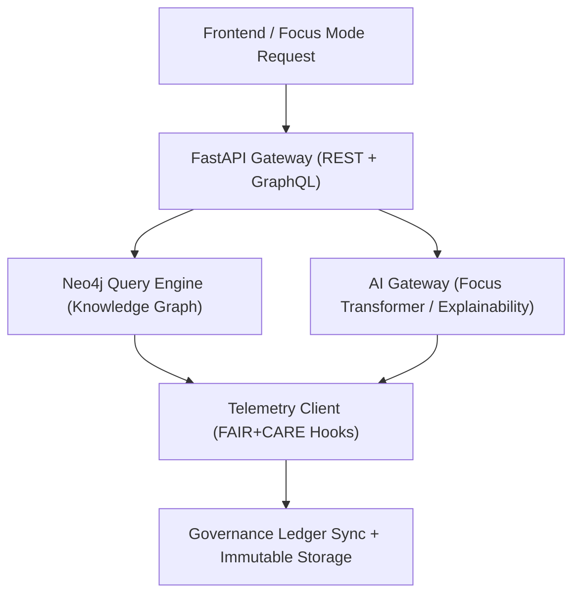

<div align="center">

# 🌐 Kansas Frontier Matrix — **API & Knowledge Graph Interface**
`src/api/README.md`

**Purpose:** Documents the structure, endpoints, and governance-compliant data flows for the Kansas Frontier Matrix API layer.  
Implements a FAIR+CARE-aligned **FastAPI + GraphQL** system that connects the frontend, AI pipelines, and Neo4j Knowledge Graph under transparent data and model governance.

[](../../.github/workflows/api-validate.yml)  
[](../../docs/standards/faircare-validation.md)  
[](../../docs/architecture/repo-focus.md)

</div>

---

## 📚 Overview

The **Kansas Frontier Matrix API** serves as the central interface for all interactions between the frontend, AI models, and the Neo4j Knowledge Graph.  
It provides REST and GraphQL endpoints for querying data, submitting Focus Mode reasoning requests, managing FAIR+CARE metadata, and exporting provenance records.

**Core Objectives:**
- 🧠 Facilitate structured access to Neo4j Knowledge Graph and AI contextual data  
- ⚖️ Enforce FAIR+CARE-aligned metadata and ethical query governance  
- 🌍 Support REST, GraphQL, and JSON-LD endpoints for interoperability  
- 🧾 Provide telemetry for all requests, responses, and audit events  
- 🔍 Integrate tightly with governance-led provenance and checksum validation  

---

## 🗂️ Directory Layout

```plaintext
src/api/
├── README.md                     # This file — API governance and documentation
│
├── fastapi_app.py                # FastAPI app entry point (REST + GraphQL hybrid)
├── routes/                       # Modular endpoint definitions
│   ├── entities.py               # Entity-level API (people, places, events)
│   ├── datasets.py               # Dataset and STAC metadata retrieval
│   ├── focusmode.py              # AI Focus Mode contextual query endpoints
│   ├── governance.py             # Governance, telemetry, and provenance API routes
│   └── healthcheck.py            # System and service status verification
│
├── models/                       # Pydantic data models and schema definitions
│   ├── base.py                   # Core API data structures
│   ├── ai.py                     # AI model response schemas and explainability metadata
│   ├── governance.py             # FAIR+CARE governance and ledger schema
│   └── telemetry.py              # Telemetry event schema for API-level observability
│
├── auth/                         # Authentication and API key management
│   ├── security.py               # Token-based and role-based authentication logic
│   └── permissions.py            # Role and access control policies
│
└── services/                     # Business logic and backend integrations
    ├── neo4j_client.py           # Handles Neo4j Knowledge Graph queries and mutations
    ├── stac_client.py            # STAC catalog ingestion and metadata access
    ├── ai_gateway.py             # Proxy for AI summarization and explainability endpoints
    └── telemetry_client.py       # Telemetry publisher for governance and FAIR+CARE metrics
```

---

## ⚙️ Example Workflows

### 🧩 Run Local API Server
```bash
uvicorn src.api.fastapi_app:app --host 0.0.0.0 --port 8000 --reload
```

### 🌍 Example REST Endpoints
| Endpoint | Method | Description |
|-----------|--------|-------------|
| `/api/entities/{id}` | `GET` | Retrieve entity details from Neo4j |
| `/api/focus/{entity_id}` | `POST` | Run Focus Mode reasoning for a given entity |
| `/api/stac/items` | `GET` | Query available STAC metadata and geospatial layers |
| `/api/governance/ledger` | `GET` | Fetch immutable governance ledger state |
| `/api/telemetry` | `POST` | Submit telemetry or governance event payload |

### 🧠 Example GraphQL Query
```graphql
query {
  entity(id: "treaty_1851") {
    name
    description
    relatedEntities {
      id
      name
    }
    aiSummary {
      text
      confidence
      explainabilityRef
    }
  }
}
```

### ⚖️ Example Governance Submission
```bash
curl -X POST "http://localhost:8000/api/governance/ledger" \
  -H "Content-Type: application/json" \
  -d '{"event": "checksum_verification", "entity": "treaty_1851", "status": "verified"}'
```

---

## 🧠 FAIR+CARE Governance Integration

| Function | Description | Output |
|-----------|--------------|---------|
| **Entity Metadata Retrieval** | Returns FAIR+CARE-compliant entity metadata | `reports/fair/entity-summary.json` |
| **Focus Mode Query** | Contextual AI reasoning pipeline | `reports/focusmode/summary_*.json` |
| **Governance Ledger Access** | Public API for governance chain synchronization | `reports/audit/governance-ledger.json` |
| **Telemetry Capture** | Logs API activity into Immutable Ledger | `releases/v9.4.0/focus-telemetry.json` |

---

## 🧩 API → Governance Data Flow



**Workflow Summary:**
1. User sends a Focus Mode or metadata query.  
2. API routes the request to Neo4j and AI Gateway simultaneously.  
3. Results enriched with explainability and provenance metadata.  
4. All responses and actions logged into the Immutable Governance Ledger.  

---

## 🧩 Security & Access Control

- **Authentication:** API tokens verified using HMAC + JWT.  
- **Authorization:** Role-based access (admin, researcher, public).  
- **Integrity:** All API payloads checksum-signed (SHA-256).  
- **Rate Limiting:** Configured for public endpoints to prevent misuse.  
- **Audit Logging:** Every request and response logged with provenance metadata.  

Governance policies defined in:
```
src/api/auth/permissions.py
docs/standards/governance/API-SECURITY.md
```

---

## 🧩 Standards & Compliance

| Standard | Purpose | Implementation |
|-----------|----------|----------------|
| **MCP-DL v6.4.3** | Documentation-first API and data contract design | This README + Pydantic models |
| **FAIR+CARE** | Ethical access, transparency, and governance | API-level FAIR metadata validation |
| **ISO 23894** | AI lifecycle and API transparency | Audit telemetry and drift detection hooks |
| **DCAT 3.0 / STAC 1.0.0** | Metadata and dataset catalog interoperability | STAC metadata endpoints |
| **JSON-LD / CIDOC CRM** | Provenance and semantic linkage | GraphQL output schemas |

---

## 🛡️ Observability & Telemetry

- **Telemetry Logs:** All API requests and AI responses recorded to governance telemetry.  
- **Metrics Collection:** Prometheus-compatible monitoring of latency, throughput, and ethics audit ratio.  
- **Provenance Tracking:** Endpoints export metadata lineage via JSON-LD.  
- **Governance Ledger Sync:** All API telemetry appended to immutable ledger for transparency.  

Telemetry Schema:  
`schemas/telemetry/api-telemetry-v1.json`

Telemetry Outputs:
```
reports/api/request-events.json
reports/audit/governance-ledger.json
releases/v9.4.0/focus-telemetry.json
```

---

## 🧾 Version History

| Version | Date | Author | Summary |
|----------|------|---------|----------|
| v9.4.0 | 2025-11-02 | @kfm-api | Added detailed governance integration, telemetry schema, and GraphQL reasoning pipeline. |
| v9.3.3 | 2025-11-01 | @kfm-architecture | Enhanced Neo4j and AI Gateway interoperability. |
| v9.3.2 | 2025-10-29 | @bartytime4life | Improved telemetry validation and FAIR+CARE metadata APIs. |
| v9.3.1 | 2025-10-27 | @kfm-ethics | Embedded ethical access control and API transparency logging. |
| v9.3.0 | 2025-10-25 | @kfm-devops | Established API structure and governance pipeline under MCP-DL v6.4.3. |

---

<div align="center">

**Kansas Frontier Matrix — Interoperable Knowledge Graph Interface**  
*“Every endpoint transparent. Every query ethical. Every response accountable.”* 🔗  
📍 `src/api/README.md` — FAIR+CARE-certified documentation for the API and Knowledge Graph layer of the Kansas Frontier Matrix.

</div>
