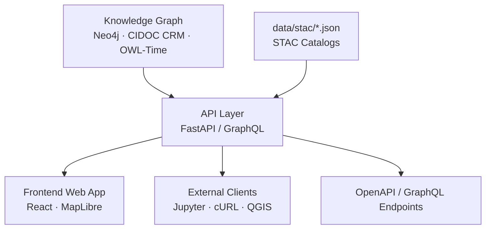

<div align="center">

# 🔌 **Kansas Frontier Matrix — API Layer**  
`src/api/README.md`

**FastAPI · GraphQL · Knowledge Graph Access · Timeline & Map Queries**

[](../../.github/workflows/site.yml)
[](../../.github/workflows/stac-validate.yml)
[](../../.github/workflows/codeql.yml)
[](../../.github/workflows/trivy.yml)
[](../../docs/)
[](../../LICENSE)

</div>

---

```yaml
---
title: "Kansas Frontier Matrix — API Layer"
version: "v1.7.0"
last_updated: "2025-10-17"
owners: ["@kfm-architecture", "@kfm-data"]
tags: ["api","fastapi","graphql","neo4j","stac","search","timeline","map","mcp","ci","semver"]
status: "Stable"
license: "MIT"
semver_policy: "MAJOR.MINOR.PATCH"
ci_required_checks:
  - pre-commit
  - unit-tests
  - codeql
  - trivy
  - docs-validate
semantic_alignment:
  - CIDOC CRM
  - OWL-Time
  - STAC 1.0
  - DCAT 2.0
  - GeoJSON
  - ISO 8601
---
```

---

## 🎯 Purpose

The **`src/api/`** directory exposes the **Knowledge Graph** and **STAC Catalog** through REST and GraphQL endpoints.  
This API powers the KFM **web app**, **timeline**, **map**, and **AI query systems**, providing open, reproducible access to Kansas historical data and semantic insights.

---

## 🏗️ System Role


<!-- END OF MERMAID -->

The API is the **bridge** between graph, catalog, and user experience — enforcing schema consistency and provenance-aware query responses.

---

## 📂 Directory Layout

```
src/api/
├── __init__.py
├── main.py                 # FastAPI entrypoint
├── routes/
│   ├── events.py           # /events
│   ├── places.py           # /places
│   ├── people.py           # /people
│   ├── stac.py             # /stac endpoints
│   ├── search.py           # /search?q=
│   └── ai.py               # /ask — AI Q/A endpoint
├── schemas/
│   ├── base.py             # shared Pydantic validators
│   ├── event_schema.py     # Event model
│   ├── place_schema.py     # Place model
│   └── stac_schema.py      # STAC schema pass-through
├── graphql/
│   └── schema.graphql      # optional GraphQL schema
├── utils/
│   ├── db.py               # Neo4j helpers
│   ├── cache.py            # Redis/local cache
│   ├── auth.py             # JWT/API key middleware
│   └── logger.py           # logging + tracing
└── README.md
```

---

## ⚙️ FastAPI Overview

Start server:
```bash
uvicorn src.api.main:app --reload --host 0.0.0.0 --port 8080
```

**Features**
- REST + GraphQL interfaces  
- Swagger (`/docs`) + ReDoc (`/redoc`)  
- Redis caching (optional)  
- Role-based access control  
- Prometheus metrics `/metrics`

---

## 🧭 REST Endpoints

| Endpoint | Description | Type |
| :-------- | :----------- | :-- |
| `/events?start=1850&end=1900` | Filter events by time | JSON/GeoJSON |
| `/events/{id}` | Detailed event data | JSON |
| `/places?bbox=-102,36,-94,40` | Places within region | GeoJSON |
| `/people/{id}` | Person details | JSON |
| `/stac/collections` | STAC collections | STAC JSON |
| `/stac/items/{id}` | Individual STAC items | STAC JSON |
| `/search?q=railroad` | Keyword/semantic search | JSON |
| `/ask` | AI/summary Q&A endpoint | JSON |

---

## 🧱 GraphQL API

```graphql
{
  event(id: "battle_solomon_fork") {
    title
    date
    places { name latitude longitude }
    participants { name role }
  }
}
```

Query:
```bash
curl -X POST http://localhost:8080/graphql \
-H "Content-Type: application/json" \
-d '{"query": "{ allEvents { id title } }"}'
```

---

## 🧩 Data Models (Pydantic)

```python
from pydantic import BaseModel
from typing import List, Optional

class PlaceRef(BaseModel):
    name: str
    latitude: float
    longitude: float

class Event(BaseModel):
    id: str
    title: str
    start_date: str
    end_date: Optional[str]
    places: List[PlaceRef]
    summary: Optional[str]
```

All API responses are validated and serialized according to these models.

---

## 🔎 Search & Query

The `/search` endpoint unifies:
- Neo4j fulltext indexes  
- STAC titles/descriptions  
- Optional AI embeddings for similarity  

```bash
curl http://localhost:8080/search?q=cheyenne
```

Response:
```json
{
  "results": [
    {"type": "TribalEntity", "name": "Cheyenne", "mentions": 132},
    {"type": "Event", "title": "Medicine Lodge Treaty (1867)"},
    {"type": "Place", "name": "Cheyenne Bottoms Wetlands"}
  ]
}
```

---

## 🧠 AI Query Endpoint

The `/ask` route interfaces with `src/nlp/` modules for semantic Q/A.

```bash
curl -X POST http://localhost:8080/ask \
-H "Content-Type: application/json" \
-d '{"question": "Which Kansas counties were hit hardest by the Dust Bowl?"}'
```

Returns:
```json
{
  "answer": "Western Kansas counties such as Finney, Ford, and Haskell saw the most severe dust storms between 1933–1938.",
  "sources": [
    "noaa_storms_1933.csv",
    "kansas_newspapers_1935.txt",
    "fema_disasters_dustbowl.json"
  ]
}
```

---

## 🔐 Authentication & Authorization

- **API Key**: `x-api-key` header  
- **JWT Bearer Tokens** for multi-role auth (`viewer`, `curator`, `admin`)  
- Configurable middleware enforces access level per route  

---

## 📈 Logging & Monitoring

| Component | Description |
| :--------- | :----------- |
| **Logs** | `logs/api/access.log` with request duration, size, status |
| **Metrics** | `/metrics` endpoint (Prometheus-compatible) |
| **Health** | `/healthz` and `/readyz` endpoints |
| **Cache** | Optional Redis or in-memory cache layer |

Example:
```
[2025-10-17 09:20:13] GET /events?start=1850&end=1900 | 245ms | 124 results
[2025-10-17 09:21:44] POST /ask | 1.8s | OK
```

---

## 🧷 Acceptance Checklist

- [ ] Endpoints documented and validated (OpenAPI/GraphQL)  
- [ ] Neo4j credentials loaded from env, not hardcoded  
- [ ] STAC responses conform to spec  
- [ ] API auth active in prod  
- [ ] Rate limits/logging enabled  
- [ ] All tests (unit/integration/security) pass CI  

---

## 🛡️ Security

- Env-based secrets; no credentials in repo  
- Cypher queries parameterized  
- Trivy + CodeQL CI scanning  
- PII stripped from responses  
- Strict CORS policies  

---

## 🧾 Version History

| Version | Date | Type | Notes |
| :-- | :-- | :-- | :-- |
| v1.7.0 | 2025-10-17 | Added | Auth, caching, Prometheus metrics, AI query endpoint |
| v1.6.0 | 2025-10-16 | Improved | GraphQL + Pydantic refactor, search optimizations |
| v1.5.0 | 2025-10-15 | Added | Initial API README and FastAPI integration |

---

## 📚 References

- AI System Developer Docs — `../../docs/ai-system.md`  
- File & Data Architecture — `../../docs/architecture.md`  
- FastAPI — https://fastapi.tiangolo.com/  
- Neo4j — https://neo4j.com/  
- STAC — https://stacspec.org/  

---

<div align="center">

**Kansas Frontier Matrix © 2025**  
*Open Science · Open Data · Interactive History*

</div>
```