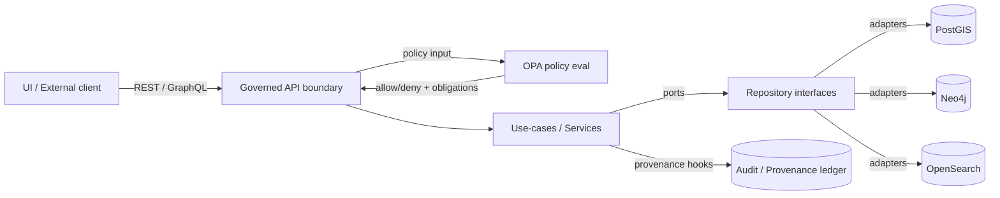

# KFM API (`src/api/`)

**🏷️ Status:** TBD (🟢 active / 🟡 experimental / 🔴 deprecated)  
**🔒 Governance:** OPA policy-gated · Trust membrane enforced  
**📜 Contracts:** OpenAPI (REST) + GraphQL (optional)  
**🧾 Provenance:** Designed to support “cite-or-abstain” flows (incl. Focus Mode outputs)

> ⚠️ **Repo reality check (required):** Some paths and filenames below are *patterns*, not guarantees.  
> Run `tree src/api` (and `rg "FastAPI|openapi|strawberry|graphql" -S`) and update this README to match what’s actually present. *(not confirmed in repo)*

---

## 📘 Overview

### Purpose

`src/api/` is the **contract + governance boundary** for Kansas Frontier Matrix (KFM) API access. This folder is the canonical home for API-facing artifacts (especially **OpenAPI** and **GraphQL** schemas) and any supporting glue needed to keep the API contract-first, policy-gated, and CI-verifiable.

Per KFM documentation conventions, **OpenAPI/GraphQL schemas are expected to live under `src/api/` and be linked from `docs/api/`** (or equivalent developer documentation). *(If your repo differs, align to the Master Guide.)*

### Scope

| In scope ✅ | Out of scope ❌ |
|---|---|
| OpenAPI specs / schema artifacts | ETL / ingestion pipeline implementations |
| GraphQL schema + resolver boundary (if enabled) | Frontend UI (React/MapLibre) |
| Policy enforcement hooks (OPA calls, deny-by-default) | Direct DB admin / manual data edits |
| API versioning, compatibility, contract tests | Non-governed “quick scripts” that bypass catalog/provenance |

### Audience

- **Backend/API developers** implementing endpoints/resolvers
- **Data/pipeline developers** who need to know the *runtime interface* they must feed (catalog/prov → API)
- **Governance reviewers** validating policy, sensitivity handling, and provenance requirements
- **Frontend developers** consuming REST/GraphQL contracts (never DBs)

### Definitions

| Term | Meaning (KFM context) |
|---|---|
| **Trust membrane** | External clients/UI do *not* access databases directly; all access is mediated via the governed API. |
| **OPA** | Open Policy Agent; policy-as-code engine (Rego) queried by the API for allow/deny decisions. |
| **OpenAPI** | REST interface contract (inventory, validation expectations, client generation). |
| **GraphQL** | Optional query interface; should reuse the same service/use-case layer as REST (no duplicated business logic). |
| **STAC / DCAT / PROV** | Catalog + metadata + provenance standards used as the canonical “handoff” from pipeline outputs to runtime services. |
| **Focus Mode** | Governed AI assistant mode; outputs must be policy-checked (e.g., citations required, sensitivity OK). |

---

## 🗂️ Directory layout

> This is an **expected** layout; adjust to match the repo. *(not confirmed in repo)*

```text
src/api/
  README.md

  # Contracts (preferred canonical artifacts)
  openapi/                 # or openapi.yaml / openapi.json
  graphql/                 # or schema.graphql (optional)

  # If the FastAPI app lives here (pattern)
  main.py                  # FastAPI app entrypoint (pattern)
  routes/                  # REST routers, e.g., datasets.py, stories.py (pattern)
  schema.py                # GraphQL schema / router mount (pattern)

  # Clean architecture slices (pattern)
  domain/                  # pure domain models/entities (no DB/UI deps)
  services/                # use-cases/workflows; calls interfaces only
  repositories/            # repository interfaces (ports/contracts)
  adapters/                # concrete integrations (PostGIS/Neo4j/OpenSearch clients)
  policy/                  # OPA client + policy input/output models (optional)

  tests/
    contract/              # OpenAPI/GraphQL schema diffs + consumer contract tests
    policy/                # OPA unit tests for allow/deny decisions
```

---

## 🚦 Quickstart (local dev)

### 1) Start the dev stack (Compose)

From repo root:

```bash
docker compose up --build
```

**Typical local ports (verify in your compose):**
- API: `8000`
- Web UI: `3000`
- PostGIS: `5432`
- Neo4j: `7474` (HTTP) / `7687` (Bolt)
- OpenSearch: `9200`
- OPA: `8181`

### 2) Explore the REST API

Swagger UI (typical FastAPI default):

- `http://localhost:8000/docs`

### 3) Explore GraphQL (if enabled)

- `http://localhost:8000/graphql`

> ✅ **Rule:** GraphQL resolvers must call the same service/use-case layer as REST endpoints to avoid duplicated business logic.

---

## 🧱 Architecture boundaries (clean layers)

### The non-negotiables

- **UI never queries PostGIS/Neo4j/OpenSearch directly** (trust membrane).
- **Controllers/routers do not contain business logic**.
- **Service/use-case layer depends only on interfaces**.
- **All sensitive data access + AI outputs are policy-gated (OPA) and auditable.**

### Request flow (high-level)



### Canonical “truth path” (data lifecycle)

```text
Raw → Processed → Catalog/Provenance → Database → API → UI
```

Any proposal that shortcuts this path (e.g., injecting data directly into UI, or bypassing metadata/provenance creation) should be treated as a governance/architecture violation unless explicitly justified and approved.

---

## 🔐 Governance, sensitivity, and CARE/FAIR

### Policy enforcement (OPA)

- **Default deny** (fail closed).
- API calls OPA as a sidecar service and enforces allow/deny decisions before returning data.
- **Focus Mode / AI endpoints must be policy checked**, including:
  - citations present (“cite-or-abstain”)
  - sensitivity gates (e.g., restricted locations)
  - disallowed content patterns

> 🚨 **Sensitive content rule of thumb:** If a layer/story could reveal a sensitive site or culturally restricted location, generalize/redact and require governance review (CARE authority-to-control).

### What should be policy-gated?

| Category | Examples | Expected handling |
|---|---|---|
| Sensitive geospatial locations | sacred sites, sensitive ecological habitats | generalized geometry, access controls, review flags |
| Personally identifying data | names + addresses + timestamps | minimize, redact, aggregate, or deny |
| Indigenous-related narratives | treaties, removal routes, culturally restricted info | governance review triggers + CARE labeling |

---

## 📜 Contracts & versioning

### REST (OpenAPI)

Treat OpenAPI as a **first-class contract artifact**:
- drives endpoint inventory
- enables request/response validation
- enables client generation
- supports diff/compat checks in CI

**Versioning guidance**
- Use an explicit version prefix such as `/api/v1/*` (if that’s the project convention).
- Any breaking change requires a version bump and a migration note.

### GraphQL (optional)

If GraphQL is enabled:
- export schema in CI as an artifact (e.g., `schema.graphql`)
- diff the schema in CI to detect breaking changes
- apply GraphQL-specific security hardening (depth limits, alias limits, persisted queries, etc.)

---

## 🧪 Testing & CI gates

Minimum test types expected for this API boundary:

- **Unit tests** (services/use-cases)
- **Contract tests**
  - OpenAPI diff checks
  - consumer contract tests for `/api/v1/*` (if that is the served prefix)
- **Policy tests**
  - OPA unit tests for allow/deny decisions
- **E2E smoke**
  - UI → API → provenance/citations render (where applicable)

> ✅ Docs and governed artifacts often require CI checks (lint, link-check, sensitivity/accessibility scanning). Keep this README lintable and link-clean.

---

## ➕ Adding or changing an endpoint (checklist)

> Use this checklist to keep the “trust membrane” + governance intact.

1. **Domain**
   - [ ] Define/extend domain model(s) (pure, no DB/UI deps)
2. **Use-case/service**
   - [ ] Add a use-case/service method (workflow + business rules)
3. **Repository interface**
   - [ ] Define/extend repository port methods (interfaces only)
4. **Infrastructure adapter**
   - [ ] Implement repository method in the appropriate adapter (PostGIS/Neo4j/OpenSearch)
5. **API surface**
   - [ ] Add REST route (router/controller) OR GraphQL resolver that calls the service
6. **Policy**
   - [ ] Add/update OPA policy rules (deny-by-default)
   - [ ] Add/update OPA unit tests
7. **Contracts**
   - [ ] Update OpenAPI spec and/or GraphQL schema
   - [ ] Add/verify contract diff checks
8. **Provenance**
   - [ ] Ensure returned entities include provenance pointers (IDs/refs) where required
9. **Docs**
   - [ ] Update `docs/api/*` to reflect the change (if applicable)

---

## 🧰 Troubleshooting (common local dev issues)

- **Port conflicts:** check `5432`, `7474`, `8000`, `3000` and adjust mappings if needed.
- **Docker memory limits:** large datasets can exceed defaults; increase Docker memory if containers are slow/killed.
- **Volume permissions:** mounted `data/` or writable directories may fail on Windows/macOS permission mismatches.
- **Hot reload not working (web):** ensure volume mounts are correct and rebuild when dependencies change.

---

## ✅ Definition of Done (for changes under `src/api/`)

- [ ] OpenAPI/GraphQL artifacts updated (if API surface changed)
- [ ] Contract diffs pass (no accidental breaking changes)
- [ ] OPA policy updated + OPA unit tests pass
- [ ] No routers/controllers contain business logic or direct DB calls
- [ ] Any sensitive data exposure reviewed; CARE/FAIR labeling applied
- [ ] Provenance links/IDs included where required
- [ ] README/docs updated; markdown lint/link checks clean

---

## 📎 References (internal)

- KFM Markdown Guide (governed doc conventions)
- KFM Comprehensive Technical Blueprint (API + routers + governance patterns)
- Engineering/advancement report (CI gates, contract tests, policy tests, compose baseline)

> If any of these references are not present in the repo, link the canonical equivalents and update this section.