# `src/api/dependencies` — FastAPI Dependencies 🧩🛡️

This directory contains **request-scoped dependencies** used by the KFM API boundary (FastAPI). Dependencies are the main mechanism we use to apply cross-cutting governance concerns consistently:

- 🔐 **Authentication & identity** (who is calling?)
- 🧭 **Tenant / namespace resolution** (which governed context applies?)
- ⚖️ **Policy enforcement** (what is allowed and what must be redacted?)
- 🧾 **Audit / provenance hooks** (what happened, under which rules?)
- 🧵 **Request-scoped resources** (DB sessions, graph/search clients, etc.)

> [!IMPORTANT]
> **Dependencies are part of the API boundary layer.**  
> They may *adapt* request context into typed objects for use cases/services, but they must **not** become a dumping ground for business logic.

---

## How this fits in KFM (Trust Membrane)

KFM’s “trust membrane” requires that **frontend and external clients never talk to storage directly**. Everything flows through the governed API layer, where we can enforce:
- policy-as-code decisions,
- redaction/sensitivity rules,
- auditability and provenance linkage.

This folder is where that enforcement is *wired in* to the FastAPI request lifecycle.

```mermaid
flowchart LR
  U["Client / UI"] --> R["FastAPI Router"]
  R --> D["Dependencies (auth • tenant • policy • context)"]
  D --> H["Route Handler"]
  H --> UC["Use Case / Service"]
  UC --> P["Ports / Repos"]
  P --> INF["Infrastructure (PostGIS • Neo4j • Search • Object Store)"]
  D -->|"policy decision"| OPA["Policy Engine / OPA (optional)"]
  H --> AUD["Audit / Provenance sink"]
```



---

## What belongs here

### ✅ Good candidates
- **Auth**: parse/verify credentials; build a `UserContext`
- **Tenant resolution**: derive tenant from header/subdomain/path; validate membership
- **Policy gates**: call policy engine, enforce allow/deny, return *sanitized* context decisions
- **Request context**: correlation IDs, tracing context, locale/timezone, feature flags
- **Request-scoped resources**: `yield` dependencies for DB sessions/clients

### ❌ Not here
- domain rules (“what is a valid Story Node claim?”)
- repository implementations (PostGIS/Neo4j drivers belong in infrastructure)
- long-running jobs (use a job runner/queue)
- direct data redaction logic that should live in **a single shared service** (dependency should *invoke* the redactor, not *be* the redactor)

---

## Expected modules (create/adjust as needed)

> [!NOTE]
> File names below are **conventions** (not confirmed in repo). Use them if helpful, or rename to match existing structure.

| Module (suggested) | Responsibility | Typical outputs |
|---|---|---|
| `request_context.py` | Correlation ID, trace context, request metadata | `RequestContext` |
| `auth.py` | Authentication + identity extraction | `UserContext` |
| `tenant.py` | Tenant/namespace resolution | `TenantContext` |
| `policy.py` | Policy evaluation (OPA/rego or in-process rules) | `PolicyDecision` |
| `db.py` | DB session factory dependency (`yield`) | `AsyncSession` / session handle |
| `graph.py` | Graph client/session dependency (`yield`) | `Neo4jSession` |
| `search.py` | Search client dependency | `SearchClient` |
| `provenance.py` | Audit/provenance hooks, request → activity IDs | `AuditContext` |

---

## Composition patterns

### Router-wide enforcement (preferred)

Router-wide dependencies are ideal for rules like:
- “everything under `/api/v1` requires auth”
- “all endpoints must resolve tenant first”
- “all endpoints must attach request context + correlation ID”

```python
from fastapi import APIRouter, Depends

from src.api.dependencies.request_context import get_request_context
from src.api.dependencies.auth import require_user
from src.api.dependencies.tenant import resolve_tenant
from src.api.dependencies.policy import enforce_base_policy

router = APIRouter(
    prefix="/api/v1",
    tags=["v1"],
    dependencies=[
        Depends(get_request_context),
        Depends(resolve_tenant),
        Depends(require_user),
        Depends(enforce_base_policy),
    ],
)
```

### Endpoint-specific enforcement (when truly specific)

Use endpoint-level dependencies for **narrow** constraints:
- a special permission gate on one route
- an “export watermark” requirement
- a stricter sensitivity rule

```python
from fastapi import Depends

@router.get("/datasets/{dataset_id}")
async def get_dataset(
    dataset_id: str,
    decision = Depends(authorize_dataset_read),
):
    ...
```

### `yield` dependencies for resource lifetimes

Use `yield` dependencies for request-scoped resources so teardown is guaranteed:

```python
from collections.abc import AsyncIterator

async def get_db_session() -> AsyncIterator["AsyncSession"]:
    session = make_session()  # created via an injected factory (port)
    try:
        yield session
    finally:
        await session.close()
```

> [!WARNING]
> Keep teardown focused on **cleanup + logging**.  
> Don’t rely on raising `HTTPException` *after* `yield` to change the response.

---

## Concurrency & performance rules

> [!IMPORTANT]
> Prefer `async def` dependencies and async I/O “all the way down.”
>
> Treat any blocking/sync dependency as a **capacity-limited resource**.

Guidelines:
- ✅ Use `async def` for network/db/cache I/O
- ⚠️ If you must call blocking code, isolate it and track threadpool impact
- ❌ Avoid heavy CPU work in dependencies

---

## Policy enforcement pattern (OPA or in-process)

Policy dependencies should be **purely evaluative**:
- gather inputs (user claims, dataset tags/classification, request intent)
- ask policy engine for allow/deny + required redactions
- return a typed decision object
- never “smuggle” data around the use-case layer

```python
from dataclasses import dataclass

@dataclass(frozen=True)
class PolicyDecision:
    allow: bool
    redaction_level: str
    reason: str | None = None

async def authorize_dataset_read(...) -> PolicyDecision:
    # 1) Build policy input
    # 2) Evaluate (OPA sidecar OR in-process evaluator)
    # 3) Return a decision object
    return PolicyDecision(allow=True, redaction_level="public")
```

---

## Testing

FastAPI supports dependency overrides; use them to test routes without hitting real infra:

```python
def override_user():
    return UserContext(user_id="test", roles=["admin"])

app.dependency_overrides[require_user] = override_user
```

Recommended test layers:
- unit tests for each dependency (input → output)
- contract tests for routes (OpenAPI stability)
- policy unit tests (allow/deny + redaction decisions)

---

## Checklist for adding a new dependency ✅

- [ ] Dependency has **single responsibility** and clear name
- [ ] Uses **async I/O** (or explicitly isolates blocking work)
- [ ] Returns a **typed object** (not a dict of random fields)
- [ ] Does **not** contain domain business logic
- [ ] Has unit tests (including “deny” paths)
- [ ] Logs are structured and include correlation ID (no secrets)
- [ ] Sensitive outputs are **redacted/generalized** per policy decision
- [ ] Documented here (update the table above)

---

## Troubleshooting

<details>
<summary><strong>“Why is my dependency running before/after another one?”</strong></summary>

Dependency order can change based on *where* it is attached (router-wide vs decorator vs parameter).  
If your enforcement must always run first, prefer router-wide dependencies.

</details>

<details>
<summary><strong>“Where do I put the real database client code?”</strong></summary>

Not here. Dependencies should call into factories/ports and return handles.  
Concrete implementations belong in infrastructure (e.g., `src/server/infrastructure/...` or the equivalent in this repo).

</details>
