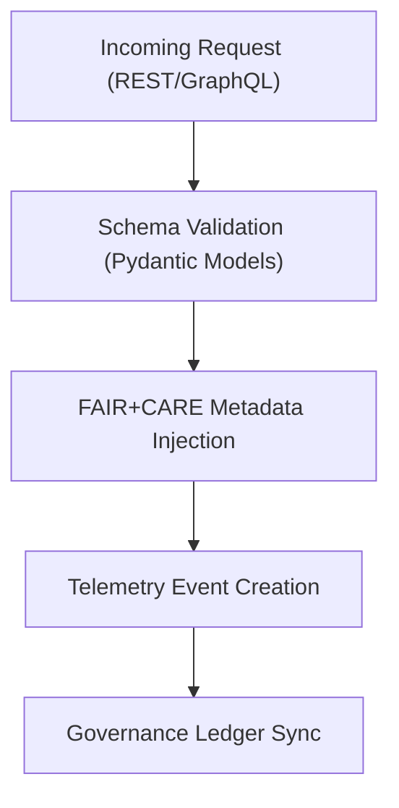

<div align="center">

# 🧱 Kansas Frontier Matrix — **API Data Models & Schemas**
`src/api/models/README.md`

**Purpose:** Defines all Pydantic data models, schema contracts, and serialization standards used within the Kansas Frontier Matrix API layer.  
Ensures that all API inputs and outputs conform to FAIR+CARE-aligned governance contracts and maintain metadata interoperability through DCAT, STAC, and JSON-LD compliance.

[](../../../../.github/workflows/api-validate.yml)  
[](../../../../docs/standards/faircare-validation.md)  
[](../../../../docs/architecture/repo-focus.md)

</div>

---

## 📚 Overview

The **API Models Module** defines the structure and validation logic for all API endpoints, including entities, datasets, Focus Mode outputs, and governance records.  
These Pydantic models enforce type safety, schema compliance, and FAIR+CARE ethical metadata consistency across all services.

**Core Objectives:**
- 🧩 Provide unified schema definitions for REST and GraphQL endpoints  
- ⚖️ Guarantee FAIR+CARE metadata integrity for all API responses  
- 🧠 Facilitate provenance-aware data modeling with JSON-LD interoperability  
- 🔍 Support ethics and transparency validation through schema hooks  
- 🧾 Maintain contract-level alignment with `data-contract-v3.json`  

---

## 🗂️ Directory Layout

```plaintext
src/api/models/
├── README.md                    # This file — documentation and governance reference
│
├── base.py                      # Core base models (FAIR metadata, provenance, validation mixins)
├── ai.py                        # AI-focused schemas (Focus Mode, explainability, confidence)
├── governance.py                # Governance ledger, telemetry, and FAIR+CARE audit models
└── telemetry.py                 # API telemetry events and observability schemas
```

**File Descriptions:**

- **`base.py`** — Core reusable models that include metadata fields for ID, timestamps, provenance, and licensing.  
- **`ai.py`** — Data structures for AI outputs (summaries, entity reasoning, explainability).  
- **`governance.py`** — Models describing governance ledger entries, FAIR+CARE audit results, and immutable records.  
- **`telemetry.py`** — Schema for telemetry events, governance metrics, and observability reporting.

---

## ⚙️ Example Model Definitions

### 🧾 Base Metadata Schema (`base.py`)
```python
from pydantic import BaseModel, Field
from typing import List, Optional
from datetime import datetime

class MetadataBase(BaseModel):
    id: str = Field(..., description="Unique identifier for the record")
    title: Optional[str] = Field(None, description="Descriptive name of the entity")
    description: Optional[str] = Field(None, description="Detailed description")
    license: str = Field("MIT", description="License for data reuse")
    checksum_sha256: Optional[str] = Field(None, description="Integrity checksum for verification")
    created_at: datetime = Field(default_factory=datetime.utcnow, description="Creation timestamp")
    faircare_alignment: List[str] = Field(default=[], description="FAIR+CARE compliance dimensions")
```

---

### 🧠 Focus Mode Output Schema (`ai.py`)
```python
class FocusSummary(BaseModel):
    entity_id: str
    summary: str
    confidence: float
    related_entities: List[str]
    explainability_ref: Optional[str]
    provenance_ref: Optional[str]
```

---

### ⚖️ Governance Ledger Entry (`governance.py`)
```python
class GovernanceEntry(BaseModel):
    event: str
    entity: str
    user: Optional[str]
    status: str
    checksum_sha256: str
    timestamp: datetime
    validated_by: Optional[str]
    faircare_dimension: List[str]
```

---

### 📡 Telemetry Event Schema (`telemetry.py`)
```python
class TelemetryEvent(BaseModel):
    route: str
    method: str
    status_code: int
    duration_ms: float
    governance_hash: Optional[str]
    timestamp: datetime
    ethics_score: Optional[float]
```

---

## 🧩 FAIR+CARE Schema Compliance

| Model | Purpose | FAIR Principle | CARE Principle |
|--------|----------|----------------|----------------|
| `MetadataBase` | Foundational schema with provenance and license metadata | Findable / Accessible | Responsibility |
| `FocusSummary` | Transparent AI reasoning and contextual output | Reusable | Ethics |
| `GovernanceEntry` | Immutable audit and compliance record | Accountability | Authority to Control |
| `TelemetryEvent` | Observability and ethics traceability | Interoperable | Collective Benefit |

Governance linkages:
```
reports/audit/governance-ledger.json
releases/v9.4.0/focus-telemetry.json
```

---

## 🔗 Schema Governance Workflow



**Workflow Summary:**
1. Each incoming request validated against schema definitions.  
2. FAIR+CARE metadata automatically injected into responses.  
3. Telemetry events logged with provenance and ethics scoring.  
4. Immutable governance ledger updated for transparency.  

---

## 🛡️ Security, Provenance & Observability

- **Integrity:** Schemas validated using Pydantic + JSON Schema exports.  
- **Transparency:** FAIR+CARE alignment tracked in metadata fields.  
- **Reproducibility:** Schema version control ensures contract consistency.  
- **Observability:** All model validation events logged via telemetry for governance auditing.

Telemetry Schema:  
`schemas/telemetry/api-telemetry-v1.json`

Telemetry Outputs:
```
reports/api/model-validation-events.json
reports/audit/governance-ledger.json
releases/v9.4.0/focus-telemetry.json
```

---

## 🧩 Standards & Compliance Mapping

| Standard | Domain | Implementation |
|-----------|----------|----------------|
| **MCP-DL v6.4.3** | Documentation-first schema governance | This README + schema definitions |
| **FAIR+CARE** | Ethical and traceable API modeling | FAIR+CARE fields and validations |
| **ISO 23894** | Transparency in AI lifecycle schemas | Provenance and ethics scoring |
| **DCAT / STAC** | Metadata and dataset schema interoperability | `datasets.py` and governance routes |
| **JSON-LD / CIDOC CRM** | Semantic lineage and provenance export | Schema-level JSON-LD hooks |

---

## 🧾 Version History

| Version | Date | Author | Summary |
|----------|------|---------|----------|
| v9.4.0 | 2025-11-02 | @kfm-api | Added full schema documentation with FAIR+CARE alignment and governance hooks. |
| v9.3.3 | 2025-11-01 | @kfm-data | Enhanced JSON-LD provenance in governance models. |
| v9.3.2 | 2025-10-29 | @bartytime4life | Added telemetry model for API observability and ethics tracking. |
| v9.3.1 | 2025-10-27 | @kfm-architecture | Improved schema validation and data-contract integration. |
| v9.3.0 | 2025-10-25 | @kfm-governance | Established Pydantic schema governance framework under MCP-DL v6.4.3. |

---

<div align="center">

**Kansas Frontier Matrix — Interoperable Data Models for Ethical APIs**  
*“Every schema verifiable. Every record traceable. Every field accountable.”* 🔗  
📍 `src/api/models/README.md` — FAIR+CARE-certified documentation for API data schemas and governance modeling in the Kansas Frontier Matrix.

</div>
