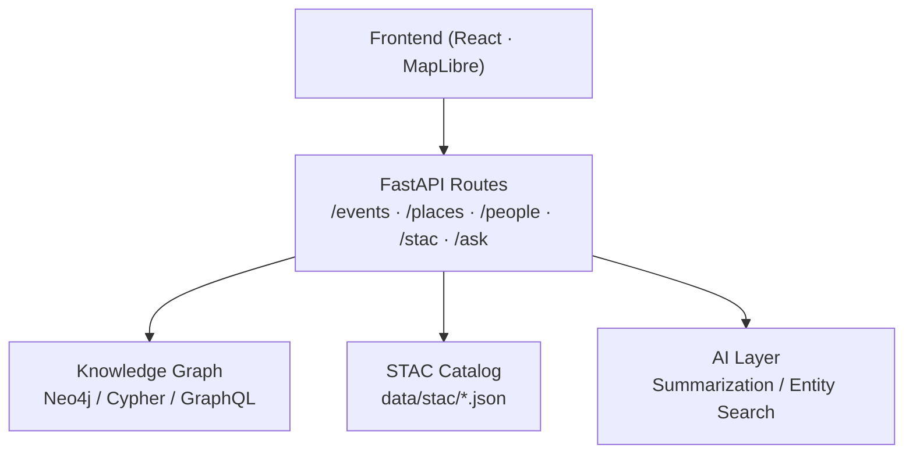

<div align="center">

# 🛠️ **Kansas Frontier Matrix — API Route Handlers**  
`src/api/routes/README.md`

**FastAPI Endpoints · REST & GraphQL Resolvers · Data Delivery Layer**

[](../../../../.github/workflows/site.yml)
[](../../../../.github/workflows/stac-validate.yml)
[](../../../../.github/workflows/codeql.yml)
[](../../../../.github/workflows/trivy.yml)
[](../../../../docs/)
[](../../../../LICENSE)

</div>

---

```yaml
---
title: "Kansas Frontier Matrix — API Route Handlers"
version: "v1.5.0"
last_updated: "2025-10-17"
owners: ["@kfm-architecture", "@kfm-data"]
tags: ["api","routes","fastapi","graphql","rest","stac","neo4j","ai","mcp","ci","semver"]
status: "Stable"
license: "MIT"
semver_policy: "MAJOR.MINOR.PATCH"
ci_required_checks:
  - pre-commit
  - unit-tests
  - codeql
  - trivy
  - docs-validate
semantic_alignment:
  - STAC 1.0
  - DCAT 2.0
  - CIDOC CRM
  - OWL-Time
  - ISO 8601
---
```

---

## 🎯 Purpose

The **`src/api/routes/`** directory defines all **FastAPI endpoint routes** for the **Kansas Frontier Matrix (KFM)**.  
Each route file contains REST and GraphQL endpoint definitions interfacing with the **Knowledge Graph**, **STAC Catalog**, and **AI/NLP enrichment layer** — powering the frontend timeline, map, and research APIs.

Routes are modularized by domain and standardized for **query parameters**, **pagination**, and **provenance enrichment**.

---

## 🏗️ System Role


<!-- END OF MERMAID -->

---

## 📂 Directory Layout

```
src/api/routes/
├── __init__.py
├── events.py          # Historical event queries (timeline)
├── places.py          # Geographic and geospatial endpoints
├── people.py          # Person / organization data
├── stac.py            # STAC collections & items
├── search.py          # Keyword + semantic search
├── ai.py              # AI-driven summarization & Q/A
└── README.md          # (this file)
```

---

## 🌎 Core Route Modules

### `/events` — Event & Timeline API

**Purpose:** Returns events within temporal/spatial filters using CIDOC CRM + OWL-Time.

```bash
GET /events?start=1850&end=1900&type=treaty
```

```json
[
  {
    "id": "event_1857_battle_solomon_fork",
    "title": "Battle of Solomon Fork",
    "start_date": "1857-07-29",
    "end_date": "1857-07-30",
    "places": [{"name": "Solomon River", "lat": 39.36, "lon": -98.92}],
    "participants": ["John Smith", "U.S. Army Cavalry"],
    "summary": "Conflict between U.S. forces and Cheyenne near Solomon River, Kansas."
  }
]
```

---

### `/places` — Geographic & Spatial API

**Purpose:** Returns spatial features (forts, towns, rivers, counties) as GeoJSON.

```bash
GET /places?bbox=-102,36,-94,40
```

```json
{
  "type": "FeatureCollection",
  "features": [
    {
      "type": "Feature",
      "properties": {"name": "Fort Larned", "category": "Fort"},
      "geometry": {"type": "Point", "coordinates": [-99.13, 38.19]}
    }
  ]
}
```

---

### `/people` — People & Organizations

**Purpose:** Provides biographical and relational data about individuals and organizations.

```bash
GET /people?id=truman_1870
```

```json
{
  "id": "truman_1870",
  "name": "Harry S. Truman",
  "roles": ["Senator", "President"],
  "associated_places": ["Independence, MO"],
  "events": ["Kansas City Flood 1951"]
}
```

---

### `/stac` — Geospatial Catalog API

**Purpose:** Exposes the **SpatioTemporal Asset Catalog (STAC)** for map layers and imagery.

```bash
GET /stac/items/ks_1m_dem_2018_2020
```

```json
{
  "stac_version": "1.0.0",
  "id": "ks_1m_dem_2018_2020",
  "type": "Feature",
  "assets": {
    "cog": {
      "href": "https://data.kansas.gov/dem/ks_1m_2018_2020.tif",
      "type": "image/tiff; application=geotiff; profile=cloud-optimized"
    }
  }
}
```

---

### `/search` — Keyword & Semantic Search

**Purpose:** Provides cross-entity search via Neo4j fulltext + NLP embeddings.

```bash
GET /search?q=cheyenne
```

```json
{
  "results": [
    {"type": "TribalEntity", "name": "Cheyenne", "mentions": 132},
    {"type": "Event", "title": "Medicine Lodge Treaty (1867)"},
    {"type": "Place", "name": "Cheyenne Bottoms Wetlands"}
  ]
}
```

---

### `/ai` — AI Query & Summarization

**Purpose:** Enables Q/A and summarization via NLP pipelines.

```bash
POST /ask
{
  "question": "Which Kansas counties were most affected by the Dust Bowl?"
}
```

```json
{
  "answer": "Western Kansas counties such as Finney, Ford, and Haskell saw the worst storms (1933–1938).",
  "sources": ["noaa_storms_1933.csv","kansas_newspapers_1935.txt","fema_dustbowl.json"]
}
```

---

## ⚙️ Implementation Details

- All routes import shared helpers from `src/api/utils/`  
- **Pydantic** schemas validate responses  
- **Structured logs** written to `logs/api/access.log`  
- **CORS**, caching, and error handling centralized via middleware  

**Boilerplate Example**
```python
from fastapi import APIRouter, Query
from src.api.schemas.event_schema import Event
from src.api.utils.db import get_session

router = APIRouter(prefix="/events", tags=["Events"])

@router.get("/", response_model=list[Event])
def list_events(start: int = 1800, end: int = 2025):
    with get_session("r") as s:
        q = f"""
        MATCH (e:Event)
        WHERE e.start_year >= {start} AND e.start_year <= {end}
        RETURN e
        """
        return [dict(r["e"]) for r in s.run(q)]
```

---

## 🧰 Development Commands

```bash
# Run one route for local test
uvicorn src.api.routes.events:router --reload

# Run all route tests
pytest tests/api/test_routes.py

# View live API documentation
curl http://localhost:8080/docs
```

---

## 🧷 CI Acceptance Checklist

- [ ] Routes documented (Swagger/GraphQL)  
- [ ] Schemas validated and response types enforced  
- [ ] Pagination + caching working across endpoints  
- [ ] `/search` and `/ai` rate-limited and logged  
- [ ] Unit tests pass CI (CodeQL, Trivy clean)  

---

## 📚 References

- API Layer — `../../README.md`  
- Schemas — `../schemas/README.md`  
- Utilities — `../utils/README.md`  
- Graph Queries — `../../../graph/graph_queries.py`  
- STAC Spec — https://stacspec.org/  
- FastAPI Docs — https://fastapi.tiangolo.com/  

---

<div align="center">

**Kansas Frontier Matrix © 2025**  
*Open Knowledge · Transparent APIs · Reproducible Science*

</div>
```