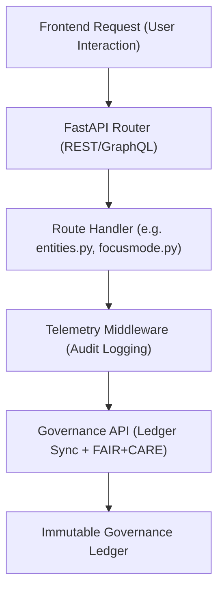

<div align="center">

# 🧩 Kansas Frontier Matrix — **API Routes & Endpoint Architecture**
`src/api/routes/README.md`

**Purpose:** Defines and documents the modular REST and GraphQL endpoint structure of the Kansas Frontier Matrix API layer.  
Each route is FAIR+CARE-aligned, ethically governed, and fully traceable through the Immutable Governance Ledger, ensuring transparency and reproducibility in all data and AI interactions.

[](../../../../.github/workflows/api-validate.yml)  
[](../../../../docs/standards/faircare-validation.md)  
[](../../../../docs/architecture/repo-focus.md)

</div>

---

## 📚 Overview

The **API Routes Module** provides the structured definition of all REST and GraphQL endpoints used by the Kansas Frontier Matrix.  
These endpoints connect the web frontend, Neo4j Knowledge Graph, and AI pipelines while enforcing FAIR+CARE governance for metadata provenance and access ethics.

**Core Objectives:**
- 🌍 Offer secure, discoverable REST and GraphQL routes for data and AI queries  
- ⚖️ Enforce FAIR+CARE compliance across all endpoint responses  
- 🧠 Integrate Focus Mode AI contextual outputs with explainability metadata  
- 🔍 Register all endpoint interactions with telemetry and governance systems  
- 🧾 Enable STAC/DCAT metadata retrieval and semantic interoperability  

---

## 🗂️ Directory Layout

```plaintext
src/api/routes/
├── README.md                     # This file — route documentation and governance summary
│
├── entities.py                   # Entity-level API for people, places, events
├── datasets.py                   # Access to STAC/DCAT datasets and metadata
├── focusmode.py                  # Contextual reasoning endpoints for Focus Mode AI
├── governance.py                 # FAIR+CARE governance, provenance, and telemetry endpoints
└── healthcheck.py                # Service status and operational health endpoint
```

---

## ⚙️ Route Summaries

| File | Route Prefix | Description | Governance Role |
|------|---------------|--------------|------------------|
| **`entities.py`** | `/api/entities` | Retrieves people, places, and events from Neo4j graph | FAIR metadata enrichment |
| **`datasets.py`** | `/api/datasets` | Serves dataset catalogs (STAC, DCAT) | Provenance access |
| **`focusmode.py`** | `/api/focus` | Executes contextual Focus Mode AI reasoning | Explainability and ethics |
| **`governance.py`** | `/api/governance` | Exposes governance ledger and telemetry logs | Immutable governance linkage |
| **`healthcheck.py`** | `/api/health` | Monitors API service uptime and dependencies | Observability telemetry |

---

## 🧠 Example Endpoints

### 📍 Entity Metadata
```bash
GET /api/entities/{entity_id}
```
**Response Example:**
```json
{
  "id": "fort_larned",
  "name": "Fort Larned",
  "type": "Historical Site",
  "related_entities": ["Santa Fe Trail", "U.S. Army"],
  "metadata": {
    "license": "CC-BY 4.0",
    "faircare_alignment": ["Findable", "Accessible"]
  }
}
```

---

### 🧭 Focus Mode Reasoning
```bash
POST /api/focus
```
**Request Example:**
```json
{
  "entity": "Treaty of Fort Laramie (1851)",
  "context": "Plains diplomacy and U.S. expansion",
  "explainability": true
}
```

**Response Example:**
```json
{
  "summary": "The 1851 Treaty of Fort Laramie established boundaries for Plains tribes and influenced westward expansion.",
  "confidence": 0.91,
  "related_entities": ["Sioux Nation", "Cheyenne", "U.S. Government"],
  "explainability_ref": "reports/focusmode/explainability_treaty_1851.json"
}
```

---

### 🧾 Governance Ledger Access
```bash
GET /api/governance/ledger
```
**Response Example:**
```json
{
  "entries": [
    {
      "event": "AI summary generated",
      "entity": "treaty_1851",
      "checksum": "a5b8c7d2e91f23d3cfe2a412b6d1a8f932b14f3feda9349d772e9b8df781ac1a",
      "timestamp": "2025-11-02T00:00:00Z"
    }
  ],
  "total_entries": 12540
}
```

---

### 📦 Dataset Metadata (STAC/DCAT)
```bash
GET /api/datasets/stac/items
```
**Response Example:**
```json
{
  "id": "kansas_topo_v3",
  "type": "FeatureCollection",
  "description": "Topographic dataset for central Kansas, 1885–1950.",
  "license": "CC-BY 4.0",
  "links": [
    {"rel": "self", "href": "https://kfm.ai/api/datasets/stac/items/kansas_topo_v3"}
  ]
}
```

---

## 🧩 FAIR+CARE Integration

| Endpoint | FAIR Principle | CARE Principle | Validation |
|-----------|----------------|----------------|-------------|
| `/api/entities` | Findable / Accessible | Collective Benefit | `faircare-validate.yml` |
| `/api/datasets` | Interoperable / Reusable | Responsibility | `data-contract-v3.json` |
| `/api/focus` | Transparent / Explainable | Ethics | `reports/fair/ai-bias-validation.json` |
| `/api/governance` | Accountability / Stewardship | Authority to Control | `reports/audit/governance-ledger.json` |

---

## 🔗 Governance & Telemetry Workflow



**Workflow Summary:**
1. Frontend requests data or reasoning context through REST or GraphQL.  
2. Router forwards request to appropriate handler (e.g., Focus Mode).  
3. Middleware logs event metadata for telemetry and ethics audits.  
4. Governance API updates immutable ledger with action metadata.  

---

## 🛡️ Security, Ethics & Provenance

- **Authentication:** Token-based auth for restricted endpoints.  
- **Ethics Checks:** All `/api/focus` requests validated under FAIR+CARE.  
- **Integrity:** Checksum verification for provenance-linked responses.  
- **Governance:** Every endpoint response recorded in governance ledger.  
- **Observability:** Telemetry logs for latency, query ethics, and access control.  

Telemetry Schema:  
`schemas/telemetry/api-telemetry-v1.json`

Telemetry Outputs:
```
reports/api/route-events.json
reports/audit/governance-ledger.json
releases/v9.4.0/focus-telemetry.json
```

---

## 🧩 Standards & Compliance

| Standard | Purpose | Implementation |
|-----------|----------|----------------|
| **MCP-DL v6.4.3** | Documentation-first endpoint definition | This README + route files |
| **FAIR+CARE** | Open, ethical, traceable API design | Metadata validation + governance logging |
| **ISO 23894** | AI and API lifecycle risk management | FAIR+CARE and ethics monitoring |
| **DCAT / STAC** | Dataset and metadata interoperability | `/api/datasets` route |
| **JSON-LD** | Provenance and semantic linkage | `/api/governance` route outputs |

---

## 🧾 Version History

| Version | Date | Author | Summary |
|----------|------|---------|----------|
| v9.4.0 | 2025-11-02 | @kfm-api | Added detailed route documentation, governance linkage, and telemetry schema. |
| v9.3.3 | 2025-11-01 | @kfm-architecture | Enhanced Focus Mode reasoning and explainability endpoints. |
| v9.3.2 | 2025-10-29 | @bartytime4life | Improved FAIR+CARE validation in entity and dataset routes. |
| v9.3.1 | 2025-10-27 | @kfm-ethics | Integrated governance ledger synchronization for REST endpoints. |
| v9.3.0 | 2025-10-25 | @kfm-devops | Established API routes structure under MCP-DL v6.4.3. |

---

<div align="center">

**Kansas Frontier Matrix — Ethical & Transparent API Architecture**  
*“Every route verifiable. Every query accountable. Every dataset governed.”* 🔗  
📍 `src/api/routes/README.md` — FAIR+CARE-certified documentation for API routes and endpoint structure in the Kansas Frontier Matrix.

</div>
