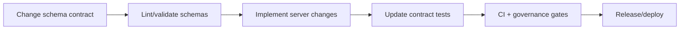

# API Schemas (src/api/schemas)

<kbd>Governed</kbd> <kbd>Contract‑first</kbd> <kbd>API Boundary</kbd> <kbd>No Hot‑Linked Images</kbd>

> **Path:** `src/api/schemas/`  
> **This file:** `src/api/schemas/README.md`  
> **Used by:** API maintainers, frontend consumers, contract-test authors

---

## 📘 Overview

### Purpose
This directory is the canonical home for **API contract schemas** used by KFM’s API surface (REST and/or GraphQL). It is where we define *what is supported*—and just as importantly, what is **not** supported—at the API boundary.

KFM’s documentation standards explicitly call out that **OpenAPI/GraphQL schemas live under `src/api/` and are linked from API documentation**.[^src-api]

### Scope
In scope for this folder:
- OpenAPI contract files (YAML/JSON)
- GraphQL SDL (schema definition language)
- Shared schema components used by the API contract (request/response shapes, error envelopes, pagination, etc.)

Out of scope for this folder:
- Data catalog/profile schemas (STAC/DCAT/PROV)
- Story Node publishing schemas
- UI config schemas

> [!IMPORTANT]
> **If it’s not in these schemas (and not covered by contract tests), it is not a stable API behavior.**

### Audience
- Backend/API engineers
- Frontend engineers and external API consumers
- Governance reviewers when a contract change affects **classification, redaction, provenance, or sensitive fields**

---

## 🗂️ Directory Layout

### This directory
- `src/api/schemas/` — API schema and contract artifacts
- `src/api/schemas/README.md` — this guide

### Typical layout (adjust to match your repo)
```text
src/api/schemas/
├── README.md
├── openapi/                 # OpenAPI 3.x contracts (YAML/JSON)
│   ├── openapi.yaml
│   └── components/          # shared components (schemas, params, responses)
├── graphql/                 # GraphQL SDL
│   └── schema.graphql
└── json/                    # optional: shared JSON Schema components
    ├── error.schema.json
    └── pagination.schema.json
```

> [!NOTE]
> If your repo uses a newer API layout (e.g., `src/server/`), keep this folder as a **thin pointer** and move canonical contract artifacts to the agreed API contract directory (often `src/server/contracts/`). Document the decision in an ADR and update links here.[^migrate]

---

## 🧭 Context

KFM treats the API boundary as a **governed trust membrane**:
- Clients should not depend on undocumented behavior.
- Schema changes must be intentional and reviewable.
- Contracts help enforce **security, provenance integrity, and sensitivity rules** by making expectations explicit.

Schemas are part of the “contract-first” discipline: define the interface, then implement it, then test it.

---

## 🗺️ Diagrams



---

## 📦 Data & Metadata

### What belongs here

| Artifact type | Typical file(s) | Primary purpose | Downstream consumers |
|---|---|---|---|
| OpenAPI contract | `openapi/openapi.yaml` | REST inventory, auth schemes, request/response shapes | client generation, docs, contract tests |
| GraphQL schema (SDL) | `graphql/schema.graphql` | Type system + query/mutation contracts | clients, GraphiQL tooling, contract tests |
| Shared schema components | `json/*.schema.json` | Reusable validation fragments | runtime validators, OpenAPI components |

### Naming & organization conventions
- Use **descriptive filenames** with underscores or hyphens (pick one convention and stay consistent).[^naming]
- Keep schemas composable: prefer **small, reusable components** with `$ref`/imports over monoliths.
- Avoid encoding storage/ORM details. These are **interface contracts**, not database schemas.

### Compatibility + versioning expectations
> [!WARNING]
> Any contract change that breaks existing consumers must be released as a **versioned change** (new endpoint version, new schema namespace, or documented deprecation strategy).

Recommended patterns:
- REST: `/api/v1/...` additive changes only; breaking changes go to `/api/v2/...`
- GraphQL: additive fields preferred; breaking changes require deprecation + communication window

---

## 🧱 Architecture

### Layer boundaries (Clean architecture)
This folder defines **interface-layer** contracts:
- ✅ API boundary contracts (requests/responses/types)
- ✅ Validation expectations and allowed shapes
- ❌ No direct coupling to DB tables, ORM models, or internal storage structures

### Contract change workflow
1. Update the contract schema(s) (OpenAPI/GraphQL/JSON Schema components)
2. Update implementation in the API layer
3. Update contract tests + fixtures (or golden responses)
4. Update any developer documentation references (e.g., `docs/api/`)
5. Record the change in **Version History** below

<details>
<summary><strong>Example: schema-driven validation (pseudo-code)</strong></summary>

```ts
// Example only — adapt to the schema validator used in this repo.
import { validate } from "../validation";

const result = validate("DatasetResponse", payload);
if (!result.ok) throw new Error(result.errors.join("\n"));
```
</details>

---

## 🧪 Validation & CI/CD

KFM’s documentation standards emphasize that artifacts must be **review & CI ready** and pass validation checks (linting, link checks, sensitivity/accessibility expectations).[^ci]

### Local workflow tips
Before committing or opening a PR:
- [ ] Run local checks (example: `pre-commit run --all-files`)  
- [ ] Preview Markdown rendering (GitHub/VSCode)
- [ ] Verify internal links resolve
- [ ] Update Version History for non-trivial changes

### Contract-focused “Definition of Done”
- [ ] OpenAPI/GraphQL schema(s) validate cleanly
- [ ] Any JSON Schema components validate cleanly
- [ ] Contract tests updated and passing
- [ ] No new sensitive/PII fields introduced without governance review
- [ ] No hot-linked external images added to docs (use local assets only)[^no-hotlink]
- [ ] Version History updated

<details>
<summary><strong>Suggested commands (adapt to repo tooling)</strong></summary>

```bash
# Examples only — replace with actual repo scripts
pre-commit run --all-files
npm test
npm run lint
```
</details>

---

## ⚖️ FAIR+CARE & Governance

KFM’s documentation standards require explicit governance attention where applicable:
- **Authority to Control & Ethics:** Do not expose culturally restricted information or precise locations when classified as sensitive.
- **Responsibility:** Contract changes that affect what can be emitted at the API boundary should trigger governance review.
- **Interoperability:** Prefer consistent terminology (STAC/DCAT/PROV) where it helps, but avoid overloading API contracts with catalog internals.

> [!TIP]
> If a field may be sensitive, default to **omit/generalize**, and open a governance review gate.

---

## 🕰️ Version History

| Version | Date | Summary of changes | Author |
|---|---:|---|---|
| v0.1.0 | 2026-02-12 | Initial governed README for `src/api/schemas/` (structure + workflow + CI expectations). | AI draft (needs maintainer review) |

---

[^src-api]: KFM Markdown guide notes that OpenAPI/GraphQL schemas live under `src/api/` and are linked from API docs.
[^naming]: KFM doc standards recommend descriptive naming and consistent separators (underscores/hyphens).
[^ci]: KFM doc standards emphasize CI-ready docs and validation expectations (linting, links, sensitivity/accessibility).
[^no-hotlink]: KFM doc validation includes checks that reject hot-linked external images.
[^migrate]: If the repo consolidates API code elsewhere (e.g., `src/server/`), treat this folder as a pointer and document the canonical location in an ADR.
