<div align="center">

# 🧾 **Kansas Frontier Matrix — API Schemas**  
`src/api/schemas/README.md`

**Pydantic Models · Data Validation · OpenAPI Compliance**

[](../../../../.github/workflows/site.yml)
[](../../../../.github/workflows/stac-validate.yml)
[](../../../../.github/workflows/codeql.yml)
[](../../../../.github/workflows/trivy.yml)
[](../../../../docs/)
[](../../../../LICENSE)

</div>

---

```yaml
---
title: "Kansas Frontier Matrix — API Schemas"
version: "v1.4.1"
last_updated: "2025-10-17"
owners: ["@kfm-architecture", "@kfm-data"]
tags: ["api","schemas","pydantic","openapi","validation","stac","graph","mcp","semver","ci"]
status: "Stable"
license: "MIT"
semver_policy: "MAJOR.MINOR.PATCH"
ci_required_checks:
  - pre-commit
  - unit-tests
  - codeql
  - trivy
  - docs-validate
semantic_alignment:
  - ISO 8601
  - GeoJSON
  - STAC 1.0
  - CIDOC CRM
  - OWL-Time
---
```

---

## 🎯 Purpose

The **`src/api/schemas/`** directory defines **Pydantic models** for all API endpoints in the Kansas Frontier Matrix (KFM).  
These schemas ensure consistent **data validation**, **type safety**, and **OpenAPI documentation** across all REST and GraphQL routes.

They form the **contract** between the backend graph data and frontend consumers — providing reproducible, standards-aligned API responses under the **Master Coder Protocol (MCP)**.

---

## 🧩 Role in the System

```mermaid
flowchart TD
    A["Neo4j Graph / STAC Catalog"] --> B["FastAPI Routes"]
    B --> C["Pydantic Schemas<br/>src/api/schemas/*"]
    C --> D["Validated JSON / GeoJSON Responses"]
    D --> E["Frontend · Clients · Researchers"]
```


<!-- END OF MERMAID -->

Schemas are the foundation of API interoperability — powering **OpenAPI**, **GraphQL**, and automated **docs generation**.

---

## 📂 Directory Layout

```
src/api/schemas/
├── __init__.py
├── base.py             # Shared base models and metadata definitions
├── event_schema.py     # Event and timeline entities
├── place_schema.py     # Geospatial place/location entities
├── person_schema.py    # People and organizations
├── stac_schema.py      # SpatioTemporal Asset Catalog (STAC 1.0.0)
└── README.md           # (this file)
```

---

## 🧱 Base Model Structure (`base.py`)

```python
from pydantic import BaseModel, Field
from datetime import datetime
from typing import Optional, Dict, Any

class BaseSchema(BaseModel):
    id: str = Field(..., description="Unique identifier for the entity.")
    title: Optional[str] = Field(None, description="Readable name or title.")
    description: Optional[str] = Field(None, description="Brief context or abstract.")
    license: Optional[str] = Field(None, description="Usage license for the record.")
    last_updated: datetime = Field(default_factory=datetime.utcnow)
    source: Optional[str] = Field(None, description="Provenance source (dataset/API).")
    meta: Optional[Dict[str, Any]] = Field(default=None, description="Additional metadata (provenance, notes).")

    class Config:
        orm_mode = True
```

All derived schemas inherit these fields for **provenance integrity** and **OpenAPI visibility**.

---

## 🧭 Example: Event Schema (`event_schema.py`)

```python
from typing import List, Optional
from pydantic import BaseModel, Field
from .base import BaseSchema

class PlaceRef(BaseModel):
    name: str
    latitude: float
    longitude: float

class Participant(BaseModel):
    name: str
    role: Optional[str]

class Event(BaseSchema):
    start_date: Optional[str] = Field(None, description="Start date (ISO 8601).")
    end_date: Optional[str] = Field(None, description="End date (ISO 8601).")
    places: List[PlaceRef] = []
    participants: List[Participant] = []
    event_type: Optional[str] = Field(None, description="Category (treaty, battle, flood, etc.)")
    summary: Optional[str] = Field(None, description="AI-generated summary or snippet.")
```

---

## 🌍 Example: Place Schema (`place_schema.py`)

```python
from typing import Optional
from pydantic import BaseModel, Field
from .base import BaseSchema

class Place(BaseSchema):
    name: str
    latitude: float
    longitude: float
    county: Optional[str] = None
    category: Optional[str] = Field(None, description="Type of place (fort, town, river, etc.)")
    elevation_m: Optional[float] = None
    gnis_id: Optional[str] = None
```

---

## 👥 Example: Person Schema (`person_schema.py`)

```python
from typing import Optional, List
from pydantic import Field
from .base import BaseSchema

class Person(BaseSchema):
    name: str
    birth_date: Optional[str] = None
    death_date: Optional[str] = None
    roles: Optional[List[str]] = []
    affiliations: Optional[List[str]] = []
    tribal_entity: Optional[str] = Field(None, description="Associated tribe or nation (if applicable).")
```

---

## 🗺️ Example: STAC Schema (`stac_schema.py`)

```python
from typing import Dict, Any, Optional, List
from pydantic import BaseModel, Field

class STACItem(BaseModel):
    id: str
    stac_version: str = "1.0.0"
    type: str = "Feature"
    properties: Dict[str, Any]
    assets: Dict[str, Any]
    bbox: Optional[List[float]] = None
    geometry: Optional[dict] = None
```

---

## 🧾 Schema Validation & OpenAPI Docs

FastAPI automatically uses these schemas to validate and document API routes:

```
GET /events → Response: List[Event]
GET /places/{id} → Response: Place
POST /events → Response: Event
```

Invalid payloads trigger descriptive **422 Unprocessable Entity** errors with field details.

---

## 🧪 Testing & Validation

```bash
pytest tests/api/test_schemas.py
make lint
```

- **Tests:** ensure field types, optional fields, and examples are valid  
- **Linting:** via **Ruff**, **Black**, and pre-commit hooks  
- **Docs:** validated under CI using FastAPI’s `/openapi.json` schema  

---

## 🔁 Integration Flow

| Stage | Description |
| :---- | :----------- |
| **Upstream** | Feeds from `graph/` (Neo4j) and `data/stac/` |
| **Downstream** | Used by `src/api/routes/` and auto-generated OpenAPI docs |
| **Automation** | `make api` and CI validation enforce schema compliance |

---

## 🧷 CI Acceptance Checklist

- [ ] All schemas validated via FastAPI `/openapi.json`  
- [ ] Required provenance fields (`id`, `license`, `source`, `last_updated`) present  
- [ ] ISO 8601 validation for temporal fields  
- [ ] STAC schemas adhere to 1.0.0 spec  
- [ ] Unit tests and linting pass in CI  

---

## 📚 References

- API Layer — `../../README.md`  
- AI System Developer Docs — `../../../../docs/ai-system.md`  
- CIDOC CRM — https://www.cidoc-crm.org/  
- STAC 1.0 — https://stacspec.org/  
- FastAPI/Pydantic — https://fastapi.tiangolo.com/

---

<div align="center">

**Kansas Frontier Matrix © 2025**  
*Data Standards · Provenance Integrity · Reproducible API Design*

</div>
```