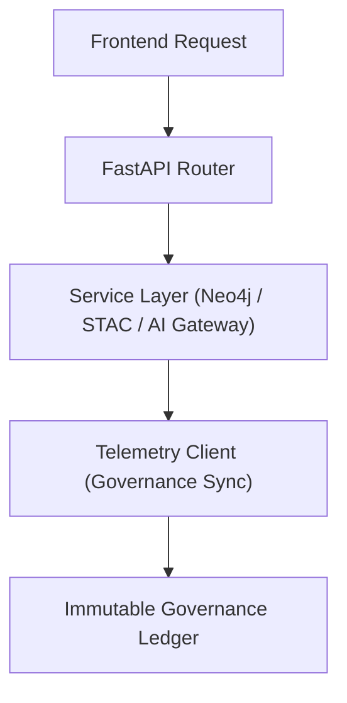

<div align="center">

# 🧩 Kansas Frontier Matrix — **API Services & Backend Integrations**
`src/api/services/README.md`

**Purpose:** Describes the backend service integrations that power the Kansas Frontier Matrix API layer.  
Includes Neo4j Knowledge Graph, STAC metadata services, AI model gateway, and telemetry systems — all governed under FAIR+CARE ethical and provenance-driven frameworks.

[](../../../../.github/workflows/api-services.yml)  
[](../../../../docs/standards/faircare-validation.md)  
[](../../../../docs/architecture/repo-focus.md)

</div>

---

## 📚 Overview

The **API Services Module** connects the Kansas Frontier Matrix API to its backend components.  
It abstracts access to Neo4j, STAC catalogs, and AI pipelines while embedding telemetry and provenance metadata for governance compliance and FAIR+CARE certification.

**Core Objectives:**
- 🧠 Provide secure and ethical access to backend systems (Neo4j, STAC, AI)  
- 🌍 Maintain FAIR+CARE metadata and lineage across API responses  
- ⚙️ Integrate telemetry hooks for governance and observability  
- 🧩 Facilitate explainable AI operations via model gateway services  
- 🔍 Ensure reproducible provenance through DCAT and JSON-LD exports  

---

## 🗂️ Directory Layout

```plaintext
src/api/services/
├── README.md                     # This file — documentation for backend integration governance
│
├── neo4j_client.py               # Manages Neo4j Knowledge Graph queries and transactions
├── stac_client.py                # Retrieves datasets and metadata from OGC STAC catalogs
├── ai_gateway.py                 # Connects API layer to AI summarization and explainability services
└── telemetry_client.py           # Publishes telemetry data to governance and monitoring systems
```

**File Descriptions:**

- **`neo4j_client.py`** — Provides data access and graph operations with schema validation, provenance tracking, and query logging.  
- **`stac_client.py`** — Enables dataset discovery and retrieval through FAIR-compliant STAC and DCAT interfaces.  
- **`ai_gateway.py`** — Routes AI reasoning, explainability, and Focus Mode requests to model endpoints with ethical validation.  
- **`telemetry_client.py`** — Handles API telemetry publishing for audit logs, metrics, and governance ledger synchronization.

---

## ⚙️ Example Workflows

### 🧩 Retrieve Graph Entity
```python
from src.api.services.neo4j_client import get_entity

entity = get_entity("treaty_1851")
print(entity)
```

**Response Example:**
```json
{
  "id": "treaty_1851",
  "name": "Treaty of Fort Laramie (1851)",
  "type": "Historical Treaty",
  "related_entities": ["Cheyenne", "Sioux Nation", "U.S. Government"],
  "metadata": {
    "license": "CC-BY 4.0",
    "provenance_ref": "reports/audit/governance-ledger.json"
  }
}
```

---

### 🌍 Fetch STAC Dataset
```python
from src.api.services.stac_client import list_stac_items

datasets = list_stac_items(collection="kansas_frontier_maps")
```

**Response Example:**
```json
{
  "collection": "kansas_frontier_maps",
  "items": [
    {
      "id": "kansas_topo_v3",
      "title": "Kansas Topographic Maps (1885–1950)",
      "license": "CC-BY 4.0",
      "stac_version": "1.0.0",
      "links": [
        {"rel": "self", "href": "https://kfm.ai/api/datasets/stac/items/kansas_topo_v3"}
      ]
    }
  ]
}
```

---

### 🧠 Run AI Contextual Summarization
```python
from src.api.services.ai_gateway import generate_focus_summary

summary = generate_focus_summary(entity_id="fort_larned", context="Military outpost significance")
```

**Response Example:**
```json
{
  "entity": "Fort Larned",
  "summary": "Fort Larned served as a key U.S. Army post supporting commerce along the Santa Fe Trail.",
  "confidence": 0.93,
  "explainability_ref": "reports/ai/explainability/focus_fort_larned.json"
}
```

---

### 📡 Emit Telemetry Event
```python
from src.api.services.telemetry_client import publish_event

publish_event(
    route="/api/focus",
    method="POST",
    status_code=200,
    duration_ms=132.7,
    ethics_score=0.98
)
```

**Telemetry Output Example:**
```json
{
  "route": "/api/focus",
  "method": "POST",
  "status_code": 200,
  "duration_ms": 132.7,
  "governance_hash": "a9e1b6cd57ff3b31f3c02af34e4bc7b7f5b2f9d4fbbdb1f3f865e5f56e71a4b3",
  "ethics_score": 0.98,
  "timestamp": "2025-11-02T00:00:00Z"
}
```

---

## 🧩 Governance & FAIR+CARE Integration

| Service | Role | FAIR Principle | CARE Dimension |
|----------|------|----------------|----------------|
| **Neo4j Client** | Graph data management | Findable / Accessible | Responsibility |
| **STAC Client** | Dataset metadata retrieval | Interoperable / Reusable | Collective Benefit |
| **AI Gateway** | Focus Mode reasoning and explainability | Transparent / Explainable | Ethics |
| **Telemetry Client** | Observability and governance logging | Accountable / Auditable | Authority to Control |

Governance artifacts synchronized with:
```
reports/audit/governance-ledger.json
releases/v9.4.0/focus-telemetry.json
```

---

## 🔗 Service Integration Workflow



**Workflow Summary:**
1. Frontend requests are routed via FastAPI endpoints.  
2. Services handle requests through Neo4j, STAC, or AI integrations.  
3. Telemetry logs generated for observability and governance traceability.  
4. Immutable Governance Ledger updated with event metadata.  

---

## 🛡️ Security, Provenance & Observability

- **Integrity:** All service responses checksum-verified before transmission.  
- **Provenance:** Each response includes JSON-LD metadata for lineage tracing.  
- **Observability:** Service events recorded under telemetry schema.  
- **Transparency:** FAIR+CARE validation integrated into all backend interactions.  

Telemetry Schema:  
`schemas/telemetry/api-telemetry-v1.json`

Telemetry Outputs:
```
reports/api/service-events.json
reports/audit/governance-ledger.json
releases/v9.4.0/focus-telemetry.json
```

---

## 🧩 Standards & Compliance Mapping

| Standard | Domain | Implementation |
|-----------|----------|----------------|
| **MCP-DL v6.4.3** | Documentation-driven backend integration | This README + service modules |
| **FAIR+CARE** | Ethical metadata governance | Governance hooks in all services |
| **ISO 23894** | AI lifecycle transparency | AI Gateway explainability and telemetry |
| **DCAT / STAC** | Dataset interoperability | STAC Client metadata API |
| **JSON-LD / CIDOC CRM** | Provenance interoperability | Embedded in Neo4j and governance exports |

---

## 🧾 Version History

| Version | Date | Author | Summary |
|----------|------|---------|----------|
| v9.4.0 | 2025-11-02 | @kfm-api | Added governance integration and FAIR+CARE-compliant telemetry hooks for all backend services. |
| v9.3.3 | 2025-11-01 | @kfm-data | Enhanced Neo4j and STAC client interoperability with provenance tracking. |
| v9.3.2 | 2025-10-29 | @bartytime4life | Integrated AI explainability bridge and governance synchronization. |
| v9.3.1 | 2025-10-27 | @kfm-architecture | Improved telemetry client and governance auditing hooks. |
| v9.3.0 | 2025-10-25 | @kfm-devops | Established backend service module architecture under MCP-DL v6.4.3. |

---

<div align="center">

**Kansas Frontier Matrix — Ethical Backend Architecture for Transparent AI**  
*“Every service traceable. Every query governed. Every dataset accountable.”* 🔗  
📍 `src/api/services/README.md` — FAIR+CARE-certified documentation for API backend services and governance-integrated integrations within the Kansas Frontier Matrix.

</div>
