<div align="center">

# ⚙️ **Kansas Frontier Matrix — Generated Design Token Outputs**
`src/design-tokens/generated/README.md`

**Purpose:**  
Store **compiled, platform-ready exports** of KFM’s design tokens in **CSS**, **SCSS**, and **JavaScript** formats for use across the web application, documentation, and Focus Mode dashboards.  
These exports are continuously built and validated under **MCP-DL v6.3**, **FAIR+CARE**, and **WCAG 2.1 AA** standards to ensure sustainable, accessible, and traceable UI systems.

[](../../../docs/README.md)
[](../../../LICENSE)
[](../../../docs/standards/faircare.md)
[]()

</div>

---

## 📘 Overview

The **Generated Token Directory** provides precompiled token outputs derived from `src/design-tokens/tokens/*.json`.  
These are consumed by KFM’s web app, documentation engine, and AI visualization systems.

Outputs are:
- **Auto-generated** via `design-token-build.yml`
- **Schema-validated** for JSON integrity
- **Governance-tracked** for accessibility and sustainability compliance

---

## 🗂️ Directory Layout

```plaintext
src/design-tokens/generated/
├── README.md                     # This file — documentation overview
│
├── tokens.css                     # Exported CSS variables for global styling
├── tokens.scss                    # SCSS export for custom builds and themes
├── tokens.js                      # JavaScript/TypeScript-compatible export
├── tokens.map.json                # Token source map for build provenance
└── metadata.json                  # Versioned governance metadata and telemetry linkage
```

---

## 🧱 Compiled Token Types

| File | Type | Purpose | Format |
|------|------|----------|--------|
| `tokens.css` | CSS Variables | Default UI token export for the web frontend. | `:root { --color-brand-primary: #003366; }` |
| `tokens.scss` | Sass Map | Used by style processors and theming layers. | `$color-brand-primary: #003366;` |
| `tokens.js` | JS Export | JavaScript module for React, D3, and AI dashboards. | `export const colorBrandPrimary = "#003366";` |
| `tokens.map.json` | Provenance Map | Links compiled variables to JSON source tokens. | JSON |
| `metadata.json` | Governance Metadata | Checksum lineage, author, and sustainability metrics. | JSON |

---

## ⚙️ Build Workflow

```mermaid
flowchart TD
A["Design Token JSON Sources (tokens/*.json)"] --> B["Token Compiler (build-tokens.js)"]
B --> C["Validation (design-token-validate.yml)"]
C --> D["Accessibility Audit (ui-accessibility.yml)"]
D --> E["Telemetry Export (focus-telemetry.json)"]
E --> F["Generated Outputs (CSS · SCSS · JS)"]
```



**Build Tool:** Style Dictionary v4.0  
**Validation:** Automated in CI/CD on every release commit.

---

## 🧩 Example CSS Output (`tokens.css`)

```css
:root {
  --color-brand-primary: #003366;
  --color-brand-secondary: #f2a900;
  --color-text-primary: #1a1a1a;
  --font-family-base: "Inter", "Helvetica", sans-serif;
  --spacing-md: 1rem;
  --shadow-md: 0 4px 6px rgba(0, 0, 0, 0.15);
}
```

---

## 🧠 Accessibility & Sustainability Metrics

Each build emits telemetry metrics to `focus-telemetry.json` for continuous improvement tracking.

| Metric | Description | Target |
|---------|-------------|---------|
| `contrast_ratio_avg` | Mean contrast ratio across UI colors | ≥ 4.5:1 |
| `render_energy_wh` | Energy cost of token rendering (avg) | ≤ 0.25 Wh |
| `carbon_gco2e` | Equivalent CO₂ per UI render | ≤ 0.4 g |
| `a11y_pass_rate` | WCAG 2.1 AA audit success | 100% |

Telemetry data validated against schema:  
`schemas/telemetry/src-design-tokens-generated-v1.json`

---

## 🧾 Governance & Provenance Metadata Example

```json
{
  "version": "v10.0.0",
  "generated_on": "2025-11-10T18:22:00Z",
  "validated": true,
  "checksum": "sha256-1a5b43f7eae9...",
  "source_tokens": [
    "tokens/colors.json",
    "tokens/typography.json",
    "tokens/spacing.json"
  ],
  "telemetry_ref": "releases/v10.0.0/focus-telemetry.json",
  "governance_ref": "docs/standards/governance/ROOT-GOVERNANCE.md"
}
```

---

## ⚖️ FAIR+CARE Design Compliance

| Principle | Implementation |
|------------|----------------|
| **Findable** | Tokens indexed in manifest + telemetry registry |
| **Accessible** | Publicly available CSS/JS/SCSS builds |
| **Interoperable** | Compatible with Figma, React, and static site generators |
| **Reusable** | Modular tokens, open license, and JSON provenance |
| **CARE** | Color and motion accessibility validated for inclusivity |

---

## 🧮 Validation Workflows

| Workflow | Description | Output |
|-----------|-------------|---------|
| `design-token-build.yml` | Compiles and hashes token exports | `src/design-tokens/generated/tokens.*` |
| `design-token-validate.yml` | Ensures token references match source JSON | `reports/self-validation/ui/design_tokens.json` |
| `telemetry-export.yml` | Updates sustainability metrics in telemetry ledger | `releases/v10.0.0/focus-telemetry.json` |

Governance and validation artifacts recorded in:
```
docs/reports/telemetry/governance_scorecard.json
```

---

## 🕰️ Version History

| Version | Date | Author | Summary |
|----------|------|---------|----------|
| v10.0.0 | 2025-11-10 | `@kfm-design-system` | Published compiled design token outputs (CSS, SCSS, JS) with full telemetry integration and governance validation. |

---

<div align="center">

**© 2025 Kansas Frontier Matrix — CC-BY 4.0**  
Generated under **Master Coder Protocol v6.3** · FAIR+CARE Certified · Diamond⁹ Ω / Crown∞Ω Ultimate Certified  
[Back to Design Tokens Index](../README.md) · [Token Sources](../tokens/README.md) · [Governance Charter](../../../docs/standards/governance/ROOT-GOVERNANCE.md)

</div>

