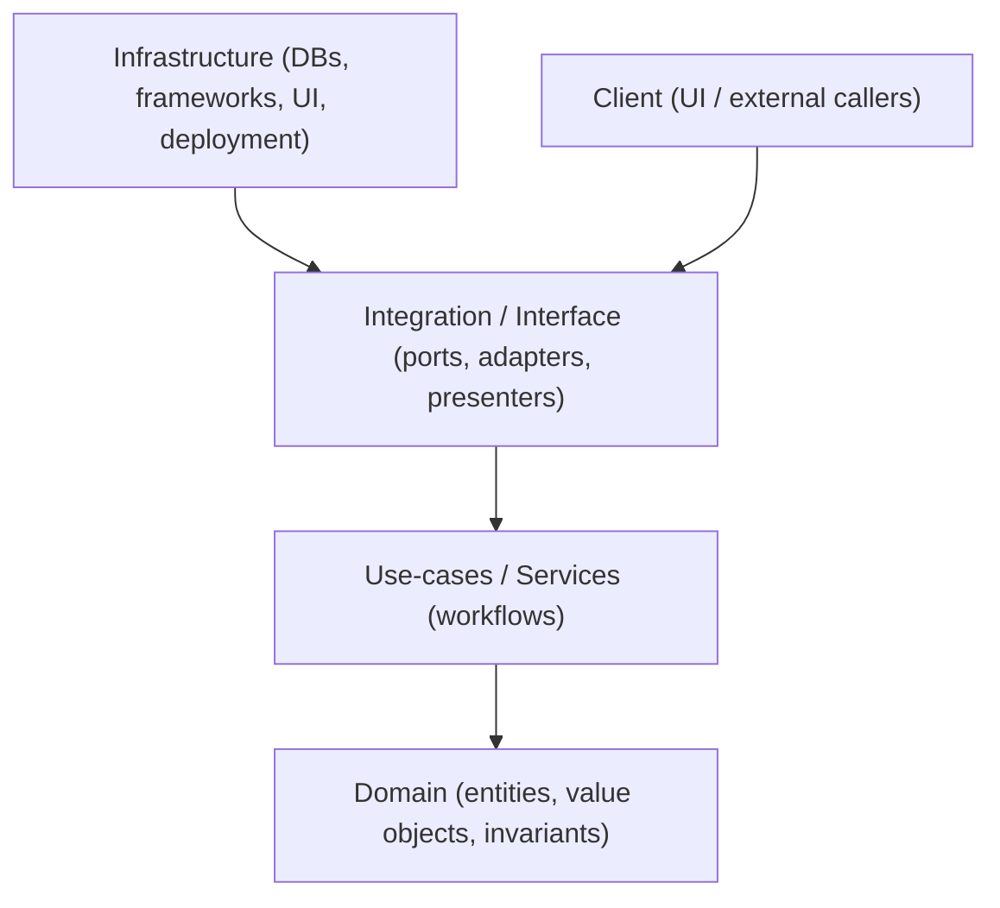

# KFM Domain Layer (`src/domain`) 🧱


This directory contains the **Domain layer** for Kansas Frontier Matrix (KFM): *pure* business concepts, rules, and invariants.  
It is the “center” of the clean architecture: other layers may depend on Domain, but Domain must not depend on them.

> [!IMPORTANT]
> **Non‑negotiable:** Domain code must remain free of **database**, **HTTP**, **GraphQL/REST framework**, **filesystem**, **UI**, and **pipeline runtime** dependencies.
>
> If your change requires PostGIS/Neo4j/OpenSearch, FastAPI/Express, React/MapLibre, ETL jobs, or environment/config access — it does **not** belong here.

---

## Why this folder exists

KFM is described as an **evidence-first, provenance-centric** geospatial system with a governed access boundary (“trust membrane”). In clean architecture terms:

- **Domain** models what the system *is* (entities, value objects, invariants).
- **Use-cases/services** model what the system *does* (workflows).
- **Interface/integration** is where governed ports/adapters live (“trust membrane”).
- **Infrastructure** is where concrete tech lives (DBs, web frameworks, UI, deployment).

This folder is specifically about **Domain**.

> [!NOTE]
> “Domain” can be overloaded in KFM.
>
> - `src/domain` = **clean-architecture Domain layer** (this folder; pure code)
> - `docs/data/**` = **dataset “domain modules”** (documentation + governance for a topic area)
>
> Keep those concepts separate.

---

## Dependency rule



**Interpretation:** dependencies point inward. The outer layers may import/use inner layers. Inner layers **must not** import outer layers.

---

## What belongs in `src/domain`

| Category | Belongs here? | Notes |
|---|---:|---|
| Entities (business objects) | ✅ | Identity + invariants (e.g., `LandParcel`, `HistoricalMap` *as examples*) |
| Value Objects | ✅ | Immutable types (e.g., `TimeRange`, `GeoPoint`, `DatasetId`) |
| Domain invariants & validation | ✅ | “Impossible states are unrepresentable” |
| Domain services (pure) | ✅ | Cross-entity logic that does **not** require I/O |
| Domain events (pure) | ✅ | Facts that something happened in the domain (no message bus code) |
| Domain errors | ✅ | Typed errors/exceptions with stable codes |
| Ports / repository interfaces | ❓ | Usually **Interface layer**; keep Domain minimal unless your architecture explicitly places ports here |
| DB models/ORM schemas | ❌ | PostGIS/Neo4j mappings live outside Domain |
| API DTOs / request/response shapes | ❌ | Belong in Interface layer (adapters/presenters) |
| GraphQL resolvers / REST controllers | ❌ | Interface/Infrastructure |
| UI components, map rendering, state | ❌ | Frontend only |
| ETL / pipeline jobs | ❌ | Pipelines layer |

> [!TIP]
> If you need *I/O*, you’re not in Domain anymore.

---

## Suggested directory layout (recommended)

> [!WARNING]
> This is a **recommended** layout. Confirm actual repo structure before enforcing via tooling (not confirmed in repo from this session).

```text
src/domain/
  README.md

  entities/
    # Domain entities (identity + invariants)

  value-objects/
    # Immutable types used by entities & services

  services/
    # Pure domain services (no I/O)

  events/
    # Domain events (pure facts)

  policies/
    # Business/governance policies that can be evaluated in-domain (pure)

  errors/
    # DomainError types, error codes

  index.*
    # Re-export surface (language-specific)
```

---

## KFM-specific modeling guidelines

### 1) Evidence-first means “traceability is a feature”
Domain models should make it *possible* (not necessarily mandatory for every type) to connect:

- **Claims → evidence references**
- **Interpretations → uncertainty**
- **Representations → sensitivity classification**

> [!IMPORTANT]
> Domain should **not** implement STAC/DCAT/PROV file generation or catalog writes.  
> But Domain should be shaped so those artifacts can be produced reliably in pipeline/service layers.

### 2) Uncertainty is not decoration
When representing derived/interpretive information, model uncertainty explicitly:

- confidence (0–1)
- range (min/max)
- method or provenance pointer (e.g., “derived from dataset X using algorithm Y”)

Avoid: “single magic number” with no way to express uncertainty.

### 3) Sensitivity & sovereignty
If a concept may involve culturally restricted or sensitive location information:

- Prefer a **generalized** geometry/value object (e.g., bounding box, centroid fuzzed to a grid, or county-level region)
- Carry an explicit **classification/sensitivity** field
- Ensure downstream layers can apply redaction rules (“deny by default”, allow by policy)

> [!CAUTION]
> Do **not** embed precise coordinates for sacred/vulnerable sites in Domain test fixtures or examples unless the data is explicitly cleared for public release by governance.

### 4) Spatial types must stay library-agnostic
Avoid domain types that require PostGIS, GEOS, Turf.js, Shapely, etc.

Good patterns:
- `GeoPoint` with `{ lat, lon }`
- `BoundingBox` with `{ west, south, east, north }`
- `Geometry` as a minimal internal representation (or an interface) that adapters can convert to/from PostGIS/GeoJSON

### 5) Time is first-class
Prefer value objects for time semantics:

- `TimeInstant` (with timezone semantics decided explicitly)
- `TimeRange` / `TimeSpan` (start ≤ end)
- `HistoricalDate` (when dates are approximate/partial)

Avoid: raw strings scattered everywhere.

---

## Contribution workflow for Domain changes

### Decision guide: “Where should this code live?”

| You are implementing… | Put it in… |
|---|---|
| a new business concept + invariants | `src/domain/entities` and/or `src/domain/value-objects` |
| a workflow (ingest dataset, generate timeline, create story node) | use-case/service layer (not here) |
| mapping domain → DB rows / DB rows → domain | interface/infrastructure adapters |
| an API endpoint or resolver | API layer (not here) |
| redaction/policy enforcement at request time | interface/integration layer (“trust membrane”) |
| a migration, ETL job, or validator in the pipeline | pipelines/tools layer (not here) |

### Checklist: adding a new domain type

- [ ] Define the **invariants** (what must always be true?)
- [ ] Prefer **value objects** for common primitives (IDs, time, geometry)
- [ ] Implement **constructors/factories** that enforce invariants
- [ ] Add **unit tests** (pure, no I/O)
- [ ] Ensure **no forbidden imports** (DB libs, HTTP libs, UI libs, fs, env)
- [ ] Document any **sensitivity/uncertainty** semantics
- [ ] Update any **public export surface** (`index.*`) if used

---

## Example patterns (illustrative)

<details>
<summary><strong>Example: Value Object with invariants (pseudocode)</strong></summary>

```ts
// Pseudocode (adapt to your language/runtime)

export class TimeRange {
  private constructor(
    public readonly start: Date,
    public readonly end: Date,
  ) {
    if (end.getTime() < start.getTime()) {
      throw new DomainError("time_range_end_before_start");
    }
  }

  static between(start: Date, end: Date) {
    return new TimeRange(start, end);
  }
}
```

</details>

<details>
<summary><strong>Example: Sensitivity classification (pseudocode)</strong></summary>

```ts
export type Sensitivity =
  | "public"
  | "restricted"
  | "tribal_sensitive"
  | "internal";

export class LocationRef {
  constructor(
    public readonly bbox: BoundingBox,   // generalized geometry
    public readonly sensitivity: Sensitivity,
  ) {
    if (sensitivity !== "public") {
      // Enforce “no precise point geometry” rule at the type level if desired.
    }
  }
}
```

</details>

---

## Testing expectations

Domain tests should be:

- **fast** (milliseconds, not seconds)
- **deterministic** (no network, no clock dependence unless injected)
- **pure** (no DB, no filesystem, no environment variables)

Good candidates:
- invariant tests
- equality/ordering semantics for value objects
- property-based tests (e.g., “start ≤ end always holds”)

---

## Governance notes

> [!IMPORTANT]
> Changes to Domain can alter system meaning and public narratives downstream (Story Nodes, Focus Mode, maps/timelines).
>
> If your change impacts:
> - how evidence/provenance is represented,
> - uncertainty semantics,
> - sensitivity classification / redaction,
>
> …treat it as a **governance-triggering change** and ensure appropriate review.

---

## Definition of Done for `src/domain` PRs ✅

- [ ] Domain remains pure (no DB/UI/framework imports)
- [ ] Invariants encoded (constructors/factories validate)
- [ ] Unit tests added/updated
- [ ] Any uncertainty/sensitivity semantics are explicit
- [ ] Documentation updated as needed (this README or module docs)
- [ ] No shortcuts that bypass the trust membrane (Domain should not enable direct client→store coupling)

---

## References (paths; verify in repo)

These are the canonical documents that describe KFM’s architectural constraints and governance expectations:

- `docs/MASTER_GUIDE_v13.md` (overall architecture + invariants)
- `docs/governance/ROOT_GOVERNANCE.md` (governance triggers)
- `docs/governance/ETHICS.md` and `docs/governance/SOVEREIGNTY.md` (sensitive data)
- `docs/standards/KFM_PROV_PROFILE.md`, `docs/standards/KFM_DCAT_PROFILE.md`, `docs/standards/KFM_STAC_PROFILE.md` (metadata/provenance standards)

[^domain-layer]: “Domain layer” here means *clean architecture Domain*, not a dataset topic area.