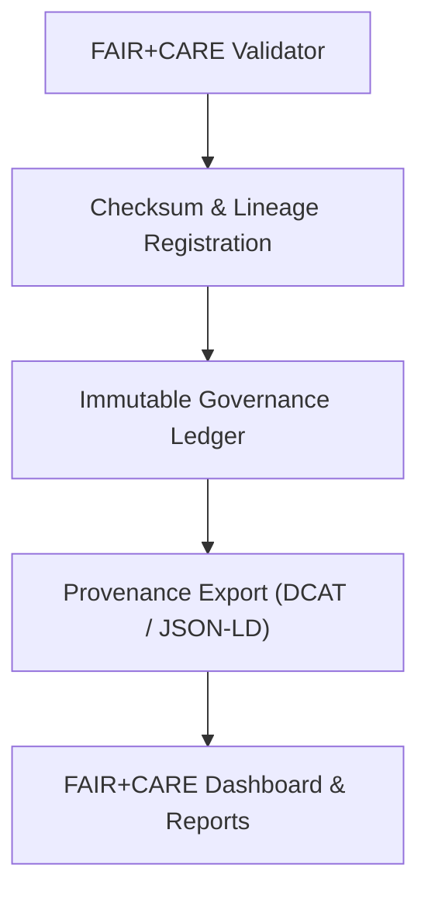

<div align="center">

# ⚖️ Kansas Frontier Matrix — **Source Governance Module**
`src/governance/README.md`

**Purpose:** Defines the architecture, workflows, and tools that ensure all Kansas Frontier Matrix data and AI pipelines maintain immutable governance, ethical compliance, and FAIR+CARE alignment.  
Implements automated auditing, provenance tracking, and ethics validation across all code and data transformations.

[](../../../.github/workflows/governance-validate.yml)  
[](../../../docs/standards/faircare-validation.md)  
[](../../../reports/audit/governance-ledger.json)  
[](../../../docs/architecture/repo-focus.md)

</div>

---

## 📚 Overview

The **Governance Module** ensures every stage of the KFM source pipeline — from ETL to AI inference — is transparently documented, verifiable, and ethically governed.  
It automates FAIR+CARE compliance validation, license checks, provenance chain generation, and synchronization of the Immutable Governance Ledger.

**Core Functions:**
- 🧾 Generate, validate, and synchronize governance ledgers  
- ⚖️ Verify FAIR+CARE compliance for datasets and AI outputs  
- 🧠 Integrate ethics validation into AI and Focus Mode workflows  
- 📜 Export provenance in DCAT/JSON-LD for interoperability  
- 🔒 Ensure every transformation is checksum-verified and auditable  

---

## 🗂️ Directory Layout

```plaintext
src/governance/
├── README.md                    # This file — documentation and governance overview
│
├── validators/                  # FAIR+CARE and compliance validation tools
│   ├── faircare_validate.py     # Validates datasets and documentation under FAIR+CARE standards
│   ├── license_check.py         # Scans all code and data assets for license consistency
│   └── schema_audit.py          # Ensures metadata schemas align with DCAT 3.0 and KFM contracts
│
├── lineage/                     # Provenance and data lineage tracking
│   ├── provenance_linker.py     # Links dataset lineage across ETL, AI, and STAC catalogs
│   ├── checksum_register.py     # Logs SHA-256 signatures to the governance ledger
│   └── ledger_sync.py           # Syncs governance ledger with CI/CD telemetry and audits
│
└── audit/                       # Governance report generation and exports
    ├── report_builder.py        # Aggregates FAIR+CARE, license, and provenance reports
    ├── provenance_export.py     # Exports provenance in DCAT/JSON-LD format
    └── governance_summary.py    # Compiles governance overview and dashboard metrics
```

**Module Roles:**

| Submodule | Responsibility | Output |
|------------|----------------|---------|
| `validators/` | FAIR+CARE validation and schema enforcement | `reports/fair/faircare-summary.json` |
| `lineage/` | Provenance and immutable checksum tracking | `reports/audit/data-lineage.json` |
| `audit/` | Consolidation and reporting of governance results | `reports/audit/governance-ledger.json` |

---

## ⚙️ Example Workflows

### ⚖️ Validate FAIR+CARE Compliance
```bash
python src/governance/validators/faircare_validate.py --input data/processed/ --output reports/fair/faircare-summary.json
```

### 🧾 Check License Consistency
```bash
python src/governance/validators/license_check.py --source data/ --output reports/audit/license-validation.json
```

### 🔗 Register Provenance Chain
```bash
python src/governance/lineage/provenance_linker.py --input data/stac/catalog.json --output reports/audit/data-lineage.json
```

### 🔒 Sync Immutable Governance Ledger
```bash
python src/governance/lineage/ledger_sync.py --input reports/audit/ --output reports/audit/governance-ledger.json
```

### 🧠 Export DCAT Provenance Report
```bash
python src/governance/audit/provenance_export.py --format jsonld --output reports/audit/provenance-export.json
```

---

## 🧩 Governance Integration Workflow



**Workflow Summary:**
1. Datasets and AI outputs validated under FAIR+CARE and MCP-DL rules.  
2. Checksums and provenance chains recorded in the ledger.  
3. Governance reports exported in open metadata standards.  
4. Immutable audit records logged to the Governance Ledger and Telemetry System.

---

## 🧠 FAIR+CARE & Provenance Integration

This module ensures that all system outputs meet ethical, transparent, and interoperable standards.

| Standard | Function | Implementation |
|-----------|-----------|----------------|
| **FAIR+CARE** | Ethical and community-aware data governance | `validators/faircare_validate.py` |
| **DCAT 3.0** | Dataset metadata standardization | `audit/provenance_export.py` |
| **STAC 1.0.0** | Geospatial data interoperability | `lineage/provenance_linker.py` |
| **CIDOC CRM** | Semantic provenance and event tracing | `lineage/provenance_linker.py` |
| **SPDX 2.3** | License audit and software traceability | `validators/license_check.py` |

---

## 🛡️ Security & Audit Logging

Governance integrity is maintained via:
- **SHA-256 validation** for every file, dataset, and governance record  
- **Immutable Ledger Sync** through CI/CD workflows  
- **Digital Signature Verification** for governance artifacts  
- **FAIR+CARE Metadata Embedding** in every audit output  

All records and lineage reports are publicly accessible and machine-readable.

Audit outputs stored in:
```
reports/audit/
reports/fair/
releases/v9.4.0/focus-telemetry.json
```

---

## 🧩 Observability & Telemetry Integration

Telemetry schema:  
`schemas/telemetry/pipelines-v1.json`

All governance actions emit telemetry events captured in:
```
releases/v9.4.0/focus-telemetry.json
reports/audit/governance-events.json
```

Each event includes:
- Execution time and module reference  
- FAIR+CARE validation score  
- Provenance chain hash  
- Governance ledger update ID  
- AI model ethics rating (if applicable)  

---

## 🧾 Version History

| Version | Date | Author | Summary |
|----------|------|---------|----------|
| v9.4.0 | 2025-11-02 | @kfm-governance | Expanded FAIR+CARE validation and automated DCAT provenance exports. |
| v9.3.3 | 2025-11-01 | @kfm-architecture | Added schema and license validation automation. |
| v9.3.2 | 2025-10-29 | @kfm-ethics | Integrated checksum registration and ledger synchronization scripts. |
| v9.3.1 | 2025-10-27 | @bartytime4life | Enhanced provenance exporter for CIDOC CRM linking. |
| v9.3.0 | 2025-10-25 | @kfm-data | Established governance module structure under MCP-DL v6.4.3. |

---

<div align="center">

**Kansas Frontier Matrix — Immutable Governance Architecture**  
*“Every action governed. Every ledger verified. Every process ethical.”* 🔗  
📍 `src/governance/README.md` — FAIR+CARE-aligned source documentation for the Kansas Frontier Matrix governance and provenance system.

</div>
