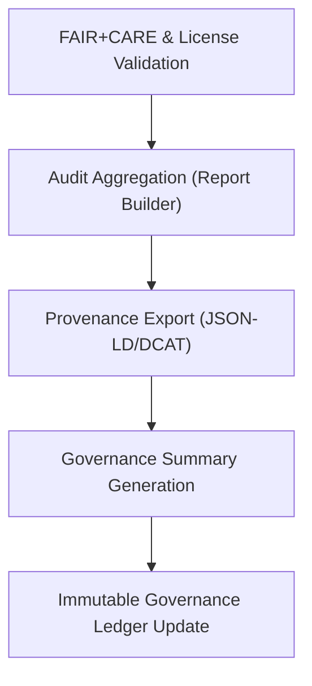

<div align="center">

# 🧮 Kansas Frontier Matrix — **Governance Audit & Reporting Module**
`src/governance/audit/README.md`

**Purpose:** Defines automated audit generation and governance reporting processes for the Kansas Frontier Matrix.  
This module consolidates FAIR+CARE validation outputs, provenance chains, checksum records, and license audits into immutable governance reports and ledgers.

[](../../../../.github/workflows/governance-validate.yml)  
[](../../../../docs/standards/faircare-validation.md)  
[](../../../../docs/architecture/repo-focus.md)

</div>

---

## 📚 Overview

The **Governance Audit Module** automates the aggregation of validation results and metadata lineage into structured governance reports.  
These reports form the official audit trail for the **Immutable Governance Ledger**, certifying all datasets, AI inferences, and documentation under FAIR+CARE compliance.

**Core Objectives:**
- 🧾 Consolidate FAIR+CARE, lineage, and license validation results  
- 📊 Generate machine-readable audit reports for governance dashboards  
- 🧠 Support explainability and ethics transparency in AI/Focus Mode audits  
- 🔐 Produce SHA-256-signed governance and provenance summaries  
- 🌍 Export DCAT/JSON-LD formatted audit reports for interoperability  

---

## 🗂️ Directory Layout

```plaintext
src/governance/audit/
├── README.md                     # This file — documentation for governance audit architecture
│
├── report_builder.py              # Aggregates FAIR+CARE, license, and lineage data into unified audit reports
├── provenance_export.py           # Exports provenance records in JSON-LD/DCAT/CIDOC CRM formats
└── governance_summary.py          # Compiles final governance summary with compliance metrics and ledger statistics
```

**File Descriptions:**

- **`report_builder.py`** — Gathers audit results from validators and lineage modules to produce consolidated governance reports.  
  Outputs `reports/audit/governance-summary.json`.

- **`provenance_export.py`** — Translates provenance chains into interoperable metadata formats (DCAT, JSON-LD, CIDOC CRM).  
  Outputs `reports/audit/provenance-export.json`.

- **`governance_summary.py`** — Compiles FAIR+CARE compliance scores, license distributions, and ledger health metrics into a summarized governance report.  
  Outputs `reports/audit/governance-ledger.json`.

---

## ⚙️ Example Workflows

### 🧾 Generate Governance Summary Report
```bash
python src/governance/audit/report_builder.py --input reports/audit/ --output reports/audit/governance-summary.json
```

### 🔗 Export Provenance Metadata (JSON-LD)
```bash
python src/governance/audit/provenance_export.py --input reports/audit/governance-ledger.json --format jsonld --output reports/audit/provenance-export.json
```

### 📊 Build Immutable Governance Ledger
```bash
python src/governance/audit/governance_summary.py --input reports/audit/ --output reports/audit/governance-ledger.json
```

---

## 🧠 Governance Reporting Workflow



**Workflow Summary:**
1. Validators and lineage modules generate audit artifacts.  
2. Reports are merged and normalized by `report_builder.py`.  
3. Provenance data exported for interoperability.  
4. Final governance summary logged to the immutable ledger and telemetry system.  

---

## 🧩 FAIR+CARE & Provenance Integration

| Component | Purpose | Output |
|------------|----------|---------|
| `report_builder.py` | Merges validation outputs into audit reports | `reports/audit/governance-summary.json` |
| `provenance_export.py` | Exports provenance records for open access | `reports/audit/provenance-export.json` |
| `governance_summary.py` | Updates immutable ledger with summary metrics | `reports/audit/governance-ledger.json` |

All governance outputs are:
- Checksum-signed (SHA-256)
- Versioned under FAIR+CARE transparency rules
- Cross-linked to `releases/v9.4.0/manifest.zip` and `focus-telemetry.json`

---

## 🧩 Standards Alignment

| Standard | Purpose | Implementation |
|-----------|----------|----------------|
| **MCP-DL v6.4.3** | Documentation-driven validation for reproducibility | All scripts |
| **FAIR+CARE 2024** | Ethical governance and accountability auditing | `report_builder.py` |
| **DCAT 3.0** | Dataset and metadata interoperability | `provenance_export.py` |
| **CIDOC CRM** | Semantic heritage and historical event linking | `provenance_export.py` |
| **ISO 19011** | Audit management and quality systems | `governance_summary.py` |

---

## 🛡️ Security, Ethics & Reproducibility

- **Integrity:** Audit outputs cryptographically signed and checksum-verified.  
- **Ethical Transparency:** FAIR+CARE metrics displayed for every dataset and AI model.  
- **Governance Consistency:** Ledger synchronization ensures complete accountability.  
- **Reproducibility:** All audit steps traceable via telemetry logs and manifest records.  

Reports stored in:
```
reports/audit/
reports/fair/
releases/v9.4.0/
```

---

## 🔍 Telemetry & Observability

All audit actions generate structured telemetry events under:
```
schemas/telemetry/pipelines-v1.json
```

**Telemetry Fields:**
- `audit_id` — Unique identifier for audit execution  
- `report_type` — FAIR, License, or Provenance  
- `checksum` — SHA-256 signature of audit report  
- `timestamp` — ISO UTC time  
- `governance_hash` — Ledger reference hash  

Telemetry stored in:
```
reports/audit/audit-events.json
releases/v9.4.0/focus-telemetry.json
```

---

## 🧾 Version History

| Version | Date | Author | Summary |
|----------|------|---------|----------|
| v9.4.0 | 2025-11-02 | @kfm-governance | Enhanced audit aggregation, added DCAT provenance export, and improved ledger summary structure. |
| v9.3.3 | 2025-11-01 | @kfm-ethics | Integrated CIDOC CRM metadata for cultural provenance tracking. |
| v9.3.2 | 2025-10-29 | @kfm-architecture | Updated FAIR+CARE score aggregation and license summary generation. |
| v9.3.1 | 2025-10-27 | @bartytime4life | Added automated checksum and telemetry integration. |
| v9.3.0 | 2025-10-25 | @kfm-compliance | Established baseline audit reporting framework under MCP-DL v6.4.3. |

---

<div align="center">

**Kansas Frontier Matrix — Immutable Governance Audit Framework**  
*“Every validation recorded. Every ledger verified. Every report transparent.”* 🔗  
📍 `src/governance/audit/README.md` — FAIR+CARE-aligned audit and reporting documentation for Kansas Frontier Matrix governance systems.

</div>
