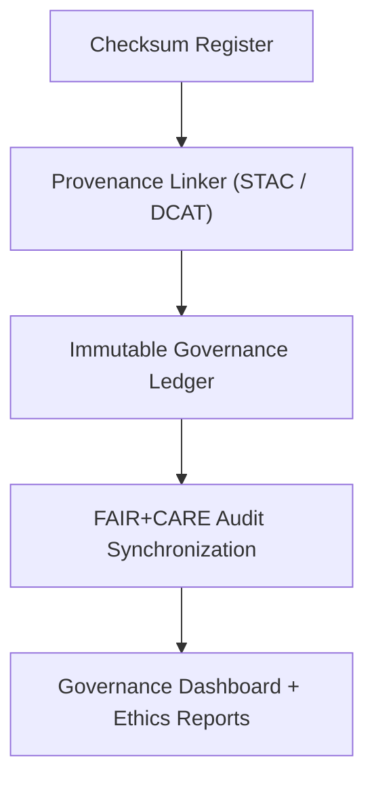

<div align="center">

# 🔗 Kansas Frontier Matrix — **Governance Lineage & Provenance Module**
`src/governance/lineage/README.md`

**Purpose:** Implements the lineage and provenance tracking framework that connects data transformations, AI models, and governance records within the Kansas Frontier Matrix.  
Ensures transparent traceability, checksum validation, and synchronization between FAIR+CARE audits and the Immutable Governance Ledger.

[](../../../../.github/workflows/governance-validate.yml)  
[](../../../../docs/standards/faircare-validation.md)  
[](../../../../reports/audit/governance-ledger.json)  
[](../../../../docs/architecture/repo-focus.md)

</div>

---

## 📚 Overview

The **Lineage Module** provides automated tracking of dataset provenance, checksum registration, and audit synchronization across KFM’s data and AI pipelines.  
It ensures that every transformation—ETL, enrichment, AI inference, or visualization—is verifiably linked to its source via the Immutable Governance Ledger.

**Core Objectives:**
- 🧾 Record the complete data and AI lineage across KFM pipelines  
- 🔐 Register checksum digests for data integrity verification  
- ⚙️ Synchronize audit and telemetry events with the governance ledger  
- 🌍 Export provenance chains in **DCAT**, **STAC**, and **CIDOC CRM** formats  
- 🧠 Guarantee reproducibility and accountability under FAIR+CARE  

---

## 🗂️ Directory Layout

```plaintext
src/governance/lineage/
├── README.md                     # This file — documentation and governance lineage overview
│
├── provenance_linker.py          # Connects datasets and models across FAIR+CARE lineage and exports JSON-LD graphs
├── checksum_register.py          # Registers and verifies SHA-256 file digests in governance logs
└── ledger_sync.py                # Synchronizes audit data and telemetry with Immutable Governance Ledger
```

**File Descriptions:**

- **`provenance_linker.py`** — Establishes data lineage between raw sources, transformations, and outputs.  
  Outputs structured provenance records (JSON-LD, DCAT, CIDOC CRM).  

- **`checksum_register.py`** — Computes and registers SHA-256 checksums for datasets, metadata, and models.  
  Validates integrity against the manifest and governance ledger.  

- **`ledger_sync.py`** — Merges audit logs, telemetry events, and provenance data into the Immutable Governance Ledger for long-term preservation.  

---

## ⚙️ Example Workflows

### 🧾 Register File Checksums
```bash
python src/governance/lineage/checksum_register.py --input data/processed/ --output reports/audit/checksum-register.json
```

### 🔗 Link Provenance Chain
```bash
python src/governance/lineage/provenance_linker.py --input reports/audit/checksum-register.json --output reports/audit/provenance-chain.json
```

### ⚖️ Sync Immutable Ledger
```bash
python src/governance/lineage/ledger_sync.py --input reports/audit/provenance-chain.json --output reports/audit/governance-ledger.json
```

### 🌍 Export DCAT Provenance Graph
```bash
python src/governance/lineage/provenance_linker.py --format dcat --output reports/audit/provenance-dcat.json
```

---

## 🧠 Governance Workflow Overview



**Workflow Summary:**
1. Files and datasets hashed and recorded via checksum register.  
2. Provenance linker builds lineage connections using DCAT and CIDOC CRM.  
3. Ledger sync integrates results into the Immutable Governance Ledger.  
4. FAIR+CARE dashboards display lineage and ethical validation metrics.  

---

## 🧩 FAIR+CARE & Provenance Integration

| Module | Role | Output |
|---------|------|---------|
| `checksum_register.py` | Data integrity verification and hash storage | `reports/audit/checksum-register.json` |
| `provenance_linker.py` | Lineage graph construction and FAIR+CARE metadata linking | `reports/audit/provenance-chain.json` |
| `ledger_sync.py` | Ledger update and audit synchronization | `reports/audit/governance-ledger.json` |

All lineage outputs are checksum-signed and appended to:
```
releases/v9.4.0/manifest.zip
releases/v9.4.0/focus-telemetry.json
```

---

## 🧩 Standards & Alignment

| Standard | Application | Implementation |
|-----------|--------------|----------------|
| **MCP-DL v6.4.3** | Documentation-driven provenance validation | All lineage modules |
| **FAIR+CARE** | Ethical traceability and data transparency | FAIR+CARE metadata embedded in JSON-LD exports |
| **DCAT 3.0** | Dataset lineage and catalog interoperability | `provenance_linker.py` |
| **STAC 1.0.0** | Geospatial data provenance tracking | `provenance_linker.py` |
| **CIDOC CRM** | Cultural heritage event and entity linkage | `provenance_linker.py` |
| **SPDX 2.3** | License traceability and checksum provenance | `checksum_register.py` |

---

## 🛡️ Security & Reproducibility

- **Integrity Verification:** Every checksum recorded and cross-verified via manifest digests.  
- **Immutable Ledgers:** Governance ledger records cryptographically signed and time-sealed.  
- **FAIR+CARE Provenance:** Metadata links ethical and technical provenance dimensions.  
- **Audit Synchronization:** All lineage actions appended to governance telemetry.

All records stored under:
```
reports/audit/
reports/fair/
releases/v9.4.0/
```

---

## 🔍 Observability & Telemetry

Telemetry Schema:  
`schemas/telemetry/pipelines-v1.json`

**Telemetry Fields:**
- `workflow_id` — Unique lineage process identifier  
- `checksum` — File or record SHA-256 hash  
- `provenance_ref` — JSON-LD or DCAT URI reference  
- `governance_hash` — Ledger entry signature  
- `timestamp` — ISO UTC timestamp  

Telemetry Outputs:
```
reports/audit/lineage-events.json
releases/v9.4.0/focus-telemetry.json
```

---

## 🧾 Version History

| Version | Date | Author | Summary |
|----------|------|---------|----------|
| v9.4.0 | 2025-11-02 | @kfm-governance | Added CIDOC CRM lineage linking and DCAT provenance export. |
| v9.3.3 | 2025-11-01 | @kfm-architecture | Enhanced checksum registration with SPDX alignment. |
| v9.3.2 | 2025-10-29 | @kfm-data | Improved ledger synchronization for continuous governance updates. |
| v9.3.1 | 2025-10-27 | @bartytime4life | Integrated provenance telemetry reporting. |
| v9.3.0 | 2025-10-25 | @kfm-ethics | Established lineage tracking framework under MCP-DL v6.4.3. |

---

<div align="center">

**Kansas Frontier Matrix — Immutable Provenance Framework**  
*“Every change traceable. Every hash verifiable. Every lineage eternal.”* 🔗  
📍 `src/governance/lineage/README.md` — FAIR+CARE-aligned documentation for provenance tracking and governance ledger integration in the Kansas Frontier Matrix.

</div>
