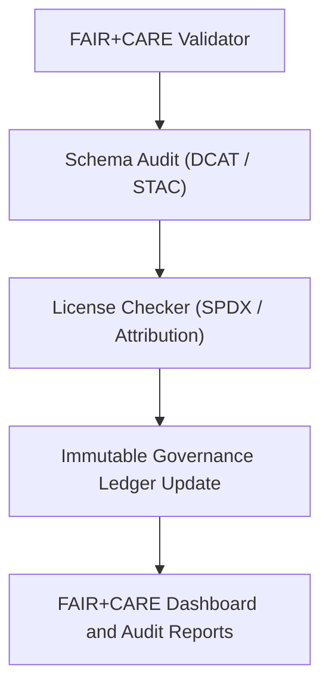

<div align="center">

# 🧾 Kansas Frontier Matrix — **Governance Validators Module**
`src/governance/validators/README.md`

**Purpose:** Contains all automated validation scripts that enforce FAIR+CARE alignment, schema conformance, and licensing transparency within the Kansas Frontier Matrix.  
This module verifies metadata integrity, open-data licensing, and provenance schema compliance before data and AI outputs are integrated into the governance ledger.

[](../../../../.github/workflows/governance-validate.yml)  
[](../../../../docs/standards/faircare-validation.md)  
[](../../../../docs/architecture/repo-focus.md)

</div>

---

## 📚 Overview

The **Governance Validators** enforce policy compliance and ethical governance across all data, AI, and documentation workflows in the Kansas Frontier Matrix.  
Each validator executes as part of CI/CD workflows or during ETL/AI pipeline runs, automatically updating the **Immutable Governance Ledger** with validation results.

**Key Objectives:**
- ✅ Validate FAIR+CARE ethical compliance and stewardship principles  
- 🧾 Verify license and attribution metadata for all files and datasets  
- 🧠 Audit schema and structural conformance for STAC/DCAT interoperability  
- 🧩 Enforce open standards (JSON-LD, SPDX, OGC) across the data lifecycle  

---

## 🗂️ Directory Layout

```plaintext
src/governance/validators/
├── README.md                 # This file — documentation for governance validators
│
├── faircare_validate.py      # Validates FAIR+CARE alignment for datasets, AI outputs, and documentation
├── license_check.py          # Scans repository for licensing, attribution, and SPDX compliance
└── schema_audit.py           # Verifies schema conformance for metadata (DCAT, STAC, CIDOC CRM)
```

**File Descriptions:**

- **`faircare_validate.py`** — Performs FAIR+CARE alignment audits across datasets and models.  
  Ensures compliance with ethical governance policies defined in `FAIR-CARE.md`.  
  Outputs: `reports/fair/faircare-summary.json`

- **`license_check.py`** — Audits all files for license declarations (MIT, CC-BY, Public Domain).  
  Generates SPDX-formatted outputs for integration with the governance ledger.  
  Outputs: `reports/audit/license-validation.json`

- **`schema_audit.py`** — Validates metadata schemas (DCAT 3.0, STAC 1.0.0, CIDOC CRM) against the KFM data contract.  
  Reports nonconformities or missing provenance fields.  
  Outputs: `reports/self-validation/schema-audit.json`

---

## ⚙️ Example Usage

### ⚖️ Run FAIR+CARE Validator
```bash
python src/governance/validators/faircare_validate.py --input data/processed/ --output reports/fair/faircare-summary.json
```

### 🧾 Run License Audit
```bash
python src/governance/validators/license_check.py --source data/ --output reports/audit/license-validation.json
```

### 📜 Execute Schema Audit
```bash
python src/governance/validators/schema_audit.py --input data/stac/catalog.json --contract docs/contracts/data-contract-v3.json
```

---

## 🧠 Governance Integration Workflow



**Workflow Summary:**
1. FAIR+CARE validation ensures ethical and reproducible data governance.  
2. Schema audit confirms compliance with open standards.  
3. License checker validates attribution and open-use compliance.  
4. Results appended to the governance ledger and telemetry chain.

---

## 🧩 FAIR+CARE Integration

| Validator | Purpose | FAIR+CARE Dimension | Output |
|------------|----------|----------------------|---------|
| **faircare_validate.py** | Ethical governance and stewardship | CARE · Collective Benefit / Responsibility | `reports/fair/faircare-summary.json` |
| **license_check.py** | License and attribution audit | FAIR · Reusability | `reports/audit/license-validation.json` |
| **schema_audit.py** | Metadata and schema compliance | FAIR · Interoperability / Findability | `reports/self-validation/schema-audit.json` |

Governance ledger entries include:
- Validation timestamp  
- SHA-256 checksum of dataset or document  
- FAIR+CARE compliance rating  
- Source and reviewer attribution  

All updates synchronized to:
```
reports/audit/governance-ledger.json
releases/v9.4.0/focus-telemetry.json
```

---

## 🛡️ Security & Compliance

- **Integrity Verification:** Every validation output is checksum-signed and timestamped.  
- **Provenance Transparency:** Reports reference input dataset, schema contract, and data source.  
- **SPDX Alignment:** Licenses expressed as SPDX identifiers for machine-readability.  
- **Accessibility Assurance:** FAIR+CARE compliance reports publicly accessible under open license.  

Audit results stored in:
```
reports/audit/
reports/fair/
reports/self-validation/
```

---

## 🧱 Standards Alignment

| Standard | Function | Validator |
|-----------|-----------|-----------|
| **MCP-DL v6.4.3** | Documentation-first test design | All validators |
| **FAIR+CARE 2024 Spec** | Ethical and data stewardship validation | `faircare_validate.py` |
| **DCAT 3.0** | Dataset schema interoperability | `schema_audit.py` |
| **STAC 1.0.0** | Geospatial metadata validation | `schema_audit.py` |
| **SPDX 2.3** | License compliance verification | `license_check.py` |

---

## 🔍 Observability & Telemetry

Each validator emits telemetry logs under the schema:
```
schemas/telemetry/pipelines-v1.json
```

Telemetry Outputs:
```
reports/audit/governance-events.json
reports/fair/faircare-summary.json
releases/v9.4.0/focus-telemetry.json
```

**Telemetry Fields:**
- `validator_id` — Name of validator executed  
- `status` — Pass/Fail/Warning  
- `timestamp` — UTC timestamp for execution  
- `checksum` — SHA-256 of report  
- `source_path` — File or dataset validated  

---

## 🧾 Version History

| Version | Date | Author | Summary |
|----------|------|---------|----------|
| v9.4.0 | 2025-11-02 | @kfm-governance | Added schema audit integration and improved FAIR+CARE validation framework. |
| v9.3.3 | 2025-11-01 | @kfm-ethics | Introduced SPDX license audit and automated provenance references. |
| v9.3.2 | 2025-10-29 | @bartytime4life | Enhanced FAIR+CARE validator to include CARE dimension scoring. |
| v9.3.1 | 2025-10-27 | @kfm-data | Added DCAT validation pipeline and metadata interoperability tests. |
| v9.3.0 | 2025-10-25 | @kfm-compliance | Established baseline governance validator scripts under MCP-DL v6.4.3. |

---

<div align="center">

**Kansas Frontier Matrix — Immutable Validation Architecture**  
*“Every dataset verified. Every license transparent. Every record accountable.”* 🔗  
📍 `src/governance/validators/README.md` — FAIR+CARE-aligned validation module for Kansas Frontier Matrix governance and ethics systems.

</div>
