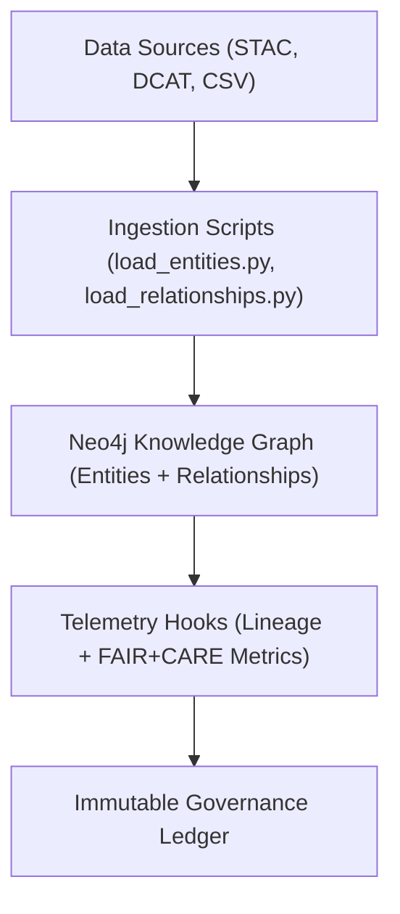

<div align="center">

# 🕸️ Kansas Frontier Matrix — **Knowledge Graph Integration Layer**
`src/graph/README.md`

**Purpose:** Defines the Neo4j-based Knowledge Graph integration layer of the Kansas Frontier Matrix, where entities, events, places, and temporal relationships are modeled and linked.  
Implements FAIR+CARE-aligned governance, provenance logging, and ontology mapping (CIDOC CRM + DCAT) to ensure transparency, ethics, and interoperability.

[](../../.github/workflows/graph-validate.yml)  
[](../../docs/standards/faircare-validation.md)  
[](../../docs/architecture/repo-focus.md)

</div>

---

## 📚 Overview

The **Knowledge Graph Layer** connects all Kansas Frontier Matrix components — datasets, treaties, maps, AI summaries, and historical entities — into a unified semantic network.  
Built with **Neo4j**, it leverages **CIDOC CRM** and **DCAT 3.0** ontologies to ensure open data interoperability and transparent FAIR+CARE provenance management.

**Core Objectives:**
- 🧩 Create and maintain an ethical, semantically rich Knowledge Graph  
- ⚖️ Ensure FAIR+CARE governance and explainable data relationships  
- 🌐 Integrate historical, environmental, and AI-derived metadata into graph nodes  
- 🔍 Provide graph queries and APIs for contextual reasoning and visualization  
- 🧾 Log all graph operations and lineage in Immutable Governance Ledger  

---

## 🗂️ Directory Layout

```plaintext
src/graph/
├── README.md                      # This file — Knowledge Graph documentation and governance reference
│
├── schema/                        # Graph ontology, labels, and property definitions
│   ├── cidoc_crm_mapping.yml       # Mapping between CIDOC CRM and Neo4j schema
│   ├── dcat_alignment.yml          # Mapping for DCAT metadata entities
│   └── graph_constraints.cypher    # Schema constraints and uniqueness validations
│
├── ingest/                        # Data ingestion and graph population scripts
│   ├── load_entities.py            # Imports entity data into Neo4j
│   ├── load_relationships.py       # Builds relationships between graph nodes
│   ├── load_datasets.py            # Integrates STAC/DCAT dataset metadata into graph
│   └── provenance_sync.py          # Syncs provenance metadata to governance ledger
│
├── queries/                       # Graph query templates for API and AI integration
│   ├── entity_lookup.cypher        # Retrieve nodes by name, ID, or type
│   ├── relationships.cypher        # Fetch relationship chains and semantic paths
│   └── focus_context.cypher        # Contextual Focus Mode entity and event exploration
│
└── utils/                         # Helper utilities for graph governance and telemetry
    ├── graph_connector.py          # Manages Neo4j sessions and connection pools
    ├── checksum_logger.py          # Logs SHA-256 checksums for all graph operations
    └── telemetry_hooks.py          # Emits telemetry and governance events for lineage updates
```

---

## ⚙️ Example Workflows

### 🧩 Ingest Entities into Knowledge Graph
```bash
python src/graph/ingest/load_entities.py --input data/processed/entities.csv
```

### 🔗 Establish Relationships
```bash
python src/graph/ingest/load_relationships.py --input data/processed/relationships.csv
```

### 🌍 Sync Provenance to Governance Ledger
```bash
python src/graph/ingest/provenance_sync.py \
  --ledger reports/audit/governance-ledger.json \
  --graph_uri neo4j://localhost:7687
```

### 🧠 Run Focus Mode Context Query
```bash
cypher-shell -f src/graph/queries/focus_context.cypher
```

---

## 🧩 Example Cypher Query (Entity Context)
```cypher
MATCH (p:Place {id: 'fort_larned'})-[r:RELATED_TO]->(e:Event)
RETURN p.name AS place, e.title AS event, r.type AS relationship_type;
```

**Result Example:**
| place | event | relationship_type |
|--------|--------|------------------|
| Fort Larned | Santa Fe Trail | Cultural Influence |
| Fort Larned | Treaty of Fort Laramie | Historical Event |

---

## 🧠 FAIR+CARE Integration

| Graph Component | FAIR Principle | CARE Principle | Output |
|------------------|----------------|----------------|---------|
| **Nodes (Entities)** | Findable / Accessible | Collective Benefit | CIDOC CRM Nodes |
| **Relationships** | Interoperable / Reusable | Responsibility | Neo4j Relationships |
| **Metadata (Provenance)** | Transparency / Accountability | Ethics | DCAT Alignment Reports |
| **Queries** | Reproducibility / Openness | Authority to Control | API & Focus Mode Responses |

All graph changes are recorded in:
```
reports/audit/governance-ledger.json
releases/v9.4.0/focus-telemetry.json
```

---

## 🔗 Governance & Provenance Workflow



**Workflow Summary:**
1. Datasets and AI outputs are ingested into the Knowledge Graph.  
2. Ontological mappings (CIDOC CRM / DCAT) applied for interoperability.  
3. Telemetry hooks emit governance events for all operations.  
4. Immutable Governance Ledger updated with checksums and provenance metadata.  

---

## 🧩 Standards & Compliance Mapping

| Standard | Domain | Implementation |
|-----------|----------|----------------|
| **MCP-DL v6.4.3** | Documentation-first graph architecture | This README + schema definitions |
| **FAIR+CARE** | Ethical and transparent data linkage | Governance-linked lineage and audit hooks |
| **CIDOC CRM** | Cultural heritage ontology integration | CIDOC to Neo4j schema mappings |
| **DCAT 3.0** | Dataset catalog interoperability | Dataset ingestion into graph |
| **ISO 23894** | AI transparency and data lineage | Telemetry hooks and governance events |
| **JSON-LD** | Provenance and metadata portability | Provenance sync scripts and exports |

---

## 🛡️ Security, Provenance & Observability

- **Integrity:** Graph transactions checksum-verified via `checksum_logger.py`.  
- **Provenance:** Lineage stored as JSON-LD and registered in governance ledger.  
- **Observability:** Telemetry events track ingestion, query, and update metrics.  
- **Transparency:** FAIR+CARE validation integrated into every node and relationship operation.  

Telemetry Schema:  
`schemas/telemetry/graph-telemetry-v1.json`

Telemetry Outputs:
```
reports/graph/ingestion-events.json
reports/audit/governance-ledger.json
releases/v9.4.0/focus-telemetry.json
```

---

## 🧾 Version History

| Version | Date | Author | Summary |
|----------|------|---------|----------|
| v9.4.0 | 2025-11-02 | @kfm-architecture | Added ontology mappings, telemetry hooks, and governance integration for graph ingestion. |
| v9.3.3 | 2025-11-01 | @kfm-data | Improved CIDOC/DCAT alignment for provenance interoperability. |
| v9.3.2 | 2025-10-29 | @bartytime4life | Enhanced graph checksum validation and lineage logging. |
| v9.3.1 | 2025-10-27 | @kfm-governance | Integrated FAIR+CARE compliance for node and relationship operations. |
| v9.3.0 | 2025-10-25 | @kfm-neo4j | Established baseline Knowledge Graph schema and ingestion scripts under MCP-DL v6.4.3. |

---

<div align="center">

**Kansas Frontier Matrix — Ethical Graph of Knowledge**  
*“Every connection verifiable. Every entity traceable. Every dataset governed.”* 🔗  
📍 `src/graph/README.md` — FAIR+CARE-certified documentation for Knowledge Graph integration and Neo4j governance within the Kansas Frontier Matrix.

</div>
