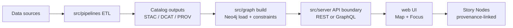
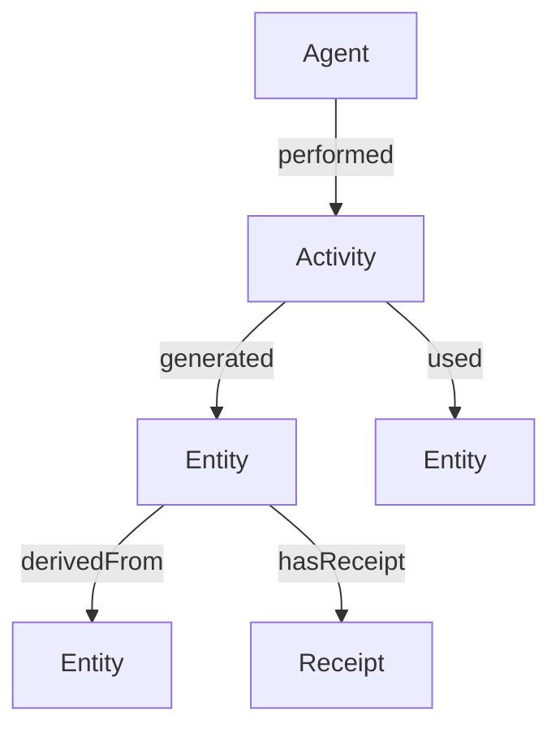
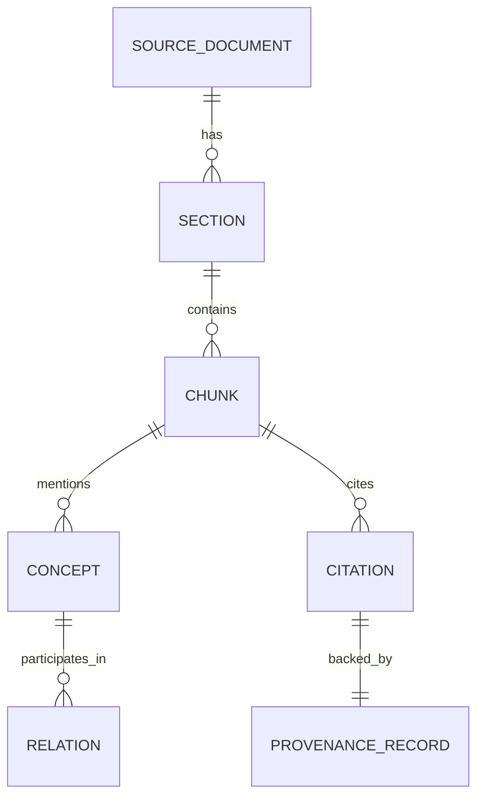
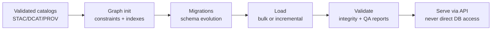

# KFM Graph Subsystem


> [!IMPORTANT]
> **Canonical home:** `src/graph/` is the single source of truth for **graph initialization and sync code**:
> - ontology application
> - Cypher migrations
> - CSV generation for bulk import
>
> If the graph needs static import files (node/edge CSVs, post-import Cypher), they live in `data/graph/`.
> **No graph definitions should live outside these paths.**  
> This is a governed architecture rule.

---

## Table of contents

- [Purpose](#purpose)
- [Scope](#scope)
- [System boundaries](#system-boundaries)
- [How the graph fits in the KFM pipeline](#how-the-graph-fits-in-the-kfm-pipeline)
- [Directory layout](#directory-layout)
- [Subsystem contract](#subsystem-contract)
- [Graph data model](#graph-data-model)
- [Identity and addressing](#identity-and-addressing)
- [Graph build workflows](#graph-build-workflows)
- [Configuration](#configuration)
- [Local development](#local-development)
- [Security and privacy](#security-and-privacy)
- [Testing and CI](#testing-and-ci)
- [Operations](#operations)
- [Change management](#change-management)
- [Glossary](#glossary)
- [References](#references)

---

## Purpose

The KFM graph is the **knowledge layer** that connects:

- datasets and their provenance and lineage
- extracted artifacts from documents
- domain entities (places, people, events, etc.)
- Story Nodes and Focus Mode evidence trails

It enables:
- provenance-first answers and narratives
- traceable citations and “why should I trust this” UI affordances
- subgraph retrieval for Focus Mode context bundles

---

## Scope

### What lives here

`src/graph/` contains graph build and maintenance code:

- ontology bindings and label mapping
- schema, constraints, and index definitions
- Cypher migrations and schema evolution tooling
- graph ingestion and sync routines
- CSV export generation for bulk import flows
- integrity checks and graph QA reports

### What does not live here

- UI code (`web/`)
- API boundary controllers and contract definitions (`src/server/`)
- ETL pipelines (`src/pipelines/`)
- policies and adjudication logic (policy lives at the governed API boundary)

> [!NOTE]
> The graph is *served* to clients through the governed API boundary. The UI does not query Neo4j directly.

---

## System boundaries

### Trust membrane rule

- **Frontend never accesses databases directly.**
- Graph reads/writes must flow through the governed API boundary and policy evaluation.
- Core logic must go through defined interfaces (ports) rather than “sneaking” around the repository layer.

### Data governance rule

- If a node/edge can affect public narratives, it must be provenance-linked.
- Sensitive record handling must be enforced consistently (no bypass routes).

---

## How the graph fits in the KFM pipeline



### What the graph consumes

Typical inputs (paths are repo conventions; domain specifics vary):

- `data/prov/` — PROV bundles per run/dataset
- `data/stac/` — STAC collections/items for spatial assets
- `data/catalog/dcat/` — DCAT JSON-LD for dataset metadata
- `data/<domain>/processed/` — curated outputs ready for downstream use
- document extraction outputs (if present) used to build the extraction subgraph

### What the graph produces

- Neo4j graph state representing validated catalog facts + relationships
- integrity check outputs and QA reports
- optional bulk import artifacts:
  - `data/graph/csv/` — node/edge CSV exports
  - `data/graph/cypher/` — optional post-import Cypher scripts

---

## Directory layout

> [!TIP]
> Keep the tree shallow. Prefer “few folders, strong contracts” over “many folders, unclear ownership”.

### This subsystem

```text
src/graph/
├── README.md
├── ontology/                 # ontology bindings, mapping tables, label conventions
├── schema/                   # constraints, indexes, schema primitives
├── migrations/               # ordered Cypher migrations + runner
├── ingest/                   # loaders: catalogs, provenance, extracted artifacts
├── export/                   # CSV export for bulk import pipelines
├── validate/                 # integrity checks + QA report generation
├── queries/                  # query templates used by API boundary
├── ports/                    # interfaces (GraphRepository, QueryService, etc.)
├── adapters/                 # Neo4j driver adapter, mock adapter for tests
└── cli/                      # optional CLI entrypoints (graph init/load/validate)
```

### Related governed homes

```text
data/graph/
├── csv/                      # bulk import artifacts
└── cypher/                   # optional post-import scripts

src/pipelines/                # ETL jobs produce validated catalogs
src/server/                   # API boundary (OpenAPI / GraphQL)
docs/                         # governance docs, ADRs, runbooks
schemas/                      # JSON Schemas and profiles (STAC / DCAT / PROV)
```

---

## Subsystem contract

This subsystem is governed by **contract-first** expectations.

### Required artifacts

| Artifact | Where it lives | Why it matters |
|---|---|---|
| Ontology definitions and mapping | `src/graph/ontology/` | Keeps labels/relationships stable and understandable |
| Migration scripts | `src/graph/migrations/` | Enables safe evolution and reproducibility |
| Integrity constraints and indexes | `src/graph/schema/` | Prevents drift and enforces invariants |
| Integrity validation | `src/graph/validate/` | Ensures “no orphan node types” and schema compliance |

### Do-not-break invariants

- **Graph schema is stable** (labels and relationships) unless a deliberate migration is performed.
- Ontology changes must be implemented through migrations and recorded in version history.
- Neo4j data must always meet ontology constraints (example: no orphan node types).
- API clients rely on schema stability: breaking changes require coordination.

> [!WARNING]
> If you need to rename a label, relationship type, or meaningfully change node identity rules:
> - it is a **breaking change**
> - it requires a migration
> - it requires a versioning decision and coordination with API/UI owners

---

## Graph data model

KFM uses a multi-subgraph approach. These are logical groupings; in Neo4j they can coexist.

### Provenance and lineage subgraph

Goal: answer “where did this come from”, “how was it produced”, “who/what did it”, “what changed”.



Common node kinds you will see:
- Dataset
- DatasetVersion
- IngestionRun or PipelineRun
- Activity
- Agent
- Artifact
- Receipt
- PolicyDecision

Relationships should be PROV-aligned (or explicitly mapped to a PROV concept).

### Extraction subgraph

Goal: connect document artifacts to concepts, relations, and citations.



### Domain entity subgraph

Goal: unify entities across datasets and narratives.

Typical node kinds:
- Place
- HistoricalPerson
- Organization
- Event
- Boundary or Region
- Instrument or Station
- StoryNode
- Claim

Typical edges:
- located_in
- occurred_at
- occurred_on
- same_as
- mentioned_in
- supports
- disputes

> [!NOTE]
> Add node kinds and edges only when you can define:
> 1) the query patterns they support  
> 2) their provenance rules  
> 3) their identity and merge rules  

---

## Identity and addressing

### Deterministic identity

Where possible, entities and artifacts should be created with deterministic identifiers to enable replayable builds and stable joins across runs.

Common strategies:
- canonical IDs derived from normalized fields
- content digests for artifacts
- spec hashes for normalized receipts or metadata blocks

### Evidence addressing

KFM uses resolver-friendly identifiers to allow “one click to evidence” UX.

Common URI shapes:
- `prov://...` for provenance bundles
- `stac://...` for STAC assets
- `dcat://...` for DCAT metadata
- `doc://...` for document artifacts
- `graph://...` for graph-native entities/edges

> [!IMPORTANT]
> Every Story Node claim that depends on graph facts must be able to resolve its supporting evidence through the governed API boundary.

---

## Graph build workflows

This section describes the **expected** workflow surface. Exact command names may differ by implementation; keep the behavior stable.

### Workflow overview



### Initialize graph

Responsibilities:
- create constraints
- create indexes
- apply baseline ontology bindings
- record schema version metadata

Expected output:
- successful schema init log
- graph schema version set

### Apply migrations

Rules:
- migrations are ordered and deterministic
- migrations are idempotent when feasible
- migrations are reviewed as “production changes”

Recommended migration naming pattern:
- `V0001__baseline_constraints.cypher`
- `V0002__add_agent_identity_index.cypher`
- `V0003__rename_relationship_type.cypher`

### Load graph data

Two supported patterns:

#### Bulk import pattern

- export nodes/edges to `data/graph/csv/`
- run Neo4j bulk import or admin import tooling
- apply `data/graph/cypher/` post-import scripts if required
- run integrity checks

#### Incremental sync pattern

- ingest changes per dataset or per pipeline run
- upsert nodes/edges using deterministic identity
- attach receipts / provenance links
- re-run targeted integrity checks

### Validate integrity

Integrity validations should include:
- orphan detection (unexpected node labels without ontology mapping)
- uniqueness constraints satisfied
- required provenance edges exist for governed node kinds
- no “source-less” Story Node dependencies

Recommended outputs:
- `graph_integrity_report.json`
- `graph_integrity_report.md` for human review

---

## Configuration

### Environment variables

| Variable | Example | Notes |
|---|---:|---|
| `NEO4J_URI` | `bolt://localhost:7687` | Bolt endpoint |
| `NEO4J_USER` | `neo4j` | RBAC applies in non-dev |
| `NEO4J_PASSWORD` | `password` | Never commit real secrets |
| `NEO4J_DATABASE` | `neo4j` | or a named database |
| `GRAPH_SCHEMA_VERSION` | `13.0` | informational; actual version stored in graph metadata |

### Config principles

- configs are explicit and checked in where safe
- secrets are always injected at runtime
- defaults are safe and deny-by-default where policy applies

---

## Local development

> [!NOTE]
> The repo may provide Docker Compose or platform-native dev tooling to start Neo4j.
> In typical KFM dev mode, Neo4j is reachable locally and the browser UI is available.

Suggested steps:

1. Start local services (Neo4j, plus any dependencies).
2. Open the Neo4j browser UI.
3. Run graph initialization and migrations.
4. Load a small “golden path” dataset run.
5. Validate integrity.
6. Run API boundary and verify queries through API, not direct DB calls.

### Sanity checks

- Can connect to Neo4j using the configured driver
- Schema constraints exist
- Migrations applied cleanly
- No orphan node types after load
- A provenance query returns a complete chain for a known artifact

---

## Security and privacy

### Provenance is sensitive by default

Provenance can reveal:
- internal file paths
- agent identities
- run metadata that might contain private tokens or URLs

Rules:
- do not expose internal-only provenance fields to public clients
- implement redaction and policy enforcement at the API boundary
- treat the graph as access-controlled infrastructure

### Least privilege

- use RBAC in Neo4j for non-dev deployments
- separate service accounts for ingest vs query
- log policy decisions for protected graph reads

---

## Testing and CI

### Required test types

- Unit tests
  - ontology mapping validation
  - deterministic identity and merge rules
  - migration parsing and ordering

- Integration tests
  - Neo4j container-backed tests for migrations + ingest
  - integrity validator end-to-end

- Contract tests
  - if `src/server/` exposes graph endpoints, assert stable API behavior across versions

### Governance gates for pull requests

- [ ] Any schema change has a migration
- [ ] Any ontology change is reflected in mapping + version history
- [ ] Integrity validations pass
- [ ] No new node label or relationship type is introduced without documentation
- [ ] Sensitive record handling is validated when applicable
- [ ] Story/Focus “No Source, No Answer” invariants are not violated

---

## Operations

### Backups and restores

Operational requirements for non-dev:
- regular backups (schedule + retention)
- restore drills (tested procedure)
- schema version tracking in backups

### Monitoring

Recommended minimum observability:
- ingest throughput
- query latency
- migration failures
- constraint violation counts
- storage and memory health

### Performance practices

- prefer query-driven modeling
- maintain indexes aligned to known query shapes
- batch writes for ingestion
- profile heavy queries and pin patterns in `src/graph/queries/`

---

## Change management

### Versioning expectations

- Graph and ontology structure should remain backwards-compatible unless a deliberate migration is performed.
- Breaking changes require coordinated rollout with API and UI layers.

### When to add a migration

Add a migration whenever you:
- introduce a new label or relationship type
- change the meaning of a label or edge
- rename labels/relationships
- change uniqueness constraints or identity rules
- add or remove required provenance links

### Suggested PR template snippet for graph changes

```text
Graph change summary:
- What labels/relationships are affected?
- What migration files are added/modified?
- How is backwards compatibility preserved?
- What integrity checks were added/updated?
- What is the evidence/provenance implication?
```

---

## Glossary

- **Ontology**: governed vocabulary for node labels, relationship types, and meaning.
- **Migration**: ordered script(s) that evolve graph schema and data safely.
- **Integrity constraint**: constraints and checks ensuring graph invariants remain true.
- **PROV**: provenance model linking entities, activities, and agents.
- **Receipt**: a normalized, hash-addressed record capturing provenance, digests, and policy outcomes.

---

## References

- `../../docs/MASTER_GUIDE_v13.md`
- `../../docs/architecture/`
- `../../schemas/` for STAC/DCAT/PROV profiles
- `../../data/graph/` for bulk import artifacts
- `../../src/server/` for API boundary endpoints that expose graph reads

