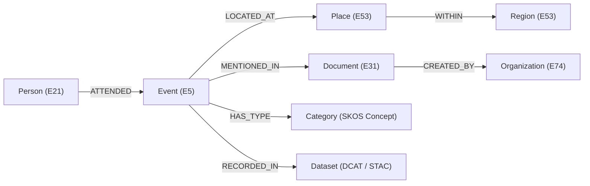

<div align="center">

# 🧩 **Kansas Frontier Matrix — Graph Schema & Knowledge Integration**
`src/graph/README.md`

**Purpose:**  
Define the **Neo4j-based semantic knowledge graph** that powers entity linking, AI reasoning, and Focus Mode analytics in KFM.  
Implements FAIR+CARE-compliant ontologies (CIDOC CRM, OWL-Time, GeoSPARQL) for reproducible, explainable data relationships.

[](../../docs/standards/)
[](../../docs/standards/faircare-validation.md)
[](../../LICENSE)
[]()
[]()

</div>

---

## 📘 Overview

The **Graph subsystem** represents the semantic core of the Kansas Frontier Matrix (KFM).  
It stores and links all historical, cultural, and environmental data as entities (nodes) and relationships (edges), enabling **cross-domain reasoning, Focus Mode queries, and explainable AI**.

Each node adheres to FAIR+CARE metadata principles and maps to global ontological standards:
- **CIDOC CRM (ISO 21127)** — cultural heritage / historical context  
- **GeoSPARQL / WKT** — spatial geometries and geographic relations  
- **OWL-Time** — temporal intervals, instants, and event durations  
- **PROV-O** — provenance tracking for data generation and use  

---

## 🧱 Graph Schema Overview



**Primary Node Types**
| Label | Ontology / Concept | Description |
|-------|--------------------|--------------|
| **Person** | CIDOC E21 | Historical or modern individual (e.g., settler, tribal leader, scientist). |
| **Place** | CIDOC E53 / GeoSPARQL | Geolocated feature (city, fort, county, river, reservation, site). |
| **Event** | CIDOC E5 / OWL-Time | Occurrence with defined time interval (e.g., treaty, flood, migration). |
| **Document** | CIDOC E31 | Source material (letters, maps, newspapers, datasets). |
| **Organization** | CIDOC E74 | Government body, tribe, company, or association. |
| **Dataset** | DCAT / STAC | Geospatial or tabular dataset indexed in data/stac/. |
| **Concept / Category** | SKOS | Controlled vocabulary or classification term. |

---

## ⚙️ Graph Integration Logic

### ETL → Graph Flow
1. **Extract**: Raw sources (NOAA, USGS, Archives) ingested via `src/pipelines/etl/`.
2. **Transform**: Entities identified using NLP (spaCy, transformer models).
3. **Link**: Entities cross-referenced against Neo4j for existing matches.
4. **Load**: New nodes/relationships upserted via Cypher transactions.
5. **Governance Sync**: Provenance and checksums recorded to IPFS and Governance Ledger.

Example Cypher snippet for linking people, events, and places:
```cypher
MERGE (p:Person {name:$person})
MERGE (e:Event {id:$event_id})
MERGE (l:Place {name:$place})
MERGE (p)-[:ATTENDED]->(e)
MERGE (e)-[:LOCATED_AT]->(l)
SET e.date = date($date),
    e.source = $source,
    e.checksum = $sha256;
```

---

## 🧠 Ontology Alignment

| Standard | Use in KFM | Integration Layer |
|-----------|-------------|-------------------|
| **CIDOC CRM** | Core entity & event semantics | Graph model |
| **GeoSPARQL** | Spatial geometry & topological relationships | Place / Region nodes |
| **OWL-Time** | Temporal alignment for events | Event nodes & Focus Mode |
| **DCAT 3.0 / STAC 1.0** | Dataset discovery & metadata | Dataset / Asset nodes |
| **PROV-O** | Provenance linkage | Governance & Ledger |
| **SKOS** | Taxonomy & category hierarchy | Concept nodes |

All ontology mappings are serialized in `graph/schema/ontology_map.ttl`.

---

## 🔍 Query Examples

### 1. Find all treaties involving the Kaw Nation
```cypher
MATCH (t:Event)-[:ATTENDED]->(p:Person {group:"Kaw Nation"})
RETURN t.title, t.date, t.location
ORDER BY t.date ASC;
```

### 2. Retrieve Focus Mode subgraph for Fort Larned
```cypher
MATCH (p:Place {name:"Fort Larned"})<-[:LOCATED_AT]-(e:Event)
OPTIONAL MATCH (e)-[:ATTENDED]->(x:Person)
RETURN e, p, collect(x) AS participants;
```

### 3. Temporal correlation of drought events and migration
```cypher
MATCH (e1:Event {type:"Drought"})-[:OCCURRED_AT]->(r:Region),
      (e2:Event {type:"Migration"})-[:OCCURRED_AT]->(r)
WHERE e1.start < e2.start < e1.end + duration('P2Y')
RETURN r.name, e1.title, e2.title;
```

---

## 🧮 Graph Telemetry & Validation

| Metric | Description | Verified By |
|--------|--------------|-------------|
| **Node Count** | Total entities (Persons, Places, Events, etc.) | Neo4j Metrics API |
| **Edge Density** | Avg. relationships per node | `src/pipelines/validation/graph_density.py` |
| **Schema Drift** | Deviation from ontology alignment | FAIR+CARE Validator |
| **Checksum Integrity** | IPFS + SHA-256 verification | Governance Ledger |
| **AI Link Accuracy** | Entity linking precision (NER → Graph) | Focus Transformer v2 reports |

Telemetry results → `../../reports/audit/graph_telemetry.json`

---

## 🧩 Directory Layout

```plaintext
src/graph/
├── README.md                # This document
├── schema/
│   ├── ontology_map.ttl     # RDF/OWL alignment definitions
│   ├── neo4j_schema.cypher  # Graph schema creation scripts
│   └── constraints.cypher   # Indexes & uniqueness constraints
├── ingest/
│   ├── load_entities.py     # ETL loader for graph nodes
│   ├── link_entities.py     # Entity linker and resolver
│   └── sync_provenance.py   # Provenance and ledger sync
├── queries/
│   ├── focus_mode.cql       # Query templates for Focus Mode
│   ├── analytics.cql        # Analytical graph queries
│   └── governance.cql       # Provenance validation queries
└── utils/
    └── graph_helpers.py     # Shared Cypher/Neo4j helpers
```

---

## 🧾 Internal Citation

```text
Kansas Frontier Matrix (2025). Graph Schema & Knowledge Integration (v10.1.0).
Semantic Neo4j knowledge graph integrating CIDOC CRM, GeoSPARQL, and FAIR+CARE metadata for Kansas historical and environmental data.
```

---

## 🕰️ Version History

| Version | Date | Summary |
|----------|------|----------|
| **v10.1.0** | 2025-11-10 | Refined ontology mappings, added PROV-O integration, enhanced Focus Mode subgraph queries. |
| **v10.0.0** | 2025-11-08 | Implemented CIDOC CRM/GeoSPARQL hybrid schema, introduced Focus Transformer v2 link layer. |
| **v9.7.0** | 2025-11-05 | Aligned Neo4j schema with DCAT 3.0 + STAC 1.0; introduced provenance hooks. |

---

<div align="center">

**© 2025 Kansas Frontier Matrix — MIT License**  
*Semantic Graph × FAIR+CARE Ethics × Provenance Integrity*  
[Back to Source Architecture](../ARCHITECTURE.md) · [Docs Portal](../../docs/) · [Governance Ledger](../../docs/standards/governance/DATA-GOVERNANCE.md)

</div>

